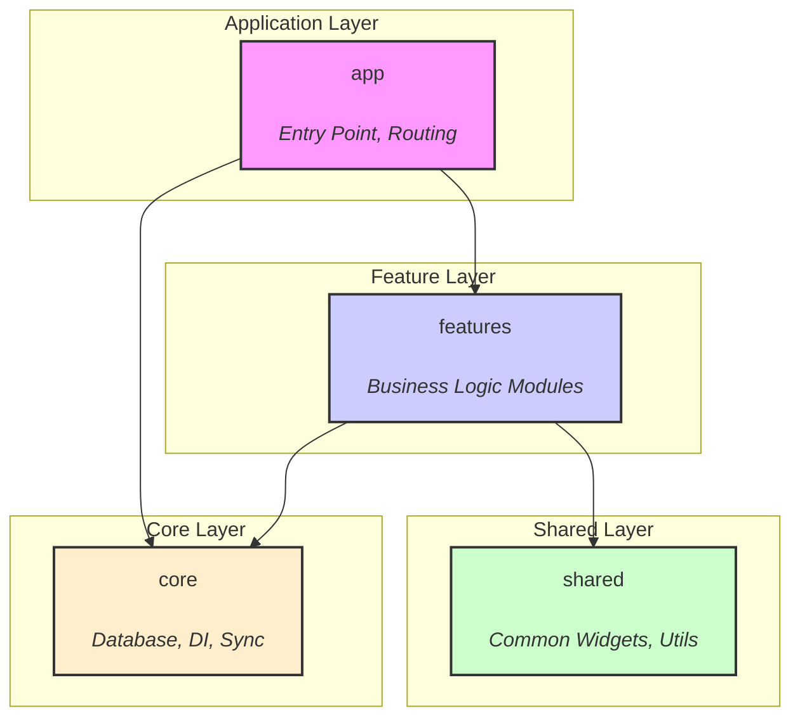
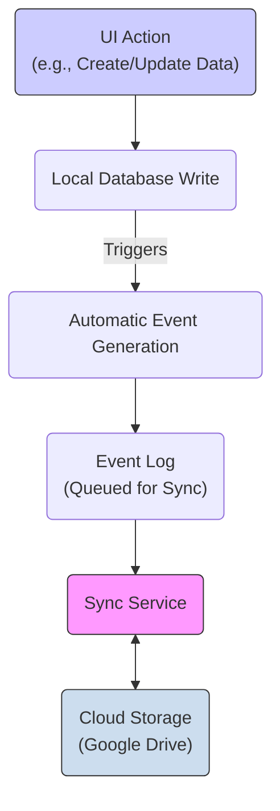
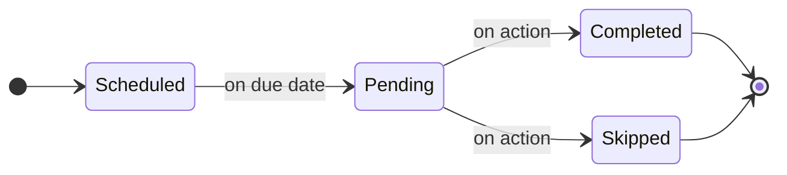
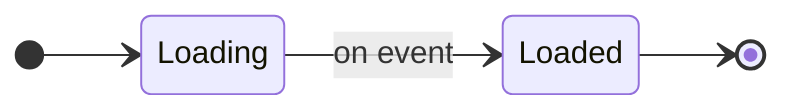

# 📖 Finance App – Developer Reference Hub

Welcome to the **Finance App** documentation. This single page is your _one-stop jump-off point_: every other guide lives only one click away. Search with **Ctrl/Cmd-F** or scan the tables below.

---

## 🚀 Getting Started

To get the project running locally, follow these steps.

**Prerequisites:**
- **Flutter SDK:** Version 3.x.x (check `pubspec.yaml` for the exact constraint)
- **IDE:** Android Studio or VS Code with the Flutter plugin.

**Setup & Run:**
1.  **Install dependencies:** `flutter pub get`
2.  **Run code generation:** `dart run build_runner build --delete-conflicting-outputs`
3.  **Run the app:** `flutter run`
4.  **Run tests:** `flutter test`

---

## 01 · File & Project Structure 📂

The project follows a feature-first Clean Architecture. The `lib/` directory is organized into four main layers:
- `features/`: Each business feature (e.g., `transactions`, `budgets`) is a self-contained module with its own data, domain, and presentation layers.
- `core/`: Shared infrastructure like database, dependency injection, and sync services.
- `shared/`: Common widgets, utilities, and extensions used across multiple features.
- `app/`: The root of the application, containing the main app widget, router, and entry point (`main.dart`).

This structure promotes modularity and separation of concerns, making the codebase easier to navigate and maintain.



| 🔗 Link | Description |
|---|---|
| [File Structure Guide](FILE_STRUCTURE.md) | Clean-Architecture map of the `lib/` source tree, build tooling & generated code locations. |

**Quick reference – bootstrap & structure files**

- `main.dart` – Application entry point; boots DI, localization and Material You theming.
- `app/app.dart` – Root `MaterialApp` with adaptive theme + router injection.
- `app/router/app_router.dart` – Central GoRouter map with custom page transitions.
- `core/di/injection.dart` – GetIt service-locator (`configureDependencies()`).
- `core/database/app_database.dart` – Drift database, table definitions & migrations.

---

## 02 · Core Infrastructure 🔧
| 🔗 Link | Description |
|---|---|
| [Database Caching](DATABASE_CACHING_GUIDE.md) | High-speed in-memory cache layer for Drift/SQLite queries. |
| [Data Sync Engine](DATA_SYNC_GUIDE.md) | Advanced, CRDT-inspired event-sourcing engine for real-time, multi-device sync, conflict resolution, and offline-first operation. |
| [Currency Management](CURRENCY_MANAGEMENT_SYSTEM.md) | Currency data, formatting, conversion APIs & offline support. |

**Data Sync Engine – High-Level Flow**


**Quick reference – core services & helpers**

***Database Caching***
- `DatabaseCacheService` – Singleton in-memory key→value store with TTL.
- `CacheableRepositoryMixin` – Adds `cacheRead`/`invalidateCache` helpers to repositories.

***Data Sync Engine***
- `SyncService` – Primary interface (`getIt<SyncService>()`). Use `IncrementalSyncService` implementation.
- `performFullSync()` – Main method for bi-directional sync.
- `syncToCloud()` / `syncFromCloud()` – For one-way syncs.
- `syncStatusStream` – `Stream<SyncStatus>` for reactive UI updates.
- `CRDTConflictResolver` – Handles data conflicts automatically.
- **How it works:** All local database changes (CUD) automatically generate events via triggers. The `SyncService` processes these events from a queue, ensuring offline capability and real-time updates when connected.

***Currency Management***
- `CurrencyService` – Facade for currency lookup, formatting & conversion.
- `formatAmount()` – Format numbers with currency symbol/code/compact style.
- `convertAmount()` – Convert amounts using cached/remote exchange rates.
- `getExchangeRate()` – Low-level helper to fetch a specific rate.

---

## 03 · Core Technologies & Key Dependencies 🛠️

This project leverages a set of robust and well-supported libraries to ensure a high-quality, maintainable codebase.

| Library | Role | Rationale |
|---|---|---|
| **`go_router`** | Routing | Provides a declarative, URL-based API for navigation, simplifying deep linking and routing logic. |
| **`flutter_bloc`** | State Management | Enforces a predictable state management pattern, separating business logic from the UI. |
| **`drift`** | Database | A powerful, reactive persistence library for Flutter and Dart, built on top of SQLite. |
| **`get_it`** | Service Locator | A simple and fast service locator for dependency injection, decoupling components. |
| **`freezed`** | Code Generation | Generates immutable data classes and unions, reducing boilerplate and improving type safety. |
| **`dio`** | Networking | A powerful HTTP client for Dart, which supports interceptors, global configuration, etc. |
| **`flutter_animate`** | **Animation** | **A performant, declarative library for composing complex animations. Replaces manual `AnimationController` logic for improved readability and maintainability.** |
| **`infinite_scroll_pagination`** | **UI/Pagination** | **Provides an efficient, out-of-the-box solution for creating paginated (lazy-loading) lists, preventing large data loads and improving UI performance.** |

---

## 04 · Domain Features 💼
| 🔗 Link | Description |
|---|---|
| [Transactions – Basics](TRANSACTIONS_BASICS.md) | CRUD operations, models & core helpers. |
| [Transactions – Attachments](ATTACHMENTS_SYSTEM.md) | Local-first files with compression & Google Drive backup. |
| [Transactions – Analytics](TRANSACTIONS_ANALYTICS.md) | Analytics, search & filtering. |
| [Transactions – Advanced](TRANSACTIONS_ADVANCED_FEATURES.md) | Subscriptions, recurring payments, loan tracking. |
| [Transactions – States & Actions](TRANSACTIONS_STATES_AND_ACTIONS.md) | Lifecycle states (`pending`, `scheduled`, etc.) & context-aware actions. |
| [Transactions – Integration](TRANSACTIONS_INTEGRATION.md) | Validation, error handling & best-practice integration. |
| [Budget Tracking](BUDGET_TRACKING_SYSTEM.md) | Create, filter & monitor budgets with real-time streams. |
| [Category Management](CATEGORIES_GUIDE.md) | Classify transactions with default and custom categories. |
| [Account Management](ACCOUNTS_GUIDE.md) | Create accounts, set balances & currency handling. |

### 🎯 Widget & Helper Cheatsheet

**Quick reference – domain APIs & helpers**

**Transactions – Basics**  
- `getAllTransactions()` – Fetch all transactions.  
- `getTransactions(page, limit)` – **🆕 Phase 1.2:** Fetch a paginated list of transactions.  
- `getTransactionsByAccount(accountId)` – Filter by account.  
- `getTransactionsByCategory(categoryId)` – Filter by category.  
- `getTransactionsByDateRange(from, to)` – Filter by date range.  
- `getTransactionById(id)` – Get a single transaction.  
- `createTransaction(transaction)` – Insert a new transaction.  
- `updateTransaction(transaction)` – Update an existing transaction.  
- `deleteTransaction(id)` – Remove a transaction.

**Transactions – Attachments**  
- `compressAndStoreFile(filePath, transactionId, fileName)` – Compress image/file and prepare it for local storage.
- `createAttachment(attachment)` – Persist attachment metadata to the database.
- `updateAttachment(attachment)` – Update an existing attachment.
- `deleteAttachment(id)` – Permanently delete an attachment and its file.
- `markAsDeleted(id)` – Soft-delete an attachment (marks for deletion, moves to Drive trash).
- `uploadToGoogleDrive(attachment)` – Cloud backup with deduplication.
- `getLocalFilePath(attachment)` – Ensure a local copy of the file exists (auto-downloads if needed).
- `getAttachmentsByTransaction(transactionId)` – List all attachments for a specific transaction.

**Transactions – Analytics**  
- `getTotalByCategory(categoryId, [from], [to])` – Aggregate spend per category.  
- `getTotalByAccount(accountId, [from], [to])` – Aggregate per account.  
- `getSpendingByCategory(from, to)` – Category → amount map.  
- `searchTransactions(query)` – Full-text search in title & notes.

**Transactions – Advanced**  
- `TransactionType` / `TransactionRecurrence` – Enums for advanced flows.  
- `Transaction.isSubscription` / `.isLoan` – Convenience getters.  
- `Transaction.specialType` – `credit` / `debt` classification.  
- `Transaction.periodLength` & `endDate` – Control recurrence and auto-cancel.  
- `collectPartialCredit(credit, amount)` – Collect a partial payment for a credit/loan.
- `settlePartialDebt(debt, amount)` – Settle a partial amount for a debt.
- `getLoanPayments(parentTransactionId)` – Get all payments made for a specific loan.
- `getRemainingAmount(loan)` – Calculate the outstanding balance of a loan.

**Transactions – States & Actions**  
- `TransactionState` – `pending`, `scheduled`, `actionRequired`, etc.  
- `TransactionAction` – `pay`, `skip`, `collect`, `settle`, …  
- `Transaction.remainingAmount` – Outstanding amount for loans.  
- `Transaction.availableActions` – Getter returning valid actions array.



**Budget Tracking**  
*Repository (`BudgetRepository`)*
- `createBudget(budget)` / `updateBudget(budget)` / `deleteBudget(id)` – CRUD operations for budgets.
- `getAllBudgets()` / `getActiveBudgets()` – Fetch all or only active budgets.
- `getBudgetById(id)` / `getBudgetsByCategory(categoryId)` – Fetch specific budgets.
- `addTransactionToBudget(transactionId, budgetId)` – Manually link a transaction to a budget.
- `removeTransactionFromBudget(transactionId, budgetId)` – Remove a manual link.

*Calculation & Filtering (`BudgetFilterService`)*
- `calculateBudgetSpent(budget)` / `calculateBudgetRemaining(budget)` – Compute totals.
- `shouldIncludeTransaction(budget, transaction)` – Check if a transaction belongs to a budget.
- `exportMultipleBudgets(budgets)` - Exports a list of budgets to CSV.

*Real-time Updates & Recalculation (`BudgetUpdateService`)*
- `watchAllBudgetUpdates()` – Stream of budget list changes.
- `watchBudgetSpentAmounts()` – Stream of live spent amount deltas for all budgets.
- `recalculateBudgetSpentAmount(budgetId)` – Force a recalculation of a budget's spent amount.
- `recalculateAllBudgetSpentAmounts()` – Force a recalculation for all budgets.

**Category Management**  
- `getAllCategories()` – List all categories.
- `getCategoryById(id)` – Get a single category by its ID.
- `getExpenseCategories()` – Filter by expense type.
- `getIncomeCategories()` – Filter by income type.
- `createCategory(category)` – Add a new category.
- `updateCategory(category)` – Update an existing category.
- `deleteCategory(id)` – Remove a category.

**Account Management**  
- `createAccount(account)` – Add a new account.  
- `updateAccount(account)` – Update an existing account.  
- `deleteAccount(id)` – Remove an account.  
- `getAllAccounts()` – List all accounts.  
- `getAccountById(id)` – Get a single account by its ID.  
- `getDefaultAccount()` – Get the user's default account.  
- `updateBalance(accountId, amount)` – Directly update an account's balance.  
- `formatBalance()` – Extension to format balance with currency & locale.

---

## 05 · UI & Navigation 🎨

### Navigation
| 🔗 Link | Description |
|---|---|
| [Navigation & Routing](NAVIGATION_ROUTING.md) | Conceptual overview, GoRouter route table, deep-link formats & guard patterns. |
| [UI Navigation Widgets](UI_NAVIGATION.md) | GoRouter setup, page transitions, adaptive navigation & `OpenContainer` helpers. |

### UI Framework
| 🔗 Link | Description |
|---|---|
| [UI Architecture & Theming](UI_ARCHITECTURE_AND_THEMING.md) | Clean Architecture for UI, theme setup (colors, text) & Material You support. |
| [UI Core Widgets](UI_CORE_WIDGETS.md) | Reusable widgets for text, buttons, pages & lists. |
| [UI Animation Framework](UI_ANIMATION_FRAMEWORK.md) | Guide to the app's animation system. **Note: The framework is being migrated from custom widgets to `flutter_animate`.** |
| [UI Dialogs & Pop-ups](UI_DIALOGS_AND_POPUPS.md) | Dialog, bottom-sheet & modal frameworks. |
| [UI Patterns & Best Practices](UI_PATTERNS_AND_BEST_PRACTICES.md) | State management with BLoC, error/loading patterns & lifecycle management. |
| [UI Testing & Troubleshooting](UI_TESTING_AND_TROUBLESHOOTING.md) | Widget testing setup, troubleshooting common UI issues & performance tips. |

**Quick reference – UI widgets & helpers**

**UI Core Widgets**  
- `AppText()` / `AppTextStyles.*()` – Consistent typography wrappers & presets.
- `PageTemplate()` – Configurable, sliver-friendly page scaffold with a collapsing app bar.
- `LanguageSelector()` – Drop-in language picker.
- `.tappable()` / `TappableWidget` – Add unified tap feedback.

**Animation Framework**  
- `FadeIn`, `ScaleIn`, `SlideIn` – Entrance animations respecting motion settings.  
- `BouncingWidget`, `BreathingWidget` – Looping attention-grabbers.  
- `SlideFadeTransition()` – Combined slide + fade.  
- `.openContainerNavigation()` – Easy Material container transform.

**Theming**  
- `AppTheme.of(context)` – Access current theme data.  
- `AppColors.*` – Semantic color lookup ("success", "error", …).  
- `AppTextTheme` – Centralised TextTheme definitions.

**Navigation**  
- `context.go(...)` / `context.goNamed(...)` – Push a route via GoRouter.  
- `AppPageTransitions.slideTransitionPage()` – Apply slide transition.  
- `AdaptiveBottomNavigation` – Animated bottom navigation bar.  
- `OpenContainerCard` / `OpenContainerListTile` – Out-of-the-box container transitions.

**Dialogs & Pop-ups**  
- `DialogService.showPopup()` – Present modal content with theme & haptic feedback.  
- `DialogService.showConfirmationDialog()` – Yes/No confirmation flow.  
- `BottomSheetService.showSimpleBottomSheet()` – Quick bottom-sheet.  
- `BottomSheetService.showOptionsBottomSheet()` – Options list bottom-sheet.

**Testing & Troubleshooting**  
- `pumpApp(widget)` – Helper to wrap widgets with providers in tests.  
- `WidgetTester` extensions – `tapAndSettle()`, `enterTextSlowly()`.  
- `GoldenToolkit.pumpGolden()` – Golden image snapshot helper.

---

## 06 · Common Tasks & Development Recipes 🍳

This section is a cookbook for common development scenarios. Instead of just pointing to a file, these recipes outline the typical steps and reference the key guides you'll need.

| I need to... | Key Steps & Where to Look |
| --- | --- |
| **...add a new feature screen?** | 1. **Routing:** Define a new route in `app/router/app_router.dart` ([Navigation & Routing](NAVIGATION_ROUTING.md)).<br/>2. **UI:** Build the screen using `PageTemplate` and other reusable widgets ([UI Core Widgets](UI_CORE_WIDGETS.md)).<br/>3. **State:** Manage state following our patterns ([UI Patterns & Best Practices](UI_PATTERNS_AND_BEST_PRACTICES.md)). |
| **...add a field to a database table?** | 1. **Schema:** Modify the Drift table in `app_database.dart`.<br/>2. **Migration:** Create a new migration file (see `core/database/migrations/`).<br/>3. **Sync:** If the field is synced, update the `EventProcessor` and conflict resolver ([Data Sync Engine](DATA_SYNC_GUIDE.md)). |
| **...debug a slow screen or query?** | 1. **Caching:** Check if the data can be/is cached via `DatabaseCacheService` ([Database Caching](DATABASE_CACHING_GUIDE.md)).<br/>2. **SQL:** Analyze the Drift query performance using its tools.<br/>3. **UI:** Check for expensive widget rebuilds using Flutter DevTools. |
| **...implement a complex, multi-step user flow?** | 1. **Navigation:** Use GoRouter's stateful shell routes or sub-routes ([Navigation Routing](NAVIGATION_ROUTING.md)).<br/>2. **UI:** Use `OpenContainer` transforms for a seamless experience ([UI Animation Framework](UI_ANIMATION_FRAMEWORK.md)).<br/>3. **State:** Model the flow with a dedicated BLoC or state machine. |
| **...add a new type of recurring transaction?** | 1. **Model:** Extend `TransactionRecurrence` and associated logic ([Transactions – Advanced](TRANSACTIONS_ADVANCED_FEATURES.md)).<br/>2. **State:** Update `TransactionState` and `TransactionAction` if new lifecycle events are needed ([States & Actions](TRANSACTIONS_STATES_AND_ACTIONS.md)).<br/>3. **Integration:** Ensure it integrates with analytics and budgeting systems. |
| **...build a new analytics dashboard?** | 1. **Data:** Add aggregation queries to the relevant repository ([Transactions – Analytics](TRANSACTIONS_ANALYTICS.md)).<br/>2. **Performance:** Cache expensive queries aggressively ([Database Caching](DATABASE_CACHING_GUIDE.md)).<br/>3. **Visualization:** Use custom painters or a charting library, wrapped in. our animation widgets for impact ([UI Animation Framework](UI_ANIMATION_FRAMEWORK.md)). |
| **...resolve a data sync conflict?** | 1. **Understand:** Read the `CRDTConflictResolver` logic in the [Data Sync Engine](DATA_SYNC_GUIDE.md)).<br/>2. **Monitor:** Use `SyncStateManager` to observe sync events in real-time.<br/>3. **Test:** Write a unit test that reproduces the specific conflict scenario. |
| **...create a custom, app-themed dialog?** | 1. **Framework:** Use `DialogService` to ensure consistent theming, haptics, and animations.<br/>2. **Content:** Build the dialog's content widget.<br/>3. **Launch:** Call `DialogService.showPopup()` ([UI Dialogs & Pop-ups](UI_DIALOGS_AND_POPUPS.md)). |
| **...add support for file attachments to a new feature?** | 1. **Local First:** Use `compressAndStoreFile` to handle the file locally ([Attachments System](ATTACHMENTS_SYSTEM.md)).<br/>2. **Metadata:** Create the attachment record via `createAttachment` linking it to your parent entity.<br/>3. **Cloud Backup:** The system will handle Google Drive backup automatically. |
| **...format a value into a specific currency?** | 1. **Service:** Use the `CurrencyService` facade for all conversions and formatting ([Currency Management](CURRENCY_MANAGEMENT_SYSTEM.md)).<br/>2. **UI:** Use the `formatAmount()` helper for a quick, consistent format.<br/>3. **Offline:** Trust the service to handle offline/cached rates gracefully. |
| **...find a generated Drift file?** | Generated code lives next to its source. Look for `.g.dart` files. For database code, check `core/database/app_database.g.dart` ([File Structure Guide](FILE_STRUCTURE.md)). |
| **...run a widget test with all providers?** | Use the `pumpApp(widget)` test helper to wrap your widget in `MaterialApp` and all necessary providers ([UI Testing & Troubleshooting](UI_TESTING_AND_TROUBLESHOOTING.md)). |

---

## 07 · Development Workflow & Testing 👨‍💻

This section outlines the standards and practices for contributing to the project, from testing to code style.

### Testing Philosophy
We aim for high test coverage to ensure stability. Our strategy is:
- **Unit Tests:** For business logic in repositories, services, and BLoCs. Mocks are located in `test/mocks/`.
- **Widget Tests:** For individual widgets and simple screen flows. Use helpers in `test/helpers/` like `pumpApp()` to wrap widgets with necessary providers.
- **Integration Tests:** For critical, end-to-end user flows, especially involving the database and sync engine.

### State Management with BLoC
We use `flutter_bloc` for predictable state management. When creating a new feature, follow this canonical example:
```dart
// 1. Define Events
abstract class MyFeatureEvent {}
class LoadData extends MyFeatureEvent {}

// 2. Define States
abstract class MyFeatureState {}
class Loading extends MyFeatureState {}
class Loaded extends MyFeatureState {
  final MyData data;
  Loaded(this.data);
}

// 3. Implement the BLoC
class MyFeatureBloc extends Bloc<MyFeatureEvent, MyFeatureState> {
  MyFeatureBloc() : super(Loading()) {
    on<LoadData>((event, emit) async {
      // emit(Loading()); // Already initial state
      final data = await _myRepository.fetchData();
      emit(Loaded(data));
    });
  }
}
```



### Code Generation
The project uses `freezed` for data classes and `drift` for the database. If you modify any file that requires code generation (e.g., `app_database.dart`, model files), run the build runner:
```bash
dart run build_runner build --delete-conflicting-outputs
```

### Contributing & Style
1.  **Docs First:** Update the relevant guide before submitting code. If a new guide is created, link it in this README.
2.  **Linting:** Run `dart format .` & `dart analyze` before every PR to ensure code style consistency.
3.  **Branch Naming:** Use `docs/<topic>` for documentation changes or `feature/<ticket>-<short-description>` for new features/fixes.
4.  **Pull Requests (PRs):**
    - Provide a clear description of the changes.
    - Link to the relevant issue or ticket.
    - Include screenshots or GIFs for any UI changes.
    - Ensure all new code is covered by tests and documentation is updated.

---

*Last updated: <!-- 2025-06-22 -->*

---
---

# 📱 Finance App - File Structure Documentation

This Flutter application follows **Clean Architecture** principles with a clear separation of concerns across Presentation, Domain, and Data layers.

## 🏗️ Architecture Overview

```
📱 Presentation Layer (UI)
    ├── Pages (Screens)
    ├── Widgets (UI Components)  
    └── BLoC (State Management)
           ↓
⚙️ Domain Layer (Business Logic)
    ├── Entities (Data Models)
    ├── Use Cases (Business Rules)
    └── Repositories (Interfaces)
           ↓
💾 Data Layer (External)
    ├── Data Sources (API, Local DB)
    ├── Repositories (Implementations)
    └── Models (Data Transfer Objects)
```

## 📁 File Structure

### 🚀 Root Entry Point
```
lib/
├── main.dart                           # App entry point - initializes dependencies, settings, localization
├── demo/                              # Demo and example code
│   └── currency_demo.dart            # Currency system demonstration
└── tmp/                               # Temporary files and development resources
    ├── currencies.json               # Currency data (54KB)
    ├── currenciesInfo.json           # Currency information data (28KB)
    ├── currenciesInfo2.json          # Additional currency data (22KB)
    └── ONLY_FOR_TEMPORARY_FILE_ONLY  # Placeholder file
```
**Summary**: Main application entry point that initializes the Flutter app, sets up dependency injection, localization, Material You theming, and Bloc observers. Includes demo code and temporary development resources.

---

### 📱 App Configuration Layer
```
lib/app/
├── app.dart                           # Main app widget with theme and routing setup
└── router/                            # Navigation configuration
    ├── app_router.dart               # GoRouter setup with enhanced page transitions
    ├── app_routes.dart               # Route constants and path definitions
    └── page_transitions.dart         # Phase 4: Page transition framework with platform-aware animations
```
**Summary**: Contains the main app configuration including routing setup using GoRouter, theme management, and app-level state providers.

---

### ⚙️ Core Layer (Infrastructure & Shared Services)
```
lib/core/
├── database/                          # Database layer (Drift/SQLite)
│   ├── app_database.dart             # Main database class with table definitions and migrations
│   ├── app_database.g.dart           # Generated Drift database code
│   ├── migrations/                  # Database schema migrations
│   │   └── schema_cleanup_migration.dart # Phase 4 schema cleanup
│   └── tables/                       # Database table definitions
│       ├── financial_tables.dart     # Combined financial table definitions
│       ├── transactions_table.dart   # Transaction table schema
│       ├── categories_table.dart     # Category table schema
│       ├── budgets_table.dart        # Budget table schema
│       ├── accounts_table.dart       # Account table schema
│       ├── attachments_table.dart    # Attachment/file table schema
│       └── sync_metadata_table.dart  # Sync metadata for cloud synchronization
├── services/                         # Core service layer
│   ├── database_service.dart         # Database service abstraction
│   ├── file_picker_service.dart      # File selection and attachment processing service
│   ├── cache_management_service.dart # Local file cache management service
│   ├── database_cache_service.dart # Phase 2: In-memory cache for database queries
│   ├── database_connection_optimizer.dart # SQLite performance and WAL optimizations
│   ├── timer_management_service.dart # Phase 1: Centralized timer management with battery-aware scheduling
│   ├── platform_service.dart        # Platform detection, device capabilities, and high refresh rate management service
│   ├── dialog_service.dart          # Dialog and popup service (Phase 3)
│   └── animation_performance_service.dart # Phase 6: Advanced animation performance optimization and monitoring service
├── sync/                             # Cloud synchronization services (Phase 5A)
│   ├── sync_service.dart            # Legacy sync service interface
│   ├── incremental_sync_service.dart # Event-driven sync service (Phase 4)
│   ├── enhanced_incremental_sync_service.dart # Phase 5A enhanced sync service
│   ├── event_processor.dart         # Phase 5A event processing engine
│   ├── sync_state_manager.dart      # Phase 5A sync state and progress tracking
│   ├── crdt_conflict_resolver.dart  # CRDT-based conflict resolution
│   ├── google_drive_sync_service.dart # Google Drive sync implementation
│   ├── interfaces/                  # Team A/B interface contracts
│   │   └── sync_interfaces.dart    # Shared sync service interfaces
│   └── (migrations moved to core/database/migrations — see below)
├── utils/                            # Core utilities
│   └── bloc_observer.dart           # BLoC observer for debugging and logging
├── theme/                            # App theming system
│   ├── app_theme.dart               # Main theme definitions (light/dark)
│   ├── app_colors.dart              # Color constants and Material You colors
│   ├── app_text_theme.dart          # Typography definitions
│   └── material_you.dart            # Material You dynamic color implementation
├── settings/                         # App settings management
│   └── app_settings.dart            # SharedPreferences-based settings manager
├── constants/                        # App constants and default data
│   └── default_categories.dart      # Default financial categories with emojis
└── di/                              # Dependency Injection
    ├── injection.dart               # GetIt service locator configuration
    └── injection.config.dart        # Generated dependency injection configuration
```
**Summary**: Core infrastructure layer containing database setup with Drift ORM, file management and attachment services, **Phase 1 centralized timer management**, **Phase 5A advanced sync services** with event sourcing and real-time capabilities, **Phase 6.1 animation performance optimization**, platform detection with high refresh rate management for optimal display performance, theming system with Material You support, dependency injection setup, and shared utilities.

---

### 🎯 Features Layer (Business Features)
```
lib/features/
├── home/                             # Home screen feature
│   ├── presentation/                 # UI layer
│   │   └── pages/
│   │       └── home_page.dart       # Main dashboard page
│   └── widgets/                      # Home-specific widgets
│       └── home_page_username.dart   # Username display widget
├── transactions/                     # Transaction management feature
│   ├── domain/                       # Business logic layer
│   │   ├── entities/
│   │   │   ├── transaction.dart     # Transaction entity/model
│   │   │   └── attachment.dart      # Attachment entity with Google Drive integration
│   │   ├── repositories/
│   │   │   ├── transaction_repository.dart # Transaction repository interface
│   │   │   └── attachment_repository.dart # Attachment repository interface
│   │   └── usecases/                # Business use cases
│   │       ├── get_transactions.dart # Transaction retrieval use cases
│   │       └── manage_transactions.dart # Transaction management use cases
│   ├── data/                        # Data access layer
│   │   └── repositories/
│   │       ├── transaction_repository_impl.dart # Transaction repository implementation
│   │       └── attachment_repository_impl.dart # Attachment repository implementation
│   └── presentation/                # UI layer
│       ├── pages/
│       │   └── transactions_page.dart # Transaction list/management page
│       └── bloc/                    # State management
│           ├── transactions_event.dart # Transaction events
│           └── transactions_state.dart # Transaction states
├── budgets/                         # Budget management feature
│   ├── domain/                      # Business logic layer
│   │   ├── entities/
│   │   │   └── budget.dart          # Budget entity/model
│   │   └── repositories/
│   │       └── budget_repository.dart # Budget repository interface
│   ├── data/                        # Data access layer
│   │   └── repositories/
│   │       └── budget_repository_impl.dart # Budget repository implementation
│   └── presentation/                # UI layer
│       └── pages/
│           └── budgets_page.dart    # Budget management page
├── accounts/                        # Account management feature
│   ├── domain/                      # Business logic layer
│   │   ├── entities/
│   │   │   └── account.dart         # Account entity/model
│   │   └── repositories/
│   │       └── account_repository.dart # Account repository interface
│   └── data/                        # Data access layer
│       └── repositories/
│           └── account_repository_impl.dart # Account repository implementation
├── categories/                      # Category management feature
│   ├── domain/                      # Business logic layer
│   │   ├── entities/
│   │   │   └── category.dart        # Category entity/model
│   │   └── repositories/
│   │       └── category_repository.dart # Category repository interface
│   └── data/                        # Data access layer
│       └── repositories/
│           └── category_repository_impl.dart # Category repository implementation
├── currencies/                      # Currency and exchange rate feature
│   ├── domain/                      # Business logic layer
│   │   ├── entities/
│   │   │   ├── currency.dart        # Currency entity with formatting
│   │   │   └── exchange_rate.dart   # Exchange rate entity
│   │   ├── repositories/
│   │   │   └── currency_repository.dart # Currency repository interface
│   │   └── usecases/
│   │       └── get_currencies.dart  # Currency retrieval use cases
│   └── data/                        # Data access layer
│       ├── repositories/
│       │   └── currency_repository_impl.dart # Currency repository implementation
│       ├── datasources/             # Data sources
│       │   ├── currency_local_data_source.dart # Local currency data
│       │   ├── exchange_rate_local_data_source.dart # Local exchange rates
│       │   └── exchange_rate_remote_data_source.dart # Remote exchange API
│       └── models/                  # Data transfer objects
│           ├── currency_model.dart  # Currency data model
│           └── exchange_rate_model.dart # Exchange rate data model
├── navigation/                      # Navigation feature (Enhanced in Phase 5)
│   ├── domain/                      # Navigation entities
│   │   └── entities/                # Navigation-related entities
│   │       └── navigation_item.dart # Navigation item entity with customization support
│   └── presentation/                # Navigation UI components
│       ├── widgets/                 # Navigation widgets
│       │   ├── adaptive_bottom_navigation.dart # Bottom navigation bar with TappableWidget integration
│       │   ├── main_shell.dart      # Main app shell wrapper with PopupFramework integration
│       │   └── navigation_customization_content.dart # Phase 5: Custom dialog content for navigation customization
│       └── bloc/                    # Navigation state management
│           ├── navigation_bloc.dart # Navigation BLoC
│           ├── navigation_event.dart # Navigation events
│           ├── navigation_state.dart # Navigation states
│           └── navigation_bloc.freezed.dart # Generated freezed code
├── settings/                        # Settings feature
│   └── presentation/                # Settings UI
│       ├── pages/                   # Settings pages
│       └── bloc/                    # Settings state management
│           └── settings_bloc.dart   # Settings BLoC
└── more/                           # More/additional features page
    └── presentation/                # More page UI
```
**Summary**: Feature modules organized by business domain, each following clean architecture with domain (entities, repositories, use cases), data (repository implementations, data sources), and presentation (UI, BLoC) layers. Includes comprehensive attachment management with Google Drive integration and multi-currency support.

---

### 🔧 Services Layer (Business Services)
```
lib/services/
├── finance_service.dart              # Example service demonstrating repository usage
└── currency_service.dart             # Business logic service for currency utilities and conversions
```
**Summary**: High-level business services that orchestrate multiple repositories and demonstrate usage patterns for the finance app's core functionality.

---

### 🛠️ Shared Layer (Reusable Components)
```
lib/shared/
├── widgets/                          # Reusable UI components
│   ├── animations/                   # Comprehensive animation framework (Phase 1-6)
│   │   ├── animation_utils.dart     # Core animation utilities with performance optimization
│   │   ├── fade_in.dart             # Fade entrance animation
│   │   ├── scale_in.dart            # Scale entrance animation with elastic curves
│   │   ├── slide_in.dart            # Directional slide animations
│   │   ├── bouncing_widget.dart     # Elastic bouncing effects
│   │   ├── breathing_widget.dart    # Pulsing scale animations
│   │   ├── animated_expanded.dart   # Smooth expand/collapse with fade
│   │   ├── animated_size_switcher.dart # Content switching with size transitions
│   │   ├── scaled_animated_switcher.dart # Scale + fade content switching
│   │   ├── slide_fade_transition.dart # Combined slide and fade effects
│   │   ├── tappable_widget.dart     # Tap response with customizable feedback (Enhanced in Phase 5)
│   │   ├── shake_animation.dart     # Horizontal shake effects for errors
│   │   └── animated_scale_opacity.dart # Combined scale and opacity changes
│   │   └── animation_performance_monitor.dart # Real-time performance monitor widget
│   ├── app_lifecycle_manager.dart   # App lifecycle manager for handling resume/pause events and high refresh rate
│   ├── dialogs/                      # Reusable dialog framework (Phase 3)
│   │   ├── popup_framework.dart     # Reusable popup template with Material 3 design
│   │   └── bottom_sheet_service.dart # Smart bottom sheets with snapping and options
│   ├── transitions/                  # Page transition components (Phase 4)
│   │   └── open_container_navigation.dart # Material 3 OpenContainer navigation components
│   ├── app_text.dart                # Custom text widgets with theming
│   ├── page_template.dart           # Common page layout template (Enhanced in Phase 5 with FadeIn and AnimatedSwitcher)
│   └── language_selector.dart       # Language selection widget
├── extensions/                      # Reusable extension methods
│   └── account_currency_extension.dart # Account to currency helpers and formatters
└── utils/                           # Shared utilities
    └── currency_formatter.dart       # Currency formatting with locale support
```
**Summary**: Shared components and utilities that can be used across multiple features, including a comprehensive animation and dialog framework, reusable widgets, and common utilities.

---

### 🧪 Performance & Benchmark Tests
```
test/performance/
  └── phase_2_performance_test.dart   # Database cache performance benchmarks (Phase 2)
```
**Summary**: Contains automated Stopwatch-based benchmarks to verify Phase 2 database optimization impact – ensuring cache retrieval is at least 2× faster than uncached database-like operations.

## 🎨 Key Architecture Patterns

### 🏛️ Clean Architecture Implementation
- **Domain Layer**: Pure business logic with entities and repository interfaces
- **Data Layer**: External concerns like database access and API calls
- **Presentation Layer**: UI components and state management with BLoC

### 🗄️ Database Architecture
- **Drift ORM**: Type-safe SQL database access
- **Table Definitions**: Separate files for each entity table
- **Migration Support**: Schema versioning and data migration
- **Sync Metadata**: Cloud synchronization tracking

### 🎨 Theming System
- **Material You**: Dynamic color generation from system
- **Light/Dark Themes**: Comprehensive theme switching
- **Custom Typography**: Consistent text styling across the app
- **Color Management**: Centralized color constants

### 🔄 State Management
- **BLoC Pattern**: Business Logic Components for state management
- **Freezed**: Immutable state and event classes
- **Stream-based**: Reactive state updates

### 🔗 Dependency Injection
- **GetIt**: Service locator pattern
- **Injectable**: Code generation for DI setup
- **Repository Pattern**: Abstracted data access

### 🌐 Localization
- **EasyLocalization**: Multi-language support (English, Vietnamese)
- **Asset-based**: Translation files in assets folder

### 📱 High Refresh Rate Display
- **Android Support**: Uses flutter_displaymode package for high refresh rate on supported devices
- **iOS Support**: Configured with CADisableMinimumFrameDurationOnPhone in Info.plist
- **Lifecycle Management**: Automatically sets high refresh rate on app startup and resume
- **Platform Detection**: Smart detection of device capabilities and platform-specific handling

### ☁️ Cloud Synchronization
- **Google Drive**: Cloud storage for data backup and file attachments
- **Conflict Resolution**: Sync metadata for data consistency
- **Device Management**: Multi-device data synchronization
- **File Upload**: Automatic attachment upload to Google Drive
- **Authentication**: Google Sign-In integration for cloud access

### 📁 File Management & Attachments
- **Attachment System**: Complete file management with Google Drive integration
- **Image Processing**: Automatic compression for camera-captured images
- **Cache Management**: Smart local caching with 30-day expiry for camera images
- **File Types**: Support for images, documents, and other file types
- **Cloud Storage**: Seamless Google Drive upload and sharing

### 💱 Currency System
- **Multi-Currency**: Support for global currencies with exchange rates
- **Currency Formatting**: Native symbol display and proper decimal handling
- **Exchange Rates**: Local and remote data sources for real-time rates
- **Country Integration**: Flag and country information for currencies

## 📊 Feature Completeness
- ✅ **Home Dashboard**: Overview of financial data
- ✅ **Transaction Management**: CRUD operations with attachment support
- ✅ **Attachment System**: File management with Google Drive integration
- ✅ **Category System**: Expense and income categorization with emoji icons
- ✅ **Account Management**: Multiple account support with balance tracking
- ✅ **Budget Tracking**: Budget creation and monitoring
- ✅ **Currency Support**: Multi-currency with exchange rate handling
- ✅ **Navigation**: Bottom navigation with adaptive design
- ✅ **Settings**: App configuration and preferences with enhanced animation controls
- ✅ **Cloud Sync**: Google Drive integration with conflict resolution
- ✅ **File Management**: Camera, gallery, and file picker integration
- ✅ **Cache Management**: Smart local file caching system
- ✅ **Theming**: Material You and custom themes
- ✅ **Localization**: Multi-language support (English, Vietnamese)
- ✅ **Use Cases**: Business logic abstraction layer
- ✅ **State Management**: Comprehensive BLoC implementation
- ✅ **Animation Framework**: Phase 1-6 - Complete animation and dialog framework with performance optimization.

### 🎬 Animation Framework (All Phases Complete)
- **Platform Detection**: Comprehensive platform and device capability detection
- **Animation Settings**: Enhanced user preferences with granular animation controls  
- **Animation Utilities**: Core framework with settings-aware animation wrappers
- **Entry Animations**: FadeIn, ScaleIn, SlideIn, BouncingWidget, BreathingWidget
- **Transition Animations**: AnimatedExpanded, AnimatedSizeSwitcher, ScaledAnimatedSwitcher, SlideFadeTransition
- **Interactive Animations**: TappableWidget, ShakeAnimation, AnimatedScaleOpacity
- **Dialog Framework**: PopupFramework, DialogService, BottomSheetService with animation integration
- **Page Transitions**: Platform-aware slide, fade, scale, and slide-fade transitions with Material 3 OpenContainer support
- **Navigation Enhancement**: Seamless container transitions for card-to-page and list-to-page navigation
- **Phase 5 Integration**: Enhanced navigation with PopupFramework dialogs, animated PageTemplate, and comprehensive TappableWidget integration
- **Performance Optimization**: Battery saver, real-time performance monitoring, and reduced motion support with zero overhead when disabled
- **Platform Adaptation**: iOS, Android, web, and desktop-specific behaviors

This architecture provides a scalable, maintainable foundation for a comprehensive personal finance management application with advanced file management, multi-currency capabilities, and a sophisticated animation framework.
