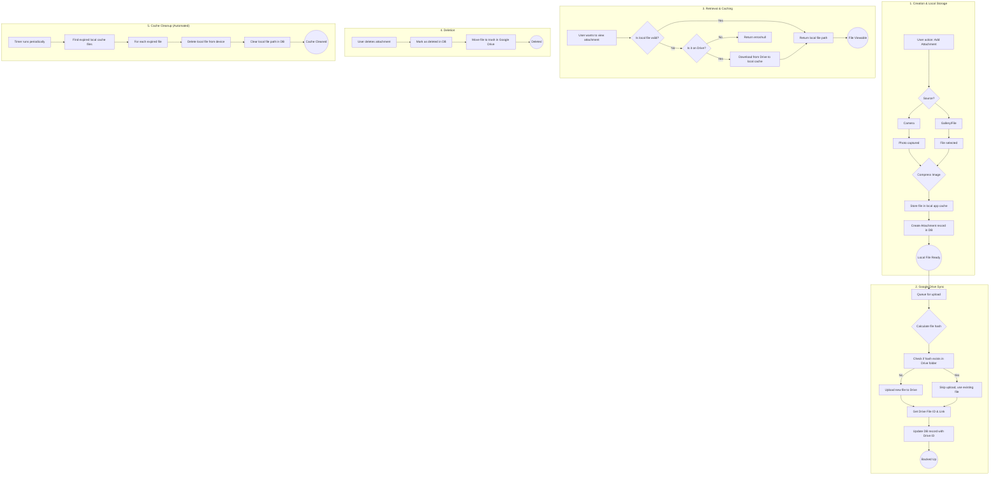

# Transactions: Attachments Guide

This guide provides a comprehensive overview of how to work with transaction attachments, including local caching, file compression, and robust Google Drive integration.

## Core Concepts

The attachment system is designed to be efficient and robust, balancing local storage usage with reliable cloud backup on Google Drive.

1.  **Local-First Access**: Files, especially images from the camera, are cached locally for quick access.
2.  **Intelligent Caching**: Camera images are cached for 30 days. After that, the local copy is deleted to save space, but the file remains safe in Google Drive.
3.  **On-Demand Downloads**: If you try to access a file that's no longer cached locally, the app will automatically download it from Google Drive.
4.  **Smart Google Drive Storage**:
    *   **Organized Folders**: Files are stored in a clean `Attachments/YYYY/MM/<TransactionID>` structure.
    *   **Deduplication**: The system calculates a hash for each file. If the same file is uploaded again for the same transaction, it won't create a duplicate, saving storage space.
    *   **Resilience**: Deleting an attachment from the app moves it to the trash in Google Drive, so it can be recovered if needed.

## Key Components

-   `AttachmentRepository`: The low-level repository responsible for all database and file system operations, including Google Drive communication.
-   `FilePickerService` (Not shown): A higher-level service that likely uses `AttachmentRepository` to provide a simplified UI-facing API for picking and managing attachments. Most features should interact with the `FilePickerService`.

---

## Working with Attachments

### Adding an Attachment (Conceptual Flow)

While you would typically use a `FilePickerService`, the underlying process managed by `AttachmentRepository` is as follows:

1.  A local file path is provided (e.g., from a camera or file picker).
2.  If the file is an image, it's compressed to save space.
3.  An `Attachment` entity is created in the local database, pointing to the local file.
4.  The file is then uploaded to Google Drive in the background. The upload process is smart: it checks if a file with the same content already exists in the transaction's attachment folder on Drive to prevent duplicates.
5.  Once uploaded, the `Attachment` entity is updated with the `googleDriveFileId`.

```dart
// Example: Creating and uploading an attachment manually
// Note: This is for advanced use. In the app, a service would handle this.

// 1. Compress and store the file locally first
final newAttachmentStub = await attachmentRepository.compressAndStoreFile(
  '/path/to/local/image.jpg',
  transactionId,
  'receipt.jpg',
  isCapturedFromCamera: true, // This enables the 30-day local cache
);

// 2. Create the record in the database
final createdAttachment = await attachmentRepository.createAttachment(newAttachmentStub);

// 3. Upload to Google Drive
// This handles folder creation, deduplication, etc.
await attachmentRepository.uploadToGoogleDrive(createdAttachment);

print('Attachment created and upload process started.');
```

### Retrieving an Attachment File Path

You should never assume a file exists locally. Always use `getLocalFilePath` to ensure the file is available, as it will download it from Google Drive if needed.

```dart
// Get a local, viewable file path for an attachment
final localPath = await attachmentRepository.getLocalFilePath(attachment);

if (localPath != null) {
  // Use the file at localPath
  print('File is available at: $localPath');
} else {
  print('Could not retrieve file from local cache or Google Drive.');
}
```

### Getting Attachments for a Transaction

```dart
// Get all non-deleted attachments for a specific transaction
final attachments = await attachmentRepository.getAttachmentsByTransaction(transactionId);
print('Found ${attachments.length} attachments');
```

### Deleting an Attachment

Marking an attachment as deleted is a soft delete. It sets an `isDeleted` flag and moves the corresponding file in Google Drive to the trash. A background process will later delete the file from the local database.

```dart
// Soft-delete an attachment
await attachmentRepository.markAsDeleted(attachment.id!);

// The associated Google Drive file is moved to trash.
// The local database entry is marked as deleted.
```

---

## Attachment Entity

The `Attachment` entity contains all the metadata for a single attachment.

```dart
// A simplified view of the Attachment entity's fields
class Attachment {
  final int? id;
  final String syncId;
  final int transactionId;

  // File Info
  final String fileName;
  final String? filePath; // Path to the file on the local device
  final AttachmentType type;
  final String? mimeType;
  final int? fileSizeBytes;
  
  // Google Drive Info
  final String? googleDriveFileId;
  final String? googleDriveLink; // A viewable link
  final bool isUploaded;

  // State & Cache Management
  final bool isDeleted;
  final bool isCapturedFromCamera; // Key for caching logic
  final DateTime? localCacheExpiry; // Typically 30 days from creation if from camera

  // Timestamps
  final DateTime createdAt;
  final DateTime updatedAt;
}
```

## Database Schema

### AttachmentsTable (Version 2)
The table was updated to support the caching logic.

```dart
class AttachmentsTable extends Table {
  IntColumn get id => integer().autoIncrement()();
  TextColumn get syncId => text()();
  IntColumn get transactionId => integer().references(TransactionsTable, #id)();
  
  // File Info
  TextColumn get fileName => text()();
  TextColumn get filePath => text().nullable()();
  IntColumn get type => integer()(); // Maps to AttachmentType enum
  TextColumn get mimeType => text().nullable()();
  IntColumn get fileSizeBytes => integer().nullable()();

  // Google Drive Info
  TextColumn get googleDriveFileId => text().nullable()();
  TextColumn get googleDriveLink => text().nullable()();
  BoolColumn get isUploaded => boolean().withDefault(const Constant(false))();

  // State & Cache Management
  BoolColumn get isDeleted => boolean().withDefault(const Constant(false))();
  BoolColumn get isCapturedFromCamera => boolean().withDefault(const Constant(false))();
  DateTimeColumn get localCacheExpiry => dateTime().nullable()();

  // Timestamps
  DateTimeColumn get createdAt => dateTime()();
  DateTimeColumn get updatedAt => dateTime()();
}
```
*A database migration from version 1 to 2 handles the addition of the `isCapturedFromCamera` and `localCacheExpiry` columns automatically.*

## Detailed Flow Diagram

This diagram illustrates the complete lifecycle of an attachment, from creation to storage and retrieval.



## Development Notes

### Dependencies
The attachment system relies on the following key packages:
- `drift`: Database ORM
- `google_sign_in`: Google authentication
- `googleapis`: Google Drive API
- `path_provider`: File system access
- `flutter_image_compress`: Image compression

### Code Generation
After making changes to the `AttachmentsTable` schema in `lib/core/database/tables/attachments.dart`, you must run the build runner to update the generated code:
```bash
dart run build_runner build --delete-conflicting-outputs
```

## Next Steps

### 🔄 Pending Tasks

1. **UI Integration**
   - Update attachment display widgets to use `getAttachmentViewPath`
   - Add cache management UI in settings
   - Show cache statistics to users

2. **Background Services** *(Completed in v2.1)*
   - Periodic cache cleanup scheduler implemented via `CacheManagementService.startPeriodicCleanup()` (internally registered with `TimerManagementService`)
   - Cache cleanup now registered during app initialization
   - `CacheStats` monitoring available through `cacheService.getCacheStats()`

3. **Advanced Features**
   - Configurable cache duration (currently fixed at 30 days)
   - Cache size limits and LRU eviction
   - Offline-first attachment access

4. **Code Quality**
   - Address remaining lint warnings (print statements, const constructors)
   - Add more comprehensive error handling
   - Implement proper logging framework

5. **Testing**
   - Add comprehensive integration tests
   - Test cache behavior under various scenarios
   - Performance testing with large attachment sets

## Troubleshooting

### Common Issues

1. **Attachments not displaying**
   - Check if Google Drive sync is working
   - Verify internet connection
   - Check file permissions

2. **Cache not cleaning up**
   - Manually call `cleanExpiredCache()`
   - Check available storage space
   - Verify cache expiry dates

3. **Sync conflicts**
   - Google Drive sync merges metadata by `syncId`
   - Local cache settings are preserved
   - Re-sync usually resolves conflicts

## Development Notes

### Code Generation
After database schema changes, run:
```bash
dart run build_runner build --delete-conflicting-outputs
```

### Static Analysis
Current status: ✅ No critical errors
- Only minor lint warnings remain (print statements, const constructors)
- All core functionality is working

### Dependencies
- `drift`: Database ORM
- `google_sign_in`: Google authentication
- `googleapis`: Google Drive API
- `path_provider`: File system access
- `flutter_image_compress`: Image compression

---

*Last updated: January 2025*
*Implementation status: ✅ Complete - Ready for UI integration and testing*
