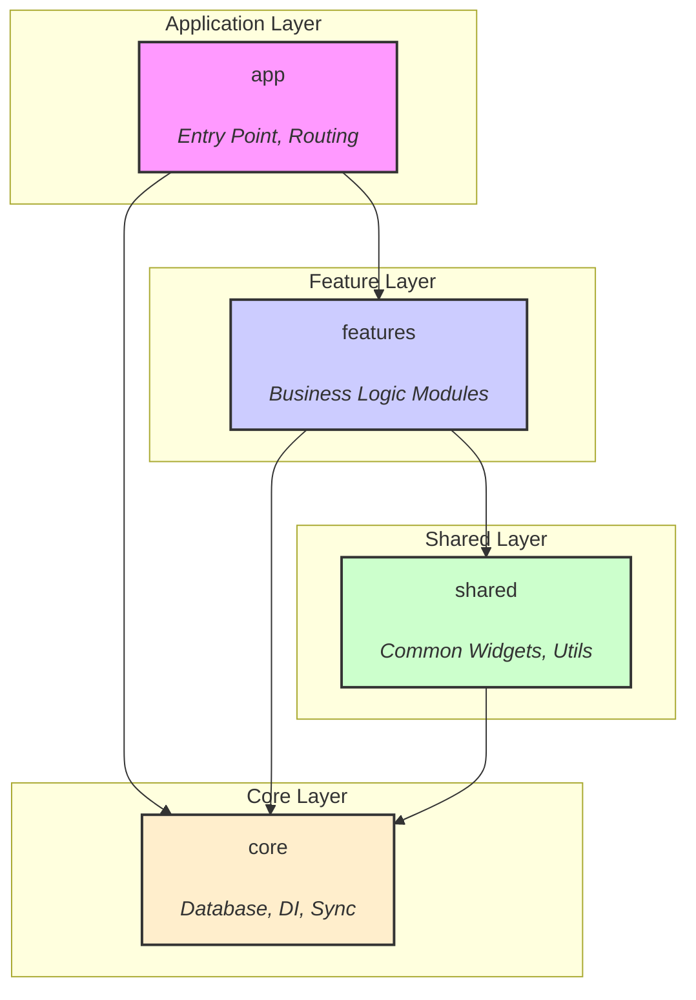
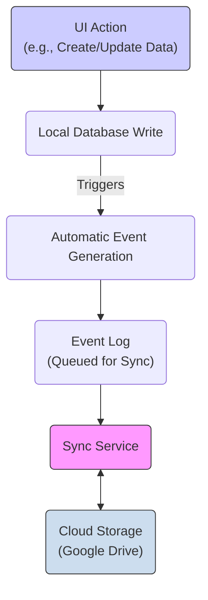
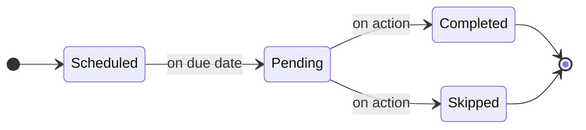
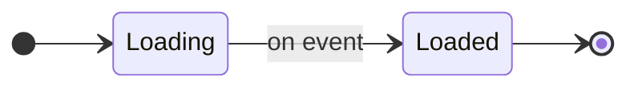

# 📖 Finance App – Developer Reference Hub

Welcome to the **Finance App** documentation. This single page is your _one-stop jump-off point_: every other guide lives only one click away. Search with **Ctrl/Cmd-F** or scan the tables below.

---

## 🚀 Getting Started

To get the project running locally, follow these steps.

**Prerequisites:**
- **Flutter SDK:** Version 3.x.x (check `pubspec.yaml` for the exact constraint)
- **IDE:** Android Studio or VS Code with the Flutter plugin.

**Setup & Run:**
1.  **Install dependencies:** `flutter pub get`
2.  **Run code generation:** `dart run build_runner build --delete-conflicting-outputs`
3.  **Run the app:** `flutter run`
4.  **Run tests:** `flutter test`

---

## 01 · File & Project Structure 📂

The project follows a feature-first Clean Architecture. The `lib/` directory is organized into four main layers:
- `features/`: Each business feature (e.g., `transactions`, `budgets`) is a self-contained module with its own data, domain, and presentation layers.
- `core/`: Shared infrastructure like database, dependency injection, and sync services.
- `shared/`: Common widgets, utilities, and extensions used across multiple features.
- `app/`: The root of the application, containing the main app widget, router, and entry point (`main.dart`).

This structure promotes modularity and separation of concerns, making the codebase easier to navigate and maintain.



| 🔗 Link | Description |
|---|---|
| [File Structure Guide](FILE_STRUCTURE.md) | Clean-Architecture map of the `lib/` source tree, build tooling & generated code locations. |

**Quick reference – bootstrap & structure files**

- `main.dart` – Application entry point; boots DI, localization and Material You theming.
- `app/app.dart` – Root `MaterialApp` with adaptive theme + router injection.
- `app/router/app_router.dart` – Central GoRouter map with custom page transitions.
- `core/di/injection.dart` – GetIt service-locator (`configureDependencies()`).
- `core/database/app_database.dart` – Drift database, table definitions & migrations.

---

## 02 · Core Infrastructure 🔧
| 🔗 Link | Description |
|---|---|
| [Database Caching](DATABASE_CACHING_GUIDE.md) | High-speed in-memory cache layer for Drift/SQLite queries. |
| [Data Sync Engine](DATA_SYNC_GUIDE.md) | Advanced, CRDT-inspired event-sourcing engine for real-time, multi-device sync, conflict resolution, and offline-first operation. |
| [Currency Management](CURRENCY_MANAGEMENT_SYSTEM.md) | Currency data, formatting, conversion APIs & offline support. |

**Data Sync Engine – High-Level Flow**


**Quick reference – core services & helpers**

***Database Caching***
- `DatabaseCacheService` – Singleton in-memory key→value store with TTL.
- `CacheableRepositoryMixin` – Adds `cacheRead`/`invalidateCache` helpers to repositories.

***Data Sync Engine***
- `SyncService` – Primary interface (`getIt<SyncService>()`). Use `IncrementalSyncService` implementation.
- `performFullSync()` – Main method for bi-directional sync.
- `syncToCloud()` / `syncFromCloud()` – For one-way syncs.
- `syncStatusStream` – `Stream<SyncStatus>` for reactive UI updates.
- `CRDTConflictResolver` – Handles data conflicts automatically.
- **How it works:** All local database changes (CUD) automatically generate events via triggers. The `SyncService` processes these events from a queue, ensuring offline capability and real-time updates when connected.

***Currency Management***
- `CurrencyService` – Facade for currency lookup, formatting & conversion.
- `formatAmount()` – Format numbers with currency symbol/code/compact style.
- `convertAmount()` – Convert amounts using cached/remote exchange rates.
- `getExchangeRate()` – Low-level helper to fetch a specific rate.

---

## 03 · Core Technologies & Key Dependencies 🛠️

This project leverages a set of robust and well-supported libraries to ensure a high-quality, maintainable codebase.

| Library | Role | Rationale |
|---|---|---|
| **`go_router`** | Routing | Provides a declarative, URL-based API for navigation, simplifying deep linking and routing logic. |
| **`flutter_bloc`** | State Management | Enforces a predictable state management pattern, separating business logic from the UI. |
| **`drift`** | Database | A powerful, reactive persistence library for Flutter and Dart, built on top of SQLite. |
| **`get_it`** | Service Locator | A simple and fast service locator for dependency injection, decoupling components. |
| **`freezed`** | Code Generation | Generates immutable data classes and unions, reducing boilerplate and improving type safety. |
| **`dio`** | Networking | A powerful HTTP client for Dart, which supports interceptors, global configuration, etc. |

---

## 04 · Domain Features 💼
| 🔗 Link | Description |
|---|---|
| [Transactions – Basics](TRANSACTIONS_BASICS.md) | CRUD operations, models & core helpers. |
| [Transactions – Attachments](ATTACHMENTS_SYSTEM.md) | Local-first files with compression & Google Drive backup. |
| [Transactions – Analytics](TRANSACTIONS_ANALYTICS.md) | Analytics, search & filtering. |
| [Transactions – Advanced](TRANSACTIONS_ADVANCED_FEATURES.md) | Subscriptions, recurring payments, loan tracking. |
| [Transactions – States & Actions](TRANSACTIONS_STATES_AND_ACTIONS.md) | Lifecycle states (`pending`, `scheduled`, etc.) & context-aware actions. |
| [Transactions – Integration](TRANSACTIONS_INTEGRATION.md) | Validation, error handling & best-practice integration. |
| [Budget Tracking](BUDGET_TRACKING_SYSTEM.md) | Create, filter & monitor budgets with real-time streams. |
| [Category Management](CATEGORIES_GUIDE.md) | Classify transactions with default and custom categories. |
| [Account Management](ACCOUNTS_GUIDE.md) | Create accounts, set balances & currency handling. |

### 🎯 Widget & Helper Cheatsheet

**Quick reference – domain APIs & helpers**

**Transactions – Basics**  
- `getAllTransactions()` – Fetch all transactions.  
- `getTransactionsByAccount(accountId)` – Filter by account.  
- `getTransactionsByCategory(categoryId)` – Filter by category.  
- `getTransactionsByDateRange(from, to)` – Filter by date range.  
- `getTransactionById(id)` – Get a single transaction.  
- `createTransaction(transaction)` – Insert a new transaction.  
- `updateTransaction(transaction)` – Update an existing transaction.  
- `deleteTransaction(id)` – Remove a transaction.

**Transactions – Attachments**  
- `compressAndStoreFile(filePath, transactionId, fileName)` – Compress image/file and prepare it for local storage.
- `createAttachment(attachment)` – Persist attachment metadata to the database.
- `updateAttachment(attachment)` – Update an existing attachment.
- `deleteAttachment(id)` – Permanently delete an attachment and its file.
- `markAsDeleted(id)` – Soft-delete an attachment (marks for deletion, moves to Drive trash).
- `uploadToGoogleDrive(attachment)` – Cloud backup with deduplication.
- `getLocalFilePath(attachment)` – Ensure a local copy of the file exists (auto-downloads if needed).
- `getAttachmentsByTransaction(transactionId)` – List all attachments for a specific transaction.

**Transactions – Analytics**  
- `getTotalByCategory(categoryId, [from], [to])` – Aggregate spend per category.  
- `getTotalByAccount(accountId, [from], [to])` – Aggregate per account.  
- `getSpendingByCategory(from, to)` – Category → amount map.  
- `searchTransactions(query)` – Full-text search in title & notes.

**Transactions – Advanced**  
- `TransactionType` / `TransactionRecurrence` – Enums for advanced flows.  
- `Transaction.isSubscription` / `.isLoan` – Convenience getters.  
- `Transaction.specialType` – `credit` / `debt` classification.  
- `Transaction.periodLength` & `endDate` – Control recurrence and auto-cancel.  
- `collectPartialCredit(credit, amount)` – Collect a partial payment for a credit/loan.
- `settlePartialDebt(debt, amount)` – Settle a partial amount for a debt.
- `getLoanPayments(parentTransactionId)` – Get all payments made for a specific loan.
- `getRemainingAmount(loan)` – Calculate the outstanding balance of a loan.

**Transactions – States & Actions**  
- `TransactionState` – `pending`, `scheduled`, `actionRequired`, etc.  
- `TransactionAction` – `pay`, `skip`, `collect`, `settle`, …  
- `Transaction.remainingAmount` – Outstanding amount for loans.  
- `Transaction.availableActions` – Getter returning valid actions array.



**Budget Tracking**  
*Repository (`BudgetRepository`)*
- `createBudget(budget)` / `updateBudget(budget)` / `deleteBudget(id)` – CRUD operations for budgets.
- `getAllBudgets()` / `getActiveBudgets()` – Fetch all or only active budgets.
- `getBudgetById(id)` / `getBudgetsByCategory(categoryId)` – Fetch specific budgets.
- `addTransactionToBudget(transactionId, budgetId)` – Manually link a transaction to a budget.
- `removeTransactionFromBudget(transactionId, budgetId)` – Remove a manual link.

*Calculation & Filtering (`BudgetFilterService`)*
- `calculateBudgetSpent(budget)` / `calculateBudgetRemaining(budget)` – Compute totals.
- `shouldIncludeTransaction(budget, transaction)` – Check if a transaction belongs to a budget.
- `exportMultipleBudgets(budgets)` - Exports a list of budgets to CSV.

*Real-time Updates & Recalculation (`BudgetUpdateService`)*
- `watchAllBudgetUpdates()` – Stream of budget list changes.
- `watchBudgetSpentAmounts()` – Stream of live spent amount deltas for all budgets.
- `recalculateBudgetSpentAmount(budgetId)` – Force a recalculation of a budget's spent amount.
- `recalculateAllBudgetSpentAmounts()` – Force a recalculation for all budgets.

**Category Management**  
- `getAllCategories()` – List all categories.
- `getCategoryById(id)` – Get a single category by its ID.
- `getExpenseCategories()` – Filter by expense type.
- `getIncomeCategories()` – Filter by income type.
- `createCategory(category)` – Add a new category.
- `updateCategory(category)` – Update an existing category.
- `deleteCategory(id)` – Remove a category.

**Account Management**  
- `createAccount(account)` – Add a new account.  
- `updateAccount(account)` – Update an existing account.  
- `deleteAccount(id)` – Remove an account.  
- `getAllAccounts()` – List all accounts.  
- `getAccountById(id)` – Get a single account by its ID.  
- `getDefaultAccount()` – Get the user's default account.  
- `updateBalance(accountId, amount)` – Directly update an account's balance.  
- `formatBalance()` – Extension to format balance with currency & locale.

---

## 05 · UI & Navigation 🎨

### Navigation
| 🔗 Link | Description |
|---|---|
| [Navigation & Routing](NAVIGATION_ROUTING.md) | Conceptual overview, GoRouter route table, deep-link formats & guard patterns. |
| [UI Navigation Widgets](UI_NAVIGATION.md) | GoRouter setup, page transitions, adaptive navigation & `OpenContainer` helpers. |

### UI Framework
| 🔗 Link | Description |
|---|---|
| [UI Architecture & Theming](UI_ARCHITECTURE_AND_THEMING.md) | Clean Architecture for UI, theme setup (colors, text) & Material You support. |
| [UI Core Widgets](UI_CORE_WIDGETS.md) | Reusable widgets for text, buttons, pages & lists. |
| [UI Animation Framework](UI_ANIMATION_FRAMEWORK.md) | Rich animations with performance controls & examples. |
| [UI Dialogs & Pop-ups](UI_DIALOGS_AND_POPUPS.md) | Dialog, bottom-sheet & modal frameworks. |
| [UI Patterns & Best Practices](UI_PATTERNS_AND_BEST_PRACTICES.md) | State management with BLoC, error/loading patterns & lifecycle management. |
| [UI Testing & Troubleshooting](UI_TESTING_AND_TROUBLESHOOTING.md) | Widget testing setup, troubleshooting common UI issues & performance tips. |

**Quick reference – UI widgets & helpers**

**UI Core Widgets**  
- `AppText()` / `AppTextStyles.*()` – Consistent typography wrappers & presets.
- `PageTemplate()` – Configurable, sliver-friendly page scaffold with a collapsing app bar.
- `LanguageSelector()` – Drop-in language picker.
- `.tappable()` / `TappableWidget` – Add unified tap feedback.

**Animation Framework**  
- `FadeIn`, `ScaleIn`, `SlideIn` – Entrance animations respecting motion settings.  
- `BouncingWidget`, `BreathingWidget` – Looping attention-grabbers.  
- `SlideFadeTransition()` – Combined slide + fade.  
- `.openContainerNavigation()` – Easy Material container transform.

**Theming**  
- `AppTheme.of(context)` – Access current theme data.  
- `AppColors.*` – Semantic color lookup ("success", "error", …).  
- `AppTextTheme` – Centralised TextTheme definitions.

**Navigation**  
- `context.go(...)` / `context.goNamed(...)` – Push a route via GoRouter.  
- `AppPageTransitions.slideTransitionPage()` – Apply slide transition.  
- `AdaptiveBottomNavigation` – Animated bottom navigation bar.  
- `OpenContainerCard` / `OpenContainerListTile` – Out-of-the-box container transitions.

**Dialogs & Pop-ups**  
- `DialogService.showPopup()` – Present modal content with theme & haptic feedback.  
- `DialogService.showConfirmationDialog()` – Yes/No confirmation flow.  
- `BottomSheetService.showSimpleBottomSheet()` – Quick bottom-sheet.  
- `BottomSheetService.showOptionsBottomSheet()` – Options list bottom-sheet.

**Testing & Troubleshooting**  
- `pumpApp(widget)` – Helper to wrap widgets with providers in tests.  
- `WidgetTester` extensions – `tapAndSettle()`, `enterTextSlowly()`.  
- `GoldenToolkit.pumpGolden()` – Golden image snapshot helper.

---

## 06 · Common Tasks & Development Recipes 🍳

This section is a cookbook for common development scenarios. Instead of just pointing to a file, these recipes outline the typical steps and reference the key guides you'll need.

| I need to... | Key Steps & Where to Look |
| --- | --- |
| **...add a new feature screen?** | 1. **Routing:** Define a new route in `app/router/app_router.dart` ([Navigation & Routing](NAVIGATION_ROUTING.md)).<br/>2. **UI:** Build the screen using `PageTemplate` and other reusable widgets ([UI Core Widgets](UI_CORE_WIDGETS.md)).<br/>3. **State:** Manage state following our patterns ([UI Patterns & Best Practices](UI_PATTERNS_AND_BEST_PRACTICES.md)). |
| **...add a field to a database table?** | 1. **Schema:** Modify the Drift table in `app_database.dart`.<br/>2. **Migration:** Create a new migration file (see `core/database/migrations/`).<br/>3. **Sync:** If the field is synced, update the `EventProcessor` and conflict resolver ([Data Sync Engine](DATA_SYNC_GUIDE.md)). |
| **...debug a slow screen or query?** | 1. **Caching:** Check if the data can be/is cached via `DatabaseCacheService` ([Database Caching](DATABASE_CACHING_GUIDE.md)).<br/>2. **SQL:** Analyze the Drift query performance using its tools.<br/>3. **UI:** Check for expensive widget rebuilds using Flutter DevTools. |
| **...implement a complex, multi-step user flow?** | 1. **Navigation:** Use GoRouter's stateful shell routes or sub-routes ([Navigation Routing](NAVIGATION_ROUTING.md)).<br/>2. **UI:** Use `OpenContainer` transforms for a seamless experience ([UI Animation Framework](UI_ANIMATION_FRAMEWORK.md)).<br/>3. **State:** Model the flow with a dedicated BLoC or state machine. |
| **...add a new type of recurring transaction?** | 1. **Model:** Extend `TransactionRecurrence` and associated logic ([Transactions – Advanced](TRANSACTIONS_ADVANCED_FEATURES.md)).<br/>2. **State:** Update `TransactionState` and `TransactionAction` if new lifecycle events are needed ([States & Actions](TRANSACTIONS_STATES_AND_ACTIONS.md)).<br/>3. **Integration:** Ensure it integrates with analytics and budgeting systems. |
| **...build a new analytics dashboard?** | 1. **Data:** Add aggregation queries to the relevant repository ([Transactions – Analytics](TRANSACTIONS_ANALYTICS.md)).<br/>2. **Performance:** Cache expensive queries aggressively ([Database Caching](DATABASE_CACHING_GUIDE.md)).<br/>3. **Visualization:** Use custom painters or a charting library, wrapped in. our animation widgets for impact ([UI Animation Framework](UI_ANIMATION_FRAMEWORK.md)). |
| **...resolve a data sync conflict?** | 1. **Understand:** Read the `CRDTConflictResolver` logic in the [Data Sync Engine](DATA_SYNC_GUIDE.md).<br/>2. **Monitor:** Use `SyncStateManager` to observe sync events in real-time.<br/>3. **Test:** Write a unit test that reproduces the specific conflict scenario. |
| **...create a custom, app-themed dialog?** | 1. **Framework:** Use `DialogService` to ensure consistent theming, haptics, and animations.<br/>2. **Content:** Build the dialog's content widget.<br/>3. **Launch:** Call `DialogService.showPopup()` ([UI Dialogs & Pop-ups](UI_DIALOGS_AND_POPUPS.md)). |
| **...add support for file attachments to a new feature?** | 1. **Local First:** Use `compressAndStoreFile` to handle the file locally ([Attachments System](ATTACHMENTS_SYSTEM.md)).<br/>2. **Metadata:** Create the attachment record via `createAttachment` linking it to your parent entity.<br/>3. **Cloud Backup:** The system will handle Google Drive backup automatically. |
| **...format a value into a specific currency?** | 1. **Service:** Use the `CurrencyService` facade for all conversions and formatting ([Currency Management](CURRENCY_MANAGEMENT_SYSTEM.md)).<br/>2. **UI:** Use the `formatAmount()` helper for a quick, consistent format.<br/>3. **Offline:** Trust the service to handle offline/cached rates gracefully. |
| **...find a generated Drift file?** | Generated code lives next to its source. Look for `.g.dart` files. For database code, check `core/database/app_database.g.dart` ([File Structure Guide](FILE_STRUCTURE.md)). |
| **...run a widget test with all providers?** | Use the `pumpApp(widget)` test helper to wrap your widget in `MaterialApp` and all necessary providers ([UI Testing & Troubleshooting](UI_TESTING_AND_TROUBLESHOOTING.md)). |

---

## 07 · Development Workflow & Testing 👨‍💻

This section outlines the standards and practices for contributing to the project, from testing to code style.

### Testing Philosophy
We aim for high test coverage to ensure stability. Our strategy is:
- **Unit Tests:** For business logic in repositories, services, and BLoCs. Mocks are located in `test/mocks/`.
- **Widget Tests:** For individual widgets and simple screen flows. Use helpers in `test/helpers/` like `pumpApp()` to wrap widgets with necessary providers.
- **Integration Tests:** For critical, end-to-end user flows, especially involving the database and sync engine.

### State Management with BLoC
We use `flutter_bloc` for predictable state management. When creating a new feature, follow this canonical example:
```dart
// 1. Define Events
abstract class MyFeatureEvent {}
class LoadData extends MyFeatureEvent {}

// 2. Define States
abstract class MyFeatureState {}
class Loading extends MyFeatureState {}
class Loaded extends MyFeatureState {
  final MyData data;
  Loaded(this.data);
}

// 3. Implement the BLoC
class MyFeatureBloc extends Bloc<MyFeatureEvent, MyFeatureState> {
  MyFeatureBloc() : super(Loading()) {
    on<LoadData>((event, emit) async {
      // emit(Loading()); // Already initial state
      final data = await _myRepository.fetchData();
      emit(Loaded(data));
    });
  }
}
```



### Code Generation
The project uses `freezed` for data classes and `drift` for the database. If you modify any file that requires code generation (e.g., `app_database.dart`, model files), run the build runner:
```bash
dart run build_runner build --delete-conflicting-outputs
```

### Contributing & Style
1.  **Docs First:** Update the relevant guide before submitting code. If a new guide is created, link it in this README.
2.  **Linting:** Run `dart format .` & `dart analyze` before every PR to ensure code style consistency.
3.  **Branch Naming:** Use `docs/<topic>` for documentation changes or `feature/<ticket>-<short-description>` for new features/fixes.
4.  **Pull Requests (PRs):**
    - Provide a clear description of the changes.
    - Link to the relevant issue or ticket.
    - Include screenshots or GIFs for any UI changes.
    - Ensure all new code is covered by tests and documentation is updated.

---

*Last updated: <!-- 2025-06-22 -->*
