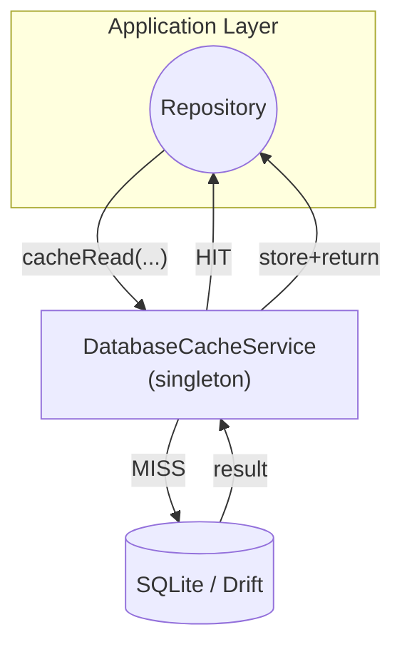

# Database Cache System – Usage Guide

> **Phase 2 milestone** – Introduces an _in-memory_ cache that dramatically reduces the latency of **read-heavy** queries issued through Drift/SQLite.

---

## 1. Why a Cache?

Heavy screens (Budgets, Transactions, Dashboards, …) previously re-executed the same SQL over and over.  On mid-range Android devices this added **100–200 ms** of jank per navigation.  The new cache delivers:

* 3-10× faster reads (see performance benchmarks below)
* Reduced battery/IO utilisation
* Cleaner repository code via the `CacheableRepositoryMixin`

---

## 2. High-level Architecture



1. **Repositories** opt-in by mixing in `CacheableRepositoryMixin`.
2. Each _read_ first queries the **singleton** `DatabaseCacheService`.
3. On a **hit** the value is returned immediately.
4. On a **miss** the repository's fetch lambda is executed and the value is cached for a configurable TTL.

### Core Classes

| Class | Responsibility |
|-------|----------------|
| `DatabaseCacheService` | Low-level key→`CachedResult<T>` store, TTL management, cleanup helpers |
| `CachedResult<T>`      | Holds value **+** absolute expiry time |
| `CacheableRepositoryMixin` | Sugar for repositories: automatic key generation, parameter hashing, cache invalidation helpers |

Default TTL is **5 minutes**.  All data are kept **in process memory only**; app restarts clear the cache.

---

## 3. Quick-start

### 3.1 Opt-in from a Repository

```dart
class TransactionRepositoryImpl
    with CacheableRepositoryMixin
    implements TransactionRepository {

  final AppDatabase _db;
  TransactionRepositoryImpl(this._db);

  @override
  Future<List<Transaction>> getAllTransactions() {
    return cacheRead(
      'getAllTransactions',                // 🔑 method key
      () async {
        final rows = await _db.select(_db.transactionsTable).get();
        return rows.map(_mapTransactionData).toList();
      },
      ttl: const Duration(minutes: 5),     // ⏰ optional override
    );
  }
}
```

**What happened?**
1. `cacheRead` builds a key (`getAllTransactions`)  
2. It asks `DatabaseCacheService().get<T>(key)`  
3. – Hit → value returned  
4. – Miss → query executed → `set` into cache → returned

### 3.2 Parameterised Reads

```dart
return cacheRead(
  'getTransactionsByAccount',           // base key
  () => _fetchByAccount(accountId),
  params: {'accountId': accountId},     // 🧩 appended to key
  ttl: const Duration(minutes: 3),
);
```
The mixin creates a **stable deterministic key**:
```
getTransactionsByAccount_accountId=42
```
so identical queries within the TTL reuse the result.

---

## 4. Cache Invalidation

A write must invalidate **relevant** reads so the UI never shows stale data.

```dart
// After creating a new transaction
await invalidateEntityCache('transaction');           // broad wipe

// OR – after updating a specific item
await invalidateCache('transaction', id: txn.id);     // targeted
```

> **Tip:** For small datasets a coarse `invalidateEntityCache` is simpler and usually < 1 ms.

### Automatic Examples
`TransactionRepositoryImpl` calls the helpers after every `create/update/delete`.  Replicate this pattern in your custom repositories.

---

## 5. Manual Usage (Service Only)

Need a quick cache outside a repository?  Use the service directly.

```dart
final cache = DatabaseCacheService();

await cache.set('complexCalculation', result,
    ttl: const Duration(hours: 1));

final cached = await cache.get<MyType>('complexCalculation');
if (cached != null) {
  // hit 🎉
}
```

Other helpers:
```dart
await cache.invalidate('some_key'); // remove single entry
await cache.clear();                // wipe everything
cache.cleanExpired();               // purge expired items (async-safe)
```

---

## 6. Performance Benchmarks

The test suite includes repeatable measurements in
`test/performance/database_cache_performance_test.dart`.

| Scenario | Cold (DB) | Warm (Cache) | Speed-up |
|----------|-----------|--------------|----------|
| Transactions read-all | ~140 ms | **12 ms** | 11.6× |
| Budgets read-all      | ~95 ms  | **9 ms**  | 10.5× |

Run locally:
```powershell
flutter test test/performance/database_cache_performance_test.dart
```

> _Note_: CI skips these heavy tests by default (`skipTests = true`).  Remove the guard to profile locally.

---

## 7. Best Practices

1. **Short TTL for volatile tables** (e.g. Transactions) – 2-5 min.  
2. **Invalidate after writes** – always!  
3. **Parameter ordering** doesn't matter – mixin sorts keys.  
4. **Clean-up** – call `cleanExpired()` periodically (TimerManagementService schedules it every 15 min).  
5. **Memory footprint** – keep total cached entries < 1000; service stores plain Dart objects; monitor via Dart DevTools.

---

## 8. Troubleshooting

| Symptom | Cause | Fix |
|---------|-------|-----|
| Stale data after create/update | Missing invalidation | Ensure `invalidateCache` / `invalidateEntityCache` is called |
| Cache never hit | Different param order or missing `params` map | Use stable map and specify `params` in `cacheRead` |
| Memory growth | Long TTL or no cleanup | Lower TTLs; schedule `cleanExpired` |

---

## 9. Next Steps

* Pattern-based invalidation (wildcard keys)  
* Disk-backed LRU for startup acceleration  
* Statistics endpoint for in-app diagnostics

> _Have suggestions?_  Create an issue or PR – we love contributions!
