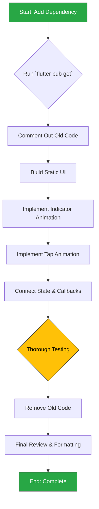
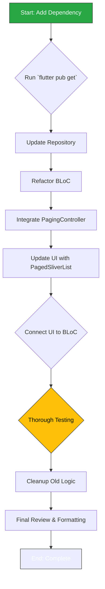
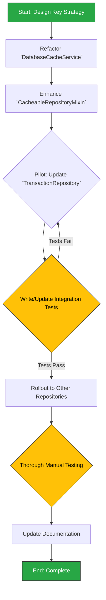
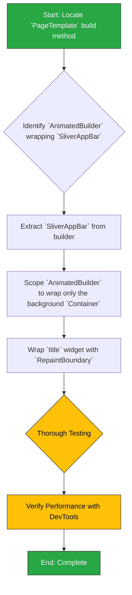
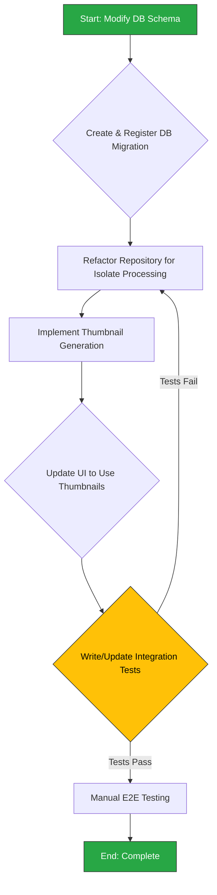
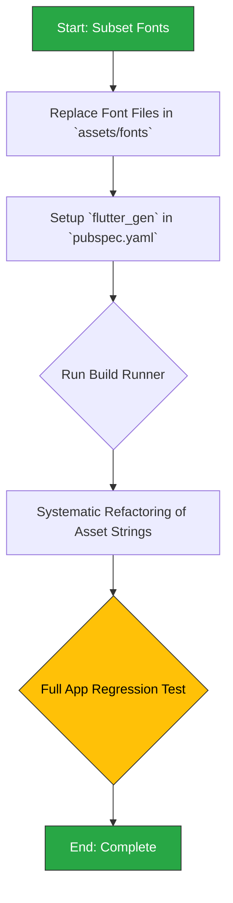
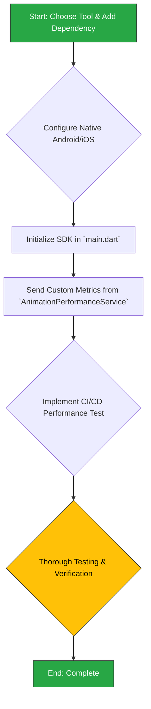
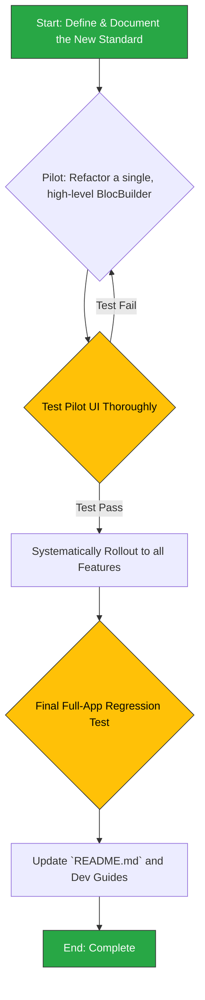

# Performance Optimization: Implementation Plan

This document provides a detailed, step-by-step preparation plan for implementing the recommendations outlined in the `2analysis_insights.md` document. Each section corresponds to a specific optimization task.

---

## Phase 1.1: Bottom Navigation Rendering Refactor

This section outlines the plan to refactor the `AdaptiveBottomNavigation` widget. The goal is to improve performance and maintainability by replacing the custom, multi-controller animation logic with the `flutter_animate` package.

### 1.1.1. Background & Rationale

As detailed in the `2analysis_insights.md` document, this refactor is motivated by the following key findings:

-   **Observation:** The current `AdaptiveBottomNavigation` widget uses a complex and inefficient system of multiple `AnimationController` instances combined with `AnimatedBuilder` to create its selection (sliding indicator) and tap (bounce) effects.
-   **Insight:** This implementation is a likely source of UI jank and is difficult to maintain or extend due to its complexity.
-   **Recommendation:** Replacing the manual animation logic with the `flutter_animate` package will provide a more performant, declarative, and maintainable solution, directly addressing the identified performance bottleneck.

### 1.1.2. Change Severity & Impact Analysis

-   **Severity:** **Medium**.
-   **Impact:** The change is highly localized to a single file, but the component is a critical, app-wide UI element (`main_shell.dart`).
-   **Complexity:** The refactoring is of **medium complexity**. It requires replacing a bespoke, multi-controller animation system with a new dependency. The primary challenge is to replicate the exact visual behavior (sliding indicator, item bounce-on-tap) using the `flutter_animate` API to ensure a seamless visual transition for the end-user. The widget's public API will not change.

### 1.1.3. Affected Files

The following files will be modified during this task:

1.  `pubspec.yaml`: To add the new dependency.
2.  `lib/features/navigation/presentation/widgets/adaptive_bottom_navigation.dart`: The entire implementation of this widget will be rewritten.

No other files should require changes, as the widget's public interface (`props` and `callbacks`) will be preserved.

### 1.1.4. Refactoring Procedure

The refactoring process will follow these steps to minimize disruption and risk.



#### Step-by-Step Guide

1.  **Add Dependency**:
    *   Add `flutter_animate: ^<latest_version>` to the `dependencies` section of `pubspec.yaml`.
    *   Run `flutter pub get`.

2.  **Isolate Existing Logic**:
    *   In `adaptive_bottom_navigation.dart`, comment out the entire body of the `_AdaptiveBottomNavigationState` class. This preserves the old code for reference during the rewrite.
    *   Remove the `with TickerProviderStateMixin`.

3.  **Build the Static UI**:
    *   First, rebuild the widget's layout *without* any animations.
    *   Use a `Stack` and `Row` to position the items and a simple `Container` for the indicator. Ensure everything is visually correct in a static state (e.g., for `currentIndex = 0`).

4.  **Implement Sliding Indicator Animation**:
    *   Use `flutter_animate`'s `.animate()` extension on the indicator `Container`.
    *   Use a `.slide()` or `.move()` effect that is driven by `widget.currentIndex`. The target `x` position will be `(itemWidth * widget.currentIndex)`.
    *   Ensure the animation plays when `widget.currentIndex` changes. The `animate` extension's `target` property can be used here, which will automatically animate when the value changes.

5.  **Implement Item Tap (Bounce) Animation**:
    *   When an item is tapped, the new selection will be passed to the parent via the `onTap` callback.
    *   The bounce effect can be achieved by applying an effect to the tapped icon/widget. The `flutter_animate` package provides an `.effect()` that can be triggered manually via an `AnimationController` if needed, but it's often simpler to use its event-listening capabilities if available. For a simple bounce, a `.then().scale()` effect chain can be used.

6.  **Finalize State and Cleanup**:
    *   Ensure all existing widget properties (`items`, `onTap`, `onLongPress`) are correctly used in the new implementation.
    *   Once the new implementation is confirmed to be working perfectly and looks identical to the original, delete all the commented-out code from the old implementation.

7.  **Testing**:
    *   Manually test all aspects:
        *   Does the indicator slide correctly when tapping different items?
        *   Does the bounce animation play on the correct item?
        *   Does it handle rapid taps gracefully?
        *   Does it still look correct on different screen sizes?
        *   Is the long-press functionality intact?
    *   Run existing widget tests (if any) and create new ones for the new implementation if necessary.

### 1.1.5. Documentation Updates (`docs/README.md`)

Upon completion of this refactor, the main `PROJECT DOCS` (`docs/README.md`) must be updated to reflect the introduction of the new animation dependency and to set the stage for the broader animation framework overhaul.

**1. Add New Core Technology:**

*   **File:** `docs/README.md`
*   **Location:** Section `03 · Core Technologies & Key Dependencies 🛠️`.
*   **Action:** Add a new row to the table for `flutter_animate`. This is our first component using it, establishing the precedent.
*   **Content:**

| Library | Role | Rationale |
|---|---|---|
| ... | ... | ... |
| **`flutter_animate`** | **Animation** | **A performant, declarative library for composing complex animations. Replaces manual `AnimationController` logic for improved readability and maintainability.** |
| ... | ... | ... |

**2. Acknowledge Animation Framework Transition:**

*   **File:** `docs/README.md`
*   **Location:** Section `05 · UI & Navigation 🎨`, in the "UI Framework" table.
*   **Action:** Update the description for the `UI Animation Framework` guide to signal the ongoing migration. This manages expectations and documents the technical direction.
*   **Proposed Change:**
    *   **Find this line:**
        ```markdown
        | [UI Animation Framework](UI_ANIMATION_FRAMEWORK.md) | Guide to the app's animation system. **Note: The framework is being migrated from custom widgets to `flutter_animate`.** |
        ```
    *   **Replace with:**
        ```markdown
        | [UI Animation Framework](UI_ANIMATION_FRAMEWORK.md) | Guide to the app's animation system. **Note: The framework is being migrated from custom widgets to `flutter_animate`.** |
        ```

---

## Phase 1.2: Transactions Page Lazy Loading

This section details the plan to implement lazy loading (pagination) on the `TransactionsPage`. The goal is to replace the inefficient "load-all" approach with a scalable, on-demand data fetching strategy using the `infinite_scroll_pagination` package.

### 1.2.1. Background & Rationale

As identified in the `2analysis_insights.md` document, this refactor is crucial for the app's long-term performance and scalability.

-   **Observation:** The `TransactionsPage` currently fetches all transaction records from the database at once when the page is loaded.
-   **Insight:** This approach is not scalable. As the number of transactions grows, it will lead to significant initial load times, high memory consumption, and a poor user experience.
-   **Recommendation:** Implement pagination by refactoring the `TransactionRepository` to fetch data in chunks and using the `infinite_scroll_pagination` package to create a "lazy-loading" list that automatically requests more data as the user scrolls.

### 1.2.2. Change Severity & Impact Analysis

-   **Severity:** **High**.
-   **Impact:** This is a fundamental change to the data access pattern for a core feature. The changes are localized to the transactions feature, but they affect the data, domain, and presentation layers.
-   **Complexity:** The refactoring is of **medium-to-high complexity**. It involves introducing a new third-party dependency, modifying database queries in the data layer (`TransactionRepository`), and overhauling the state management and UI logic in the presentation layer (`TransactionsBloc`, `TransactionsPage`). The primary challenge is correctly integrating the `PagingController` from the new package with the existing BLoC architecture.

### 1.2.3. Affected Files

The following files will be modified during this task:

1.  `pubspec.yaml`: To add the `infinite_scroll_pagination` dependency.
2.  `lib/features/transactions/domain/repositories/transaction_repository.dart`: The repository interface will be updated to support paginated queries.
3.  `lib/features/transactions/data/repositories/transaction_repository_impl.dart`: The implementation will be updated with a new Drift query using `LIMIT` and `OFFSET` for pagination.
4.  `lib/features/transactions/presentation/bloc/transactions_bloc.dart` (and related state/event files): The BLoC will be completely rewritten to manage the `PagingController` and handle page requests instead of a one-time data fetch.
5.  `lib/features/transactions/presentation/pages/transactions_page.dart`: The UI will be refactored to use `PagedSliverList` instead of the current `SliverList`.

### 1.2.4. Refactoring Procedure

The process is designed to introduce the new logic layer by layer, starting from the data access layer and moving up to the UI.



#### Step-by-Step Guide

1.  **Add Dependency**:
    *   Add `infinite_scroll_pagination: ^<latest_version>` to `pubspec.yaml`.
    *   Run `flutter pub get`.

2.  **Update Data & Domain Layers (`TransactionRepository`)**:
    *   In the domain interface (`transaction_repository.dart`), modify the `getAllTransactions` method signature to `getTransactions(int page, int limit)`.
    *   In the implementation (`transaction_repository_impl.dart`), update the Drift query to use `limit()` and `offset()` based on the `page` and `limit` parameters to fetch data in chunks.

3.  **Refactor State Management (`TransactionsBloc`)**:
    *   This is the most critical step. The existing BLoC, which likely fetches a list once, needs to be refactored to drive the pagination.
    *   In `_TransactionsBlocState`, add a `PagingController<int, Transaction>`. The key (`int`) represents the page number.
    *   In the BLoC's constructor, initialize the `PagingController` and add a listener to it (`_pagingController.addPageRequestListener`).
    *   The page request listener will be responsible for triggering a new event (e.g., `_FetchTransactionPage`) that calls the repository's `getTransactions` method with the new page key.
    *   On success, append the new items to the controller (`_pagingController.appendPage(newItems, nextPageKey)`). On error, set the controller's error state (`_pagingController.error = error`).

4.  **Update the UI (`TransactionsPage`)**:
    *   In the widget that builds the list, replace the existing `ListView` or `SliverList` with `PagedSliverList`.
    *   Provide the `pagingController` from the `TransactionsBloc` to the `PagedSliverList`.
    *   The `itemBuilder` for `PagedSliverList` will provide you with the `Transaction` object for each item, similar to `ListView.builder`.
    *   The package will automatically handle displaying loading indicators (for the first page and subsequent pages) and error messages.

5.  **Finalize and Test**:
    *   Remove any old, unused logic related to fetching the full list of transactions (e.g., old BLoC states/events, old state variables holding the list).
    *   Manually test all scenarios:
        *   Does the initial page load correctly?
        *   Does the loading indicator appear at the bottom when scrolling down?
        *   Does a new page of items load and appear seamlessly?
        *   Is an error message displayed if a page fails to load?
        *   Does pull-to-refresh work correctly?
    *   Update existing widget tests to work with the new paginated approach.

### 1.2.5. Documentation Updates (`docs/README.md`)

Upon completion of this refactor, the main `PROJECT DOCS` (`docs/README.md`) must be updated to reflect the introduction of the new pagination dependency and the changes to the transaction data access API.

**1. Add New Core Technology:**

*   **File:** `docs/README.md`
*   **Location:** Section `03 · Core Technologies & Key Dependencies 🛠️`.
*   **Action:** Add a new row to the table for `infinite_scroll_pagination`.
*   **Content:**

| Library                    | Role             | Rationale                                                                                                                                    |
| -------------------------- | ---------------- | -------------------------------------------------------------------------------------------------------------------------------------------- |
| ...                        | ...              | ...                                                                                                                                          |
| **`infinite_scroll_pagination`** | **UI/Pagination** | **Provides an efficient, out-of-the-box solution for creating paginated (lazy-loading) lists, preventing large data loads and improving UI performance.** |
| ...                        | ...              | ...                                                                                                                                          |

**2. Update Domain API Cheatsheet:**

*   **File:** `docs/README.md`
*   **Location:** Section `04 · Domain Features 💼`, in the "Widget & Helper Cheatsheet" under "Transactions – Basics".
*   **Action:** Modify the method signature for fetching transactions to reflect the new paginated approach.
*   **Proposed Change:**
    *   **Find this line:**
        ```markdown
        - `getAllTransactions()` – Fetch all transactions.
        ```
    *   **Replace with:**
        ```markdown
        - `getTransactions(page, limit)` – Fetch a paginated list of transactions.
        ```

---

## Phase 1.3: Data Caching Strategy Enhancement

This section details the plan to enhance the `DatabaseCacheService`. The goal is to evolve the generic TTL cache into an intelligent, query-aware caching layer that automatically manages keys and invalidation, significantly boosting performance and simplifying repository logic.

### 1.3.1. Background & Rationale

As detailed in the `2analysis_insights.md` document, this refactor is essential for building a performant and maintainable data layer.

-   **Observation:** The current `DatabaseCacheService` is a generic, time-to-live (TTL) key-value store.
-   **Insight:** This cache is ineffective for dynamic or filtered data. It cannot cache specific queries (e.g., a certain page of transactions) without complex, manual key management in every repository, which is error-prone and hard to maintain.
-   **Recommendation:** Enhance the caching strategy by making the `DatabaseCacheService` capable of transparently handling query-specific caching. The cache key should be automatically generated from the query and its parameters. A robust, automated cache invalidation mechanism should be implemented using the `CacheableRepositoryMixin` to clear relevant cache entries when data is created, updated, or deleted.

### 1.3.2. Change Severity & Impact Analysis

-   **Severity:** **High**.
-   **Impact:** This is a foundational change to a core data service that affects data retrieval performance and consistency across the entire application. It alters the `DatabaseCacheService`, the shared `CacheableRepositoryMixin`, and requires modifications to all major data repositories (`TransactionRepository`, `BudgetRepository`, etc.).
-   **Complexity:** **High**. The primary challenges are:
    1.  Designing a generic and reliable cache key generation strategy that can uniquely identify any query and its parameters.
    2.  Implementing a robust invalidation mechanism that correctly targets dependent cache entries after a mutation. The logic must be precise to avoid either leaving stale data or clearing the entire cache unnecessarily.

### 1.3.3. Affected Files

The following files will be modified or created during this task:

1.  `lib/core/services/database_cache_service.dart`: The core implementation will be updated to support more advanced invalidation patterns.
2.  `lib/core/repositories/cacheable_repository_mixin.dart`: This mixin will be significantly enhanced to provide new helper methods for automated query caching and invalidation.
3.  `lib/features/transactions/data/repositories/transaction_repository_impl.dart`: Will be the first repository to adopt the new caching mechanism.
4.  `lib/features/budgets/data/repositories/budget_repository_impl.dart`: Will be updated after the pattern is proven.
5.  `lib/features/accounts/data/repositories/account_repository_impl.dart`: Will be updated.
6.  `lib/features/categories/data/repositories/category_repository_impl.dart`: Will be updated.
7.  `test/core/services/database_cache_service_test.dart`: Existing tests will need to be updated or rewritten.
8.  `test/integration/database_cache_integration_test.dart`: New integration tests are crucial to verify the correctness of the caching and invalidation logic end-to-end.

### 1.3.4. Refactoring Procedure

The process is designed to mitigate risk by implementing and testing the new caching logic on a single repository before rolling it out across the application.



#### Step-by-Step Guide

1.  **Design Cache Key Strategy**:
    *   Define a standard, automated way to generate a cache key. The key should be a composite string including the repository/table name, the method name, and a consistent representation of its arguments (e.g., `transactions:getTransactions:page=1:limit=20:filter=none`). This ensures every unique query has a unique key.

2.  **Enhance `DatabaseCacheService`**:
    *   Modify the service to support tag-based or prefix-based invalidation. For example, add a method like `invalidateWhere(bool Function(String key) test)` or `invalidateByPrefix(String prefix)`. This allows for targeted cache clearing (e.g., clear all keys starting with `transactions:`).

3.  **Refactor `CacheableRepositoryMixin`**:
    *   This is the most significant change. Abstract the caching logic here.
    *   Create a new protected helper method, e.g., `cacheReadQuery`. This method will:
        *   Accept the database query function and its parameters.
        *   Automatically generate the unique cache key based on the strategy from Step 1.
        *   Check the cache for this key. If found and valid, return the cached data.
        *   If not found, execute the database query, store the result in the cache with the generated key, and return the result.
    *   Create a new helper for write operations, e.g., `cacheWriteQuery`. This method will:
        *   Accept the write function (create/update/delete) and a cache `tag` or `prefix` (e.g., 'transactions').
        *   Execute the write function.
        *   Upon successful completion, call the new invalidation method in the `DatabaseCacheService` to remove all cache entries matching the prefix.

4.  **Update `TransactionRepositoryImpl` as a Pilot**:
    *   Refactor all read methods (e.g., `getTransactions`, `getTransactionById`) to use the new `cacheReadQuery` helper.
    *   Refactor all write methods (e.g., `createTransaction`, `deleteTransaction`) to use the `cacheWriteQuery` helper, passing `'transactions'` as the invalidation prefix.

5.  **Write and Pass Integration Tests**:
    *   Create a dedicated integration test file to rigorously validate the new mechanism.
    *   **Test 1 (Caching):** Call `getTransactions()`, then call it again. Verify (e.g., by mocking the DB) that the second call was served from the cache.
    *   **Test 2 (Invalidation):** Call `getTransactions()`, then call `createTransaction()`, then call `getTransactions()` again. Verify the cache was invalidated and the final call hit the database.
    *   These tests are critical to ensure data consistency.

6.  **Roll Out to Other Repositories**:
    *   Once the pattern is proven with `TransactionRepositoryImpl` and the tests are passing reliably, apply the same refactoring to `BudgetRepositoryImpl`, `AccountRepositoryImpl`, `CategoryRepositoryImpl`, and any other data-heavy repositories. This becomes a safe, repetitive task.

7.  **Update Documentation**:
    *   The `README.md` references a `DATABASE_CACHING_GUIDE.md`. Update that guide to reflect the new, superior caching strategy. Explain how to use the `cacheReadQuery` and `cacheWriteQuery` helpers and why manual key management is no longer necessary.

### 1.3.5. Documentation Updates (`docs/README.md` & Associated Guides)

Upon completion, the documentation must be updated to reflect the new automated caching paradigm, ensuring developers immediately adopt the correct, more straightforward pattern.

**1. Update Core Infrastructure Cheatsheet:**

*   **File:** `docs/README.md`
*   **Location:** Section `02 · Core Infrastructure 🔧`, in the "Quick reference – core services & helpers" under "Database Caching".
*   **Action:** Rewrite the descriptions for `DatabaseCacheService` and `CacheableRepositoryMixin` to reflect the new automated, query-aware system.
*   **Proposed Change:**
    *   **Find this section:**
        ```markdown
        ***Database Caching***
        - `DatabaseCacheService` – Singleton in-memory key→value store with TTL.
        - `CacheableRepositoryMixin` – Adds `cacheRead`/`invalidateCache` helpers to repositories.
        ```
    *   **Replace with:**
        ```markdown
        ***Database Caching***
        - `DatabaseCacheService` – Intelligent, query-aware in-memory cache. Supports prefix-based invalidation for automated cache clearing.
        - `CacheableRepositoryMixin` – Provides **automated** query caching (`cacheReadQuery`) and invalidation (`cacheWriteQuery`), eliminating manual key management.
        ```

**2. Overhaul the Main Caching Guide:**

*   **File:** `docs/DATABASE_CACHING_GUIDE.md`
*   **Action:** This guide needs to be fundamentally rewritten to document the new, superior caching strategy. The old TTL-based, manual key-management approach is now obsolete.
*   **Key updates for the guide:**
    *   **Introduction:** Explain that the cache is no longer a simple key-value store but an automated query caching layer.
    *   **Core Concept:** Describe how cache keys are now automatically generated from repository method names and parameters, making caching transparent.
    *   **Usage (`cacheReadQuery`):** Provide a clear "before and after" code example showing how to refactor a repository read method to use the new `cacheReadQuery` helper. Emphasize that no manual key is needed.
    *   **Usage (`cacheWriteQuery`):** Provide a clear example for write methods (create/update/delete). Explain how `cacheWriteQuery` accepts a prefix (e.g., `'transactions'`) and automatically invalidates all related cache entries after the write operation succeeds.
    *   **Best Practices:** Explicitly state that manual cache management (`get()`, `set()`, `invalidate()`) should no longer be used directly in repositories. The new mixin helpers handle everything.

---

## Phase 2.1: Animation Framework Overhaul

This section details the plan to refactor the application's animation system. The goal is to replace the custom animation widgets in `lib/shared/widgets/animations/` with the more powerful and declarative `flutter_animate` package, as recommended in the analysis phase.

### 2.1.1. Background & Rationale

As detailed in the `2analysis_insights.md` document, this overhaul is motivated by key architectural insights.

-   **Observation:** The project uses a custom animation framework of individual widgets (`FadeIn`, `SlideIn`, etc.). The main `PageTemplate` also wraps all content in a generic, inflexible `FadeIn` widget.
-   **Insight:** This approach is verbose, making combined effects (e.g., fade + slide) difficult to write and maintain. Staggered animations require manual delay calculations. The generic `FadeIn` on `PageTemplate` is not ideal for crafting meaningful, context-specific entrance effects.
-   **Recommendation:** Replacing the custom framework with `flutter_animate` is strongly advised. It offers a more performant, declarative, and powerful API that simplifies complex individual and staggered animations and will reduce boilerplate code. The generic `FadeIn` should be removed from `PageTemplate` and animations should be applied specifically where needed.

### 2.1.2. Change Severity & Impact Analysis

-   **Severity:** **High**. This is a foundational, cross-cutting change that replaces a core UI framework used across the entire application.
-   **Impact:** The change is widespread, affecting dozens of UI files across all features. It involves removing an entire directory of shared widgets and requires developers to adopt a new, more powerful animation paradigm. The `PageTemplate` modification will affect every screen in the app.
-   **Complexity:** **High**. While `flutter_animate` simplifies animation code, the primary challenge lies in the sheer volume of work. It requires methodically replacing every instance of the old animation widgets, ensuring visual fidelity and behavior are preserved or improved, and thoroughly testing every affected screen.

### 2.1.3. Affected Files

The following files and directories are central to this refactoring task:

1.  `pubspec.yaml`: To add the `flutter_animate` dependency.
2.  `lib/shared/widgets/page_template.dart`: The generic `FadeIn` will be removed from its build method.
3.  `lib/shared/widgets/animations/`: This entire directory and all its contents will be deleted after the refactor is complete.
4.  **Numerous UI files**: Many files within `lib/features/` and `lib/shared/widgets/` that currently import from `package:finance/shared/widgets/animations/` will need to be modified. A project-wide search for this import path will be necessary to identify all affected files.

### 2.1.4. Refactoring Procedure

The refactoring will be executed in a phased approach to manage complexity and risk, starting with the foundational dependency and `PageTemplate`, then systematically replacing animations feature by feature.

```mermaid
graph TD
    A[Start: Add Dependency] --> B{Run `flutter pub get`};
    B --> C[Remove Generic FadeIn from PageTemplate];
    C --> D{Pilot: Refactor one feature's animations (e.g., Settings)};
    D --> E{Test Pilot Feature Thoroughly};
    E -- Tests Pass --> F[Rollout to All Other Features];
    E -- Tests Fail --> D;
    F --> G{Final App-Wide Regression Test};
    G --> H[Delete Old `animations` Directory];
    H --> I[Update Documentation];
    I --> J[End: Complete];

    style A fill:#28a745,color:#fff,stroke:#333
    style J fill:#28a745,color:#fff,stroke:#333
    style C fill:#dc3545,color:#fff,stroke:#333
    style E fill:#ffc107,color:#000,stroke:#333
    style G fill:#ffc107,color:#000,stroke:#333
```

#### Step-by-Step Guide

1.  **Add Dependency**:
    *   Add `flutter_animate: ^<latest_version>` to the `dependencies` section of `pubspec.yaml`.
    *   Run `flutter pub get`.

2.  **Refactor `PageTemplate`**:
    *   This is the first and most critical coding step.
    *   In `lib/shared/widgets/page_template.dart`, locate the `FadeIn` widget that wraps the page content.
    *   Remove the `FadeIn` wrapper completely. This is a breaking change that will remove the default entrance animation from all pages, which is the intended outcome. Pages will now be responsible for their own entrance animations.

3.  **Pilot Refactoring (e.g., Settings Feature)**:
    *   Choose a single, non-critical feature to act as the pilot (e.g., the Settings screens).
    *   Go through every UI file in that feature.
    *   Find where widgets like `FadeIn`, `SlideIn`, etc., are used.
    *   Replace them with the `flutter_animate` syntax. For example, `FadeIn(child: MyWidget())` becomes `MyWidget().animate().fadeIn()`.
    *   This is the perfect time to create more meaningful animations, such as staggering list items: `MyListView.children.animate(interval: 50.ms).fadeIn().slideY()`.

4.  **Test the Pilot Feature**:
    *   Thoroughly test the screens of the refactored feature.
    *   Ensure all animations look correct, perform well, and respect the app's animation settings.
    *   Fix any issues before proceeding.

5.  **Roll Out to Remaining Features**:
    *   Once the pilot is successful, repeat the process for all other features (`Transactions`, `Budgets`, `Accounts`, `Home`, etc.) and any remaining shared widgets.
    *   This will be a repetitive but straightforward task of applying the now-proven pattern.

6.  **Cleanup and Finalization**:
    *   After all imports of the old animation framework have been removed from the project, delete the entire `lib/shared/widgets/animations/` directory.
    *   Run a final, full regression test of the application, navigating through all screens to check for any visual or behavioral issues.

7.  **Update Documentation**:
    *   The `README.md` and `UI_ANIMATION_FRAMEWORK.md` guide must be updated to reflect the removal of the old framework and the introduction of `flutter_animate`.
    *   Add examples of the new, preferred way to create animations.

### 2.1.5. Documentation Updates (`docs/README.md` & `UI_ANIMATION_FRAMEWORK.md`)

With the old custom animation framework now removed, the project documentation must be updated to establish `flutter_animate` as the new standard and provide clear guidance on its use.

**1. Update UI Framework Guide Description:**

*   **File:** `docs/README.md`
*   **Location:** Section `05 · UI & Navigation 🎨`, in the "UI Framework" table.
*   **Action:** The migration to `flutter_animate` is now complete. Update the description to reflect that `flutter_animate` is the new standard, removing any mention of migration.
*   **Proposed Change:**
    *   **Find this line (or the one modified by Phase 1.1):**
        ```markdown
        | [UI Animation Framework](UI_ANIMATION_FRAMEWORK.md) | Guide to the app's animation system. **Note: The framework is being migrated from custom widgets to `flutter_animate`.** |
        ```
    *   **Replace with:**
        ```markdown
        | [UI Animation Framework](UI_ANIMATION_FRAMEWORK.md) | Guide to the app's animation system. **Note: The framework is being migrated from custom widgets to `flutter_animate`.** |
        ```

**2. Overhaul Animation Cheatsheet:**

*   **File:** `docs/README.md`
*   **Location:** Section `05 · UI & Navigation 🎨`, in the "Quick reference – UI widgets & helpers" under "Animation Framework".
*   **Action:** The old custom animation widgets (`FadeIn`, `SlideIn`, etc.) are now deleted. Replace the entire section with new examples demonstrating the `flutter_animate` API.
*   **Proposed Change:**
    *   **Find this section:**
        ```markdown
        **Animation Framework**
        - `FadeIn`, `ScaleIn`, `SlideIn` – Entrance animations respecting motion settings.
        - `BouncingWidget`, `BreathingWidget` – Looping attention-grabbers.
        - `SlideFadeTransition()` – Combined slide + fade.
        - `.openContainerNavigation()` – Easy Material container transform.
        ```
    *   **Replace with:**
        ```markdown
        **Animation Framework (`flutter_animate`)**
        - `myWidget.animate().fadeIn()` – Simple fade-in effect.
        - `myWidget.animate().slide(duration: 500.ms)` – Simple slide effect.
        - `myWidget.animate().fade().slide()` – Chain multiple effects together.
        - `myList.children.animate(interval: 100.ms).slideX()` – Staggered list animations.
        ```

**3. Overhaul the Main Animation Guide:**

*   **File:** `docs/UI_ANIMATION_FRAMEWORK.md`
*   **Action:** This guide needs a complete rewrite to remove all references to the old, deleted widgets (`FadeIn`, `SlideIn`, etc.) and replace them with comprehensive documentation for using `flutter_animate`.
*   **Key updates for the guide:**
    *   **Introduction:** State that `flutter_animate` is now the sole, official animation library for the project.
    *   **Core Concepts:** Explain the declarative API using the `.animate()` extension. Cover chaining effects, setting durations, curves, and delays.
    *   **Common Patterns:**
        *   Provide "before and after" examples showing how `FadeIn(child: ...)` becomes `... .animate().fadeIn()`.
        *   Demonstrate list animations with staggered effects (`.animate(interval: ...)`).
        *   Show how to create more complex, multi-effect animations.
    *   **Best Practices:** Emphasize removing the now-deleted imports from `lib/shared/widgets/animations/` and using the new syntax everywhere.

---

## Phase 2.2: PageTemplate Scroll Performance Optimization

This section outlines the plan to refactor the `PageTemplate` widget to optimize scroll performance. The goal is to reduce unnecessary widget rebuilds caused by an inefficiently scoped `AnimatedBuilder`.

### 2.2.1. Background & Rationale

As detailed in the `2analysis_insights.md` document, this optimization is critical for smooth scrolling performance across the application.

-   **Observation:** The `PageTemplate` widget uses an `AnimatedBuilder` that listens to a `ScrollController` to fade in the app bar's background color.
-   **Insight:** The `AnimatedBuilder` currently wraps the entire `SliverAppBar`, causing it and all its children (actions, title) to rebuild on every single scroll frame. This is a significant and unnecessary performance cost.
-   **Recommendation:** Refactor the widget by:
    1.  Scoping the `AnimatedBuilder` to wrap only the `Container` whose background color is changing.
    2.  Ensuring the `SliverAppBar` itself does not rebuild on scroll.
    3.  Wrapping the `title` widget in a `RepaintBoundary` to prevent it from repainting during the background color animation.

### 2.2.2. Change Severity & Impact Analysis

-   **Severity:** **Medium**.
-   **Impact:** The change is localized to a single, critical shared widget (`page_template.dart`). While only one file is modified, its central role means any mistake could have widespread visual consequences across the entire app, affecting every page that uses it.
-   **Complexity:** **Low-to-Medium**. The refactoring itself is not algorithmically complex; it involves restructuring the widget tree within one file. The challenge lies in carefully applying the changes without altering the existing visual behavior and ensuring performance gains are achieved without introducing regressions.

### 2.2.3. Affected Files

The following file is the sole target for modification:

1.  `lib/shared/widgets/page_template.dart`

Although only one file is edited, a full app-wide visual regression test is mandatory after the change.

### 2.2.4. Refactoring Procedure

The process is designed to be a precise surgical change to the widget's build method.



#### Step-by-Step Guide

1.  **Locate Target Code**:
    *   Open `lib/shared/widgets/page_template.dart`.
    *   Navigate to the `build` method of the widget's `State`.

2.  **Restructure `AnimatedBuilder`**:
    *   Find the `AnimatedBuilder` that listens to the `_scrollController`. Currently, it returns the entire `SliverAppBar`.
    *   The goal is to move the `AnimatedBuilder` *inside* the `SliverAppBar`'s `flexibleSpace` or `background` property, so it only wraps the `Container` responsible for the color fade.
    *   The `SliverAppBar` itself should be returned directly and should no longer be inside the `builder` function. The `scrolledUnderElevation` can still be controlled by the `_scrollController.offset`.

3.  **Isolate Title with `RepaintBoundary`**:
    *   Locate the `title` widget passed to the `SliverAppBar`.
    *   Wrap this widget with a `RepaintBoundary`. This will prevent the text from being repainted every time the background color of the app bar animates, further improving performance.

4.  **Testing and Verification**:
    *   **Manual Testing**: Navigate through several different pages of the application that use `PageTemplate`.
        *   Scroll up and down repeatedly.
        *   Verify that the app bar background color still fades in correctly.
        *   Verify that the title, actions, and other app bar elements remain visually correct and stable.
        *   Check for any new jank or visual glitches.
    *   **Performance Profiling**: Use Flutter DevTools.
        *   Open the "Performance" or "CPU Profiler" view.
        *   Record a session while scrolling on a page that uses `PageTemplate`.
        *   Enable "Track Widget Builds".
        *   Confirm that the `SliverAppBar` and its `title` and `actions` are no longer rebuilding on every frame during the scroll. You should only see the background `Container` rebuilding.

### 2.2.5. Documentation Updates (`docs/README.md` & `UI_TESTING_AND_TROUBLESHOOTING.md`)

The optimization of `PageTemplate` is a perfect, practical example of a critical Flutter performance pattern. Documenting this pattern is more valuable than just noting the widget was improved. It provides a reusable lesson for future development.

**1. Enhance Guide Description in Main README:**

*   **File:** `docs/README.md`
*   **Location:** Section `05 · UI & Navigation 🎨`, in the "UI Framework" table.
*   **Action:** Update the description for the `UI Testing & Troubleshooting` guide to explicitly mention performance patterns, making it more discoverable.
*   **Proposed Change:**
    *   **Find this line:**
        ```markdown
        | [UI Testing & Troubleshooting](UI_TESTING_AND_TROUBLESHOOTING.md) | Widget testing setup, troubleshooting common UI issues & performance tips. |
        ```
    *   **Replace with:**
        ```markdown
        | [UI Testing & Troubleshooting](UI_TESTING_AND_TROUBLESHOOTING.md) | Widget testing setup, troubleshooting common UI issues & key **UI performance patterns**. |
        ```

**2. Add "UI Performance Best Practices" to Troubleshooting Guide:**

*   **File:** `docs/UI_TESTING_AND_TROUBLESHOOTING.md`
*   **Action:** Add a new, detailed section to this guide that uses the `PageTemplate` refactor as a case study for two crucial performance optimizations.
*   **Content to Add:**

    ```markdown
    ---
    
    ## UI Performance Best Practices
    
    This section covers key patterns for writing performant Flutter UI code, preventing common sources of jank and unnecessary builds.
    
    ### 1. Scope Builders Tightly to Minimize Rebuilds
    
    **Problem:** Using builders like `AnimatedBuilder`, `ValueListenableBuilder`, or `BlocBuilder` around large widget trees is a common source of performance issues. If the builder wraps a complex widget, the entire widget and all its children will be rebuilt every time the listened-to object changes, even if only a small part of the UI actually needs to be updated.
    
    **Solution:** Always scope builders as tightly as possible around only the widgets that need to be rebuilt. Move the builder down the widget tree so it wraps the smallest possible widget.
    
    **Case Study: The `PageTemplate` Refactor**
    
    -   **Before (Inefficient):** The `AnimatedBuilder` wrapped the entire `SliverAppBar`, causing it and its `title` and `actions` to rebuild on every scroll frame just to update the background color.
    
    -   **After (Efficient):** The `AnimatedBuilder` was moved *inside* the `SliverAppBar`'s `flexibleSpace` property. Now, it rebuilds *only* the `Container` responsible for the background color, leaving the rest of the app bar static and efficient.
    
    ### 2. Use `RepaintBoundary` to Isolate Static, Complex Widgets
    
    **Problem:** Even if a widget itself doesn't rebuild, it might still be forced to *repaint* if its parent changes. In the `PageTemplate` example, the changing background color of the app bar could cause the `title` widget to repaint on every frame, which is inefficient.
    
    **Solution:** Wrap static, complex, or expensive-to-paint widgets inside a `RepaintBoundary`. This creates a separate paint layer for the widget. The Flutter framework can then skip repainting this layer entirely if its contents haven't changed, even if other things around it are changing.
    
    **When to use it:**
    -   When you have a complex widget (e.g., a custom painter, a chart) inside an animated container.
    -   When you see static UI elements repainting unnecessarily with Flutter DevTools' "Highlight Repaints" feature.
    
    **Case Study: The `PageTemplate` Refactor**
    
    -   The `title` widget in the `SliverAppBar` was wrapped in a `RepaintBoundary`. This prevents it from being repainted every time the background color behind it animates, further improving scroll performance.
    
    ```

---

## Phase 3.1: Attachment System Optimization

This section details the plan to optimize the attachment handling system. The goal is to improve UI performance by offloading image compression to a background isolate and enhance efficiency by generating and using thumbnails.

### 3.1.1. Background & Rationale

As detailed in the `2analysis_insights.md` document, this optimization is motivated by critical performance analysis:

-   **Insight (Attachments):** The current implementation in `AttachmentRepositoryImpl` performs image compression on the **main isolate**, a major cause of UI jank when adding image attachments. The system also lacks thumbnail generation, which is inefficient for list views that display full-size, compressed images.
-   **Recommendation (Attachments):**
    1.  Refactor the image compression method in `AttachmentRepositoryImpl` to run in a separate isolate using `compute()`.
    2.  Implement thumbnail generation during the image compression step. This involves a schema change to `AttachmentsTable` to store a thumbnail path or data.
    3.  Investigate using `CompressFormat.webp` for better compression ratios.

### 3.1.2. Change Severity & Impact Analysis

-   **Severity:** **High**.
-   **Impact:** This change is multi-layered, affecting the database schema, data repository logic, and UI components. Offloading compression is critical for UI smoothness. Introducing thumbnails fundamentally changes how attachment images are stored and displayed.
-   **Complexity:** **High**. The refactor requires:
    1.  A database migration, which is a sensitive operation.
    2.  Implementing isolate communication with `compute()`, which has constraints (e.g., top-level functions).
    3.  Modifying repository logic to handle both the original image and the new thumbnail.
    4.  A project-wide search to identify and update all UI components that display attachments to use the new thumbnail system.

### 3.1.3. Affected Files

1.  `lib/core/database/tables/attachments_table.dart`: To add a new `thumbnailPath` or `thumbnailData` column.
2.  `lib/core/database/app_database.dart`: To increment the schema version and register the new migration.
3.  **New Migration File:** `lib/core/database/migrations/new_migration_file.dart` (A new file to be created).
4.  `lib/features/transactions/data/repositories/attachment_repository_impl.dart`: The image compression logic will be significantly refactored.
5.  **Potentially many UI files:** A project-wide search will be needed to find all widgets that display attachment images and update them to use thumbnails.
6.  `test/`: Related unit and integration tests will require updates.

### 3.1.4. Refactoring Procedure

The process is structured to handle the database changes first, followed by the repository logic, and finally the UI.



#### Step-by-Step Guide

1.  **Update Database Schema**:
    *   In `lib/core/database/tables/attachments_table.dart`, add a new column to the `Attachments` table, for example: `TextColumn get thumbnailPath => text().nullable()();`.
2.  **Create Database Migration**:
    *   Create a new migration file in `lib/core/database/migrations/`.
    *   Implement the `onUpgrade` logic to `addColumn` for the new `thumbnailPath`.
    *   In `app_database.dart`, increment the `schemaVersion` and add the new migration to the `migration` getter.
3.  **Refactor Image Processing**:
    *   Create a new top-level function (outside any class) that takes the image data as input, performs both compression for the full image and generates a smaller thumbnail, and returns a result object containing paths/data for both.
    *   In `lib/features/transactions/data/repositories/attachment_repository_impl.dart`, replace the existing direct call to the compression logic with a call to `compute()`, passing your new top-level function.
    *   Update the repository methods (`createAttachment`, etc.) to save the new `thumbnailPath` along with the other attachment data.
4.  **Update UI Layer**:
    *   Conduct a project-wide search for usages of attachment images.
    *   In list views or previews, modify the `Image.file` or `Image.memory` widgets to load the `thumbnailPath` instead of the full image path.
    *   Ensure that the full image is still loaded when a user taps to view the attachment in detail.
5.  **Testing**:
    *   Create or update integration tests to verify that creating an attachment correctly generates and saves a thumbnail.
    *   Manually test the full flow: add a new image attachment, verify the UI remains smooth, check that a thumbnail appears in the list, and confirm the full image opens correctly.

### 3.1.5. Documentation Updates (`docs/README.md` & `ATTACHMENTS_SYSTEM.md`)

The optimization of the attachment system introduces a more performant background processing model and a critical new feature (thumbnails). The documentation must be updated to guide developers on how to leverage these improvements and to reflect the updated repository APIs.

**1. Update Domain API Cheatsheet:**

*   **File:** `docs/README.md`
*   **Location:** Section `04 · Domain Features 💼`, in the "Widget & Helper Cheatsheet" under "Transactions – Attachments".
*   **Action:** Update the description for `compressAndStoreFile` to highlight the new, efficient background processing and thumbnail generation. This signals the performance improvement at a high level.
*   **Proposed Change:**
    *   **Find this line:**
        ```markdown
        - `compressAndStoreFile(filePath, transactionId, fileName)` – Compress image/file and prepare it for local storage.
        ```
    *   **Replace with:**
        ```markdown
        - `compressAndStoreFile(...)` – **Efficiently processes an image in the background** to compress it and generate a thumbnail before storing.
        ```

**2. Overhaul the Main Attachments Guide:**

*   **File:** `docs/ATTACHMENTS_SYSTEM.md`
*   **Action:** This guide needs a comprehensive update to document the new architecture. The previous implementation details are now obsolete.
*   **Key updates for the guide:**
    *   **Introduction:** Revise the introduction to state that the system is optimized for performance, using background processing for compression and thumbnails for efficient rendering.
    *   **Core Concept: Isolate-based Compression:**
        *   Add a new section explaining that image compression is a heavy operation that is now offloaded to a background isolate using `compute()`.
        *   Explain that this prevents UI jank when a user adds a large image.
    *   **Core Concept: Thumbnail Generation:**
        *   Add a new section detailing the thumbnail system.
        *   Explain that a small thumbnail is automatically generated and stored alongside the full-size compressed image.
        *   Document the database schema change: the addition of the `thumbnailPath` column to the `Attachments` table.
    *   **Updated Usage Guide / Best Practices:**
        *   Create a "Best Practices" section for displaying attachment images.
        *   **Rule 1: Use Thumbnails for Lists:** Emphasize that any list or grid view of attachments MUST use the `attachment.thumbnailPath` to render the image. This is critical for scroll performance.
        *   **Rule 2: Use Full Image for Detail Views:** The original (compressed) image path should only be used when displaying a single attachment in a full-screen or detail view.
        *   Provide a clear code example:

            ```dart
            // Good: For a list view
            Image.file(File(attachment.thumbnailPath!))
            
            // Good: For a detail view
            Image.file(File(attachment.filePath))
            
            // Bad: Using full image in a list, causes poor performance
            Image.file(File(attachment.filePath)) 
            ```

---

## Phase 3.2: Asset Optimization (Fonts & Type Safety)

This section details the plan to reduce the app's bundle size by subsetting fonts and to improve code safety by migrating to a type-safe asset management system.

### 3.2.1. Background & Rationale

As detailed in `2analysis_insights.md`, this task is driven by asset analysis:

-   **Insight (Fonts & Assets):** The app bundles a number of large, custom font files. Asset paths are managed via raw strings, which is error-prone and can lead to unused assets remaining in the bundle.
-   **Recommendation (Fonts & Assets):**
    1.  Implement font subsetting by using a tool to create smaller font files that only include the glyphs used by the application.
    2.  Use a tool like `flutter_gen` to generate type-safe asset accessors, eliminating string-based lookups and helping to identify unused assets.

### 3.2.2. Change Severity & Impact Analysis

-   **Severity:** **Medium**.
-   **Impact:** Font subsetting has a high impact on reducing the final bundle size. Type-safe asset generation is a project-wide refactoring effort that touches dozens of files, significantly improving developer experience and code maintainability.
-   **Complexity:** **Medium**. Font subsetting is a low-complexity task focused on file replacement. The `flutter_gen` migration is of medium complexity due to the breadth of the refactoring required, although the changes themselves are simple and repetitive.

### 3.2.3. Affected Files

1.  `pubspec.yaml`: To add the `flutter_gen` and `flutter_gen_runner` build dependencies and configure the tool.
2.  `assets/fonts/`: The existing font files will be replaced with smaller, subsetted versions.
3.  **All files using assets:** A project-wide search for asset paths (e.g., `'assets/...'`) is required to replace them with generated code (e.g., `Assets` class).

### 3.2.4. Refactoring Procedure

This is a two-part process: first, the external font optimization, followed by the internal code refactoring.



#### Step-by-Step Guide

1.  **Subset Fonts**:
    *   Use an external tool (e.g., the `font_subset` pub package or a web utility like Font Squirrel) to process the font files located in `assets/fonts/`.
    *   Configure the tool to include only the characters and glyphs necessary for the languages supported by the app (e.g., Latin characters, symbols).
    *   Replace the original font files with the new, smaller subsetted files. Visually verify in-app that all text still renders correctly.
2.  **Setup `flutter_gen`**:
    *   Add `flutter_gen` and `flutter_gen_runner` to the `dev_dependencies` in `pubspec.yaml`.
    *   Add the `flutter_gen` configuration section to `pubspec.yaml` to specify input and output directories.
    *   Run `dart run build_runner build` to generate the asset accessor class (e.g., `lib/gen/assets.gen.dart`).
3.  **Refactor Asset Paths**:
    *   This is the most time-consuming step. Methodically go through the entire project.
    *   Replace all hardcoded asset strings like `AssetImage('assets/icons/my_icon.svg')` with their type-safe counterparts, e.g., `SvgPicture.asset(Assets.icons.myIcon)`.
    *   This applies to images, fonts, icons, and any other files managed as assets.
4.  **Testing**:
    *   After refactoring, perform a full visual regression test of the application.
    *   Navigate to every screen and ensure all images, icons, and custom fonts are displayed correctly.

### 3.2.5. Documentation Updates (`docs/README.md` & `FILE_STRUCTURE.md`)

The migration to type-safe assets is a fundamental change in the development workflow. The documentation must be updated to make this new pattern clear, mandatory, and easy to adopt. Font subsetting should also be noted as a key optimization practice.

**1. Add New Core Technology:**

*   **File:** `docs/README.md`
*   **Location:** Section `03 · Core Technologies & Key Dependencies 🛠️`.
*   **Action:** Add a new row to the table for `flutter_gen_runner` to formalize its role in the project.
*   **Content:**

| Library | Role | Rationale |
|---|---|---|
| ... | ... | ... |
| **`flutter_gen_runner`** | **Code Generation** | **Generates type-safe code for assets (images, fonts, etc.), eliminating error-prone string paths and enabling compile-time verification.** |
| ... | ... | ... |

**2. Update Development Workflow Guide:**

*   **File:** `docs/README.md`
*   **Location:** Section `07 · Development Workflow & Testing 👨‍💻`, under the "Code Generation" heading.
*   **Action:** Update the text to explicitly include assets in the code generation process.
*   **Proposed Change:**
    *   **Find this paragraph:**
        ```markdown
        The project uses `freezed` for data classes and `drift` for the database. If you modify any file that requires code generation (e.g., `app_database.dart`, model files), run the build runner:
        ```
    *   **Replace with:**
        ```markdown
        The project uses code generation for data classes (`freezed`), the database (`drift`), and **assets (`flutter_gen`)**. If you add or change an asset, or modify a file that requires code generation (e.g., `app_database.dart`, model files), run the build runner:
        ```

**3. Add a "Working with Assets" Recipe:**

*   **File:** `docs/README.md`
*   **Location:** Section `06 · Common Tasks & Development Recipes 🍳`.
*   **Action:** Add a new row to the cookbook table for the common task of adding a new asset.
*   **Content to Add:**

| I need to... | Key Steps & Where to Look |
| --- | --- |
| ... | ... |
| **...add a new image or other asset?** | 1. **Add File:** Place the asset file in the correct subfolder under `assets/`.<br/>2. **Generate Code:** Run `dart run build_runner build` to create the type-safe reference.<br/>3. **Use:** Reference the asset in your code using the generated `Assets` class (e.g., `Assets.images.myImage.path`). See the `FILE_STRUCTURE.md` for details. |
| ... | ... |

**4. Overhaul Asset Documentation in the File Structure Guide:**

*   **File:** `docs/FILE_STRUCTURE.md`
*   **Action:** This guide is the primary source for asset-related documentation. It needs a new section dedicated to the type-safe asset system and font optimization.
*   **Content to Add:**

    ```markdown
    ---
    
    ## Asset Management
    
    This project uses a type-safe and optimized approach to asset management to improve developer experience, prevent runtime errors, and reduce application size.
    
    ### Type-Safe Asset Generation with `flutter_gen`
    
    We have eliminated raw string paths for assets (e.g., `'assets/images/logo.png'`). Instead, we use `flutter_gen` to automatically generate a class with static accessors for every asset.
    
    **Workflow for Adding a New Asset:**
    1.  Place the new asset file (e.g., `new_icon.svg`) into the appropriate subdirectory within the `assets/` folder (e.g., `assets/icons/`).
    2.  Run the build runner: `dart run build_runner build --delete-conflicting-outputs`.
    3.  This will update the `lib/gen/assets.gen.dart` file. You can now access your asset in code with full type-safety and auto-completion.
    
    **Usage Example:**
    
    -   **Before (Error-prone):**
        ```dart
        Image.asset('assets/images/profile_avatar.png');
        SvgPicture.asset('assets/icons/close_icon.svg');
        ```
    
    -   **After (Safe and Recommended):**
        ```dart
        // The generated 'Assets' class provides direct access.
        Image.asset(Assets.images.profileAvatar.path);
        
        // The generator even creates helpful methods for different asset types.
        Assets.icons.closeIcon.svg(); 
        ```
    
    This approach prevents typos, ensures that all referenced assets exist at compile time, and makes it easier to find unused assets.
    
    ### Font Subsetting for Optimization
    
    **Problem:** Font files often contain thousands of glyphs for many languages, making them very large. Bundling full font files significantly increases the app's download and installation size.
    
    **Solution:** We use **font subsetting**. Before being added to the `assets/fonts/` directory, all custom fonts are processed by a tool that removes any glyphs not used in our application. This reduces font file sizes by over 90% in most cases.
    
    **Best Practice:** If you need to add or update a font, ensure you use a subsetted version containing only the necessary character sets (e.g., Latin, common symbols) for the languages the app supports.
    ```

---

## Phase 3.3: Code Splitting (Deferred Loading)

This section details the plan to implement deferred loading for select features. The goal is to improve app startup time and reduce initial memory consumption by loading feature code only when it is needed.

### 3.3.1. Background & Rationale

This plan is based on the analysis of the app's architecture:

-   **Insight (Code Splitting):** The project's feature-first architecture using `go_router` is perfectly suited for deferred loading, but the current implementation loads all features at startup.
-   **Recommendation (Code Splitting):** Implement deferred loading using the `deferred as` keyword for features that are not critical for the initial user experience (e.g., Settings, Analytics). This will directly improve app startup time and reduce the initial memory footprint.

### 3.3.2. Change Severity & Impact Analysis

-   **Severity:** **High**.
-   **Impact:** This change directly and positively impacts a key performance metric: app startup time. The changes are primarily localized to the routing configuration.
-   **Complexity:** **Medium**. While the `deferred as` syntax is simple, implementing it correctly in `go_router` requires careful state management. A loading screen or indicator must be shown while the deferred library is loaded asynchronously, which adds complexity to the navigation logic. Choosing which features to defer also requires careful consideration of the user experience.

### 3.3.3. Affected Files

1.  `lib/app/router/app_router.dart`: This is the central file where routing logic will be modified.
2.  **Feature files**: The `import` statements for the pages of deferred features will be modified within `app_router.dart`.

### 3.3.4. Refactoring Procedure

The process involves identifying suitable features to defer and then modifying the router to handle the asynchronous loading of that feature's code.

```mermaid
graph TD
    A[Start: Identify Target Features for Deferral] --> B{Modify Imports in `app_router.dart`};
    B --> C[Wrap Route Builders in a Loader];
    C --> D[Implement `loadLibrary()` call];
    D --> E[Show Loading Indicator];
    E --> F{Thoroughly Test Navigation};
    F --> G[Rollout to other non-critical features];
    G --> H[End: Complete];

    style A fill:#28a745,color:#fff,stroke:#333
    style H fill:#28a745,color:#fff,stroke:#333
    style F fill:#ffc107,color:#000,stroke:#333
```

#### Step-by-Step Guide

1.  **Identify Target Features**:
    *   Analyze user flows and identify features that are not required immediately on app startup. Good candidates are often Settings, Analytics, or other secondary sections.
2.  **Modify Imports in Router**:
    *   In `lib/app/router/app_router.dart`, find the import statement for the main page of the feature you want to defer (e.g., `import 'package:finance/features/settings/presentation/pages/settings_page.dart';`).
    *   Change it to a deferred import: `import 'package:finance/features/settings/presentation/pages/settings_page.dart' deferred as settings_page;`.
3.  **Implement a Loading Wrapper**:
    *   The `GoRoute` builder for the deferred route can no longer instantiate the page directly.
    *   Wrap the page instantiation in a `FutureBuilder` or a custom stateful widget that calls `settings_page.loadLibrary()`.
    *   The `FutureBuilder`'s `builder` will show a `CircularProgressIndicator` while the connection state is `waiting`, and will build the actual `settings_page.SettingsPage()` once the future completes successfully.
4.  **Testing**:
    *   Launch the app and navigate to a non-deferred screen. Verify startup is faster (using profiling tools).
    *   Navigate to the deferred feature for the first time. Verify that a loading indicator is briefly shown, followed by the feature's page.
    *   Navigate away and back to the deferred feature. Verify that it now loads instantly, as the library is already in memory.
5.  **Rollout**:
    *   Once the pattern is proven and tested on one feature, repeat the process for other identified non-critical features.

### 3.3.5. Documentation Updates (`docs/README.md` & `NAVIGATION_ROUTING.md`)

This optimization introduces a powerful new performance pattern. The documentation must be updated to make developers aware of it and guide them on its correct implementation.

**1. Add a "Performance Recipe" to Main README:**

*   **File:** `docs/README.md`
*   **Location:** Section `06 · Common Tasks & Development Recipes 🍳`.
*   **Action:** Add a new row to the cookbook table for the task of optimizing startup time with deferred loading. This makes the pattern highly discoverable.
*   **Content to Add:**

| I need to... | Key Steps & Where to Look |
| --- | --- |
| ... | ... |
| **...improve app startup time?** | 1. **Identify:** Choose non-critical features to lazy-load.<br/>2. **Implement:** Use `deferred as` to load the feature's code on-demand in the router.<br/>3. **Guide:** Follow the detailed instructions in the [Navigation & Routing](NAVIGATION_ROUTING.md) guide under "Deferred Loading". |
| ... | ... |

**2. Add "Deferred Loading" Section to the Navigation Guide:**

*   **File:** `docs/NAVIGATION_ROUTING.md`
*   **Action:** Add a new, detailed section to this guide explaining what deferred loading is, why it's important, and how to implement it with `go_router`.
*   **Content to Add:**

    ```markdown
    ---
    
    ## Performance Optimization: Deferred Loading
    
    **Problem:** By default, all code for all application features is compiled and loaded into memory when the user starts the app. For large applications, this can significantly slow down the initial startup time.
    
    **Solution:** We use **deferred loading** (also known as lazy loading) to split our code into separate chunks. This allows us to load the code for certain features only when the user navigates to them for the first time. This technique is ideal for features that are not on the main screen, such as Settings or detailed analytics pages.
    
    ### How to Implement Deferred Loading with GoRouter
    
    We leverage Dart's `deferred as` syntax within our `app_router.dart` file.
    
    **Step 1: Change the Import to be Deferred**
    
    Identify the import for the page you want to lazy-load and change it from a regular import to a deferred one.
    
    -   **Before:**
        ```dart
        import 'package:finance/features/settings/presentation/pages/settings_page.dart';
        ```
    
    -   **After:**
        ```dart
        import 'package:finance/features/settings/presentation/pages/settings_page.dart' deferred as settings_page;
        ```
    
    **Step 2: Wrap the Route in a Loader Widget**
    
    Because the `settings` library now needs to be loaded asynchronously, you cannot directly instantiate the page. You must wrap it in a builder that can handle the loading process. A `FutureBuilder` is a good choice.
    
    -   **Before:**
        ```dart
        GoRoute(
          path: '/settings',
          builder: (context, state) => const SettingsPage(),
        )
        ```
    
    -   **After:**
        ```dart
        GoRoute(
          path: '/settings',
          builder: (context, state) {
            return FutureBuilder<void>(
              future: settings_page.loadLibrary(), // This triggers the load
              builder: (context, snapshot) {
                if (snapshot.connectionState == ConnectionState.done) {
                  // When loaded, build the actual page
                  return settings_page.SettingsPage();
                } else {
                  // While loading, show a spinner
                  return const Scaffold(
                    body: Center(child: CircularProgressIndicator()),
                  );
                }
              },
            );
          },
        )
        ```
    
    This pattern ensures a smooth user experience by showing a loading indicator while the required code is downloaded and loaded into memory. Subsequent visits to the route will be instant, as the library will already be loaded.
    ```

---

## Phase 4.1: Performance Monitoring Integration

This section details the plan to integrate a remote performance monitoring tool. The goal is to capture and analyze real-world performance data from the `AnimationPerformanceService`, enabling proactive issue detection and ensuring long-term application health.

### 4.1.1. Background & Rationale

As detailed in the `2analysis_insights.md` document, this task is motivated by the need to operationalize existing performance metrics:

-   **Insight (Performance Monitoring):** The `AnimationPerformanceService` is an advanced, adaptive system that already monitors frame rates. However, its valuable metrics are purely local and are not sent to a remote monitoring service, making it impossible to track real-world performance or diagnose device-specific issues.
-   **Recommendation (Performance Monitoring):**
    1.  Integrate a remote performance monitoring tool like Sentry or Firebase Performance Monitoring.
    2.  Use this integration to send the detailed metrics from `AnimationPerformanceService.getPerformanceProfile()` to the remote service.
    3.  Implement automated performance tests in the CI/CD pipeline using `flutter test --profile`.

### 4.1.2. Change Severity & Impact Analysis

-   **Severity:** **High**.
-   **Impact:** This is a foundational change that adds a critical long-term health monitoring capability. It requires adding a third-party dependency, modifying the app's core initialization sequence in `main.dart`, and includes native configuration for both Android and iOS.
-   **Complexity:** **Medium**. The primary complexity involves correctly initializing the chosen monitoring SDK (e.g., Sentry) with the appropriate app-start hooks and DSN configuration, adding native code, and then identifying the correct location and frequency for sending the custom performance profile from the `AnimationPerformanceService`.

### 4.1.3. Affected Files

1.  `pubspec.yaml`: To add the chosen monitoring dependency (e.g., `sentry_flutter`).
2.  `lib/main.dart`: To initialize the monitoring service at application startup.
3.  `lib/core/services/animation_performance_service.dart`: The logical place to add the code that sends metrics to the remote service.
4.  `android/app/build.gradle`: May require changes for the monitoring SDK.
5.  `ios/Runner/Info.plist`: May require changes for the monitoring SDK.
6.  **CI/CD Configuration** (e.g., a new file in `.github/workflows/`): To add the automated performance testing job.

### 4.1.4. Refactoring Procedure

The process involves integrating the service first, then wiring up the custom metrics, and finally automating checks in CI.



#### Step-by-Step Guide

1.  **Select Tool and Add Dependency**:
    *   Choose a monitoring tool (Sentry is a strong choice for its Flutter support).
    *   Add the `sentry_flutter` package to `pubspec.yaml` and run `flutter pub get`.

2.  **Configure Native Projects**:
    *   Follow the official documentation for the chosen SDK to configure the native Android and iOS projects. This typically involves adding metadata to `AndroidManifest.xml` and `Info.plist` and may involve build script changes.

3.  **Initialize SDK in `main.dart`**:
    *   In `lib/main.dart`, wrap the `runApp()` call with the SDK's initialization block (e.g., `SentryFlutter.init(...)`). This will capture crashes and performance data from the very start of the app's lifecycle.

4.  **Send Custom Metrics**:
    *   In `lib/core/services/animation_performance_service.dart`, or a suitable consumer of this service, implement the logic to send the performance profile.
    *   This could be triggered periodically (e.g., every few minutes) or tied to app lifecycle events (e.g., when the app is backgrounded).
    *   The logic will call `getPerformanceProfile()` and use the monitoring SDK's API to send the resulting data as a custom event or measurement.

5.  **Implement CI/CD Performance Test**:
    *   Create a new workflow file in your CI/CD system.
    *   This workflow should run `flutter test --profile` on a dedicated set of integration tests that cover key, performance-critical user flows.
    *   This step establishes a performance baseline and prevents future regressions.

6.  **Testing and Verification**:
    *   Run the app and verify it doesn't crash on startup.
    *   Trigger the conditions for sending custom metrics.
    *   Log into the monitoring tool's web dashboard and confirm that performance data and the custom metrics from your app are being received.

### 4.1.5. Documentation Updates (`docs/README.md` & `UI_TESTING_AND_TROUBLESHOOTING.md`)

The integration of remote performance monitoring is a critical step towards maintaining long-term application health. The documentation must be updated to reflect this new capability and guide the team on how to use it.

**1. Add New Core Technology:**

*   **File:** `docs/README.md`
*   **Location:** Section `03 · Core Technologies & Key Dependencies 🛠️`.
*   **Action:** Add a new row to the table for the chosen monitoring library (e.g., `sentry_flutter`).
*   **Content:**

| Library | Role | Rationale |
|---|---|---|
| ... | ... | ... |
| **`sentry_flutter`** | **Performance & Error Monitoring** | **Captures real-world performance data, custom metrics, and errors, enabling proactive issue detection and diagnostics.** |
| ... | ... | ... |

**2. Update Testing Philosophy:**

*   **File:** `docs/README.md`
*   **Location:** Section `07 · Development Workflow & Testing 👨‍💻`, under the "Testing Philosophy" heading.
*   **Action:** Add a bullet point for the new performance testing CI job to embed it into the team's standard practices.
*   **Proposed Change:**
    *   **Find this list:**
        ```markdown
        - **Unit Tests:** For business logic...
        - **Widget Tests:** For individual widgets...
        - **Integration Tests:** For critical, end-to-end user flows...
        ```
    *   **Add a new bullet point:**
        ```markdown
        - **Unit Tests:** For business logic...
        - **Widget Tests:** For individual widgets...
        - **Integration Tests:** For critical, end-to-end user flows...
        - **Performance Tests:** Automated CI jobs run performance-critical integration tests in profile mode to establish and track performance baselines, preventing regressions.
        ```

**3. Add a "Performance Monitoring" Recipe:**

*   **File:** `docs/README.md`
*   **Location:** Section `06 · Common Tasks & Development Recipes 🍳`.
*   **Action:** Add a new row to the cookbook table for the common task of checking application health.
*   **Content to Add:**

| I need to... | Key Steps & Where to Look |
| --- | --- |
| ... | ... |
| **...check real-world app performance or errors?** | 1. **Dashboard:** Open the Sentry dashboard to view performance trends and crashes.<br/>2. **Custom Metrics:** Analyze the custom performance profiles sent from `AnimationPerformanceService`.<br/>3. **Guide:** See the `UI_TESTING_AND_TROUBLESHOOTING.md` guide for more details. |
| ... | ... |

**4. Add "Remote Performance Monitoring" Section to Troubleshooting Guide:**

*   **File:** `docs/UI_TESTING_AND_TROUBLESHOOTING.md`
*   **Action:** Add a new, detailed section to this guide explaining the "what" and "why" of our performance monitoring strategy.
*   **Content to Add:**

    ```markdown
    ---
    
    ## Remote Performance Monitoring
    
    To ensure the application remains fast and reliable for real users on a wide variety of devices, we have integrated a remote performance and error monitoring service (Sentry). This service automatically captures crashes and allows us to proactively analyze the app's performance in the wild.
    
    ### What We Track
    
    Beyond standard metrics like screen load times, we send custom performance data to the monitoring service.
    
    -   **Source:** The `AnimationPerformanceService` continuously monitors the app's frame rate and UI responsiveness.
    -   **Data:** Periodically, the service sends a detailed performance profile to the remote monitoring service. This profile includes metrics such as:
        -   Average, worst, and best frame build times.
        -   The number of janky frames detected.
        -   The current `AnimationPerformanceMode` (e.g., `smooth`, `balanced`, `degraded`).
    -   **Purpose:** This data allows us to identify device-specific performance issues, understand the real-world impact of complex animations, and validate the effectiveness of our adaptive performance system.
    
    ### How to Use It
    
    -   **Access:** Performance and crash data can be viewed on the project's Sentry dashboard (link should be available in the project's secure notes).
    -   **Analysis:** When investigating a performance regression, check the dashboard for new trends in slow frames, an increase in janky frames, or a shift in the performance mode distribution across devices.
    
    ```

---

## Phase 4.2: BLoC State Management Refactor

This section outlines the plan to conduct a codebase-wide refactoring of BLoC usage. The goal is to drastically reduce unnecessary widget rebuilds by enforcing the use of `buildWhen` and `listenWhen` conditions, a key performance optimization.

### 4.2.1. Background & Rationale

As detailed in the `2analysis_insights.md` document, this refactor addresses a systemic performance issue:

-   **Insight (BLoC & State Management):** A codebase review confirms that `BlocBuilder` widgets often lack `buildWhen` conditions. This causes entire UI sections—sometimes even the whole `MaterialApp`—to rebuild for irrelevant state changes, leading to significant and unnecessary performance costs.
-   **Recommendation (BLoC & State Management):**
    1.  Enforce a new standard: all `BlocBuilder` and `BlocListener` widgets must include `buildWhen` and `listenWhen` conditions, respectively, unless the state has only a single property.
    2.  Conduct a one-time audit of the entire codebase to refactor existing `BlocBuilder` widgets to meet this standard.
    3.  Update the project's development guides.

### 4.2.2. Change Severity & Impact Analysis

-   **Severity:** **High**.
-   **Impact:** This is a pervasive, cross-cutting architectural change that will touch dozens of UI files across every feature. While the performance benefits are significant, the risk of introducing subtle UI bugs (i.e., widgets not updating when they should) is high if not done carefully.
-   **Complexity:** **High**. The complexity lies not in the code for a single change, but in the scale of the task. It requires a meticulous, project-wide audit and a deep understanding of each feature's state logic to write correct and efficient conditions.

### 4.2.3. Affected Files

1.  **Potentially all UI files using BLoC:** A project-wide search for `BlocBuilder` and `BlocListener` will be necessary. This will affect files throughout `lib/features/` and `lib/shared/`.
2.  `docs/README.md`: To update the "State Management with BLoC" section with the new mandatory standard.
3.  A new, more detailed guide could be created, e.g., `docs/BLOC_BEST_PRACTICES.md`, and linked from the main README.

### 4.2.4. Refactoring Procedure

The process is designed to be systematic, starting with a clear standard and a small pilot, then rolling out carefully across the app.



#### Step-by-Step Guide

1.  **Define and Document the Standard**:
    *   Formally write down the new rule: "All `BlocBuilder` and `BlocListener` widgets MUST include a `buildWhen` or `listenWhen` condition. This condition should compare the previous and current state and return true only if a change has occurred that affects this specific widget. This can be a comparison of specific properties (e.g., `previous.status != current.status`)."

2.  **Pilot Refactor**:
    *   Identify a single `BlocBuilder` that is a good candidate for a pilot—ideally one that is known to rebuild frequently.
    *   Add the `buildWhen` property to it. For example:
        `buildWhen: (prev, curr) => prev.isLoading != curr.isLoading || prev.items.length != curr.items.length`

3.  **Test the Pilot**:
    *   Rigorously test the UI controlled by the refactored widget.
    *   Trigger state changes that *should* cause a rebuild and verify the UI updates.
    *   Trigger state changes that *should not* cause a rebuild and verify the UI remains static. Use Flutter DevTools' "Track Widget Builds" to confirm.

4.  **Systematic Rollout**:
    *   Once the pilot is successful, begin the codebase-wide audit.
    *   Use your IDE's search functionality to find all instances of `BlocBuilder` and `BlocListener`.
    *   Go through the list methodically, feature by feature, applying the `buildWhen`/`listenWhen` logic. For each one, analyze its state object and determine which properties are relevant to that specific widget.

5.  **Final Regression Test**:
    *   After refactoring all instances, perform a full manual regression test of the entire application. Navigate every screen and test every interaction to catch any UI update bugs that may have been introduced.

6.  **Update Project Documentation**:
    *   Modify the `README.md` section on "State Management with BLoC" to include the new standard as a mandatory practice.
    *   Provide a clear "before and after" code example.
    *   Stress the importance of this practice for performance.
