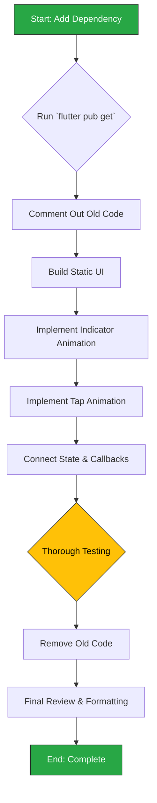

## Phase 1.1: Bottom Navigation Rendering Refactor

This section outlines the plan to refactor the `AdaptiveBottomNavigation` widget. The goal is to improve performance and maintainability by replacing the custom, multi-controller animation logic with the `flutter_animate` package.

### 1.1.1. Background & Rationale

As detailed in the `2analysis_insights.md` document, this refactor is motivated by the following key findings:

-   **Observation:** The current `AdaptiveBottomNavigation` widget uses a complex and inefficient system of multiple `AnimationController` instances combined with `AnimatedBuilder` to create its selection (sliding indicator) and tap (bounce) effects.
-   **Insight:** This implementation is a likely source of UI jank and is difficult to maintain or extend due to its complexity.
-   **Recommendation:** Replacing the manual animation logic with the `flutter_animate` package will provide a more performant, declarative, and maintainable solution, directly addressing the identified performance bottleneck.

### 1.1.2. Change Severity & Impact Analysis

-   **Severity:** **Medium**.
-   **Impact:** The change is highly localized to a single file, but the component is a critical, app-wide UI element (`main_shell.dart`).
-   **Complexity:** The refactoring is of **medium complexity**. It requires replacing a bespoke, multi-controller animation system with a new dependency. The primary challenge is to replicate the exact visual behavior (sliding indicator, item bounce-on-tap) using the `flutter_animate` API to ensure a seamless visual transition for the end-user. The widget's public API will not change.

### 1.1.3. Affected Files

The following files will be modified during this task:

1.  `pubspec.yaml`: To add the new dependency.
2.  `lib/features/navigation/presentation/widgets/adaptive_bottom_navigation.dart`: The entire implementation of this widget will be rewritten.

No other files should require changes, as the widget's public interface (`props` and `callbacks`) will be preserved.

### 1.1.4. Refactoring Procedure

The refactoring process will follow these steps to minimize disruption and risk.



#### Step-by-Step Guide

1.  **Add Dependency**:
    *   Add `flutter_animate: ^<latest_version>` to the `dependencies` section of `pubspec.yaml`.
    *   Run `flutter pub get`.

2.  **Isolate Existing Logic**:
    *   In `adaptive_bottom_navigation.dart`, comment out the entire body of the `_AdaptiveBottomNavigationState` class. This preserves the old code for reference during the rewrite.
    *   Remove the `with TickerProviderStateMixin`.

3.  **Build the Static UI**:
    *   First, rebuild the widget's layout *without* any animations.
    *   Use a `Stack` and `Row` to position the items and a simple `Container` for the indicator. Ensure everything is visually correct in a static state (e.g., for `currentIndex = 0`).

4.  **Implement Sliding Indicator Animation**:
    *   Use `flutter_animate`'s `.animate()` extension on the indicator `Container`.
    *   Use a `.slide()` or `.move()` effect that is driven by `widget.currentIndex`. The target `x` position will be `(itemWidth * widget.currentIndex)`.
    *   Ensure the animation plays when `widget.currentIndex` changes. The `animate` extension's `target` property can be used here, which will automatically animate when the value changes.

5.  **Implement Item Tap (Bounce) Animation**:
    *   When an item is tapped, the new selection will be passed to the parent via the `onTap` callback.
    *   The bounce effect can be achieved by applying an effect to the tapped icon/widget. The `flutter_animate` package provides an `.effect()` that can be triggered manually via an `AnimationController` if needed, but it's often simpler to use its event-listening capabilities if available. For a simple bounce, a `.then().scale()` effect chain can be used.

6.  **Finalize State and Cleanup**:
    *   Ensure all existing widget properties (`items`, `onTap`, `onLongPress`) are correctly used in the new implementation.
    *   Once the new implementation is confirmed to be working perfectly and looks identical to the original, delete all the commented-out code from the old implementation.

7.  **Testing**:
    *   Manually test all aspects:
        *   Does the indicator slide correctly when tapping different items?
        *   Does the bounce animation play on the correct item?
        *   Does it handle rapid taps gracefully?
        *   Does it still look correct on different screen sizes?
        *   Is the long-press functionality intact?
    *   Run existing widget tests (if any) and create new ones for the new implementation if necessary.

### 1.1.5. Documentation Updates (`docs/README.md`)

Upon completion of this refactor, the main `PROJECT DOCS` (`docs/README.md`) must be updated to reflect the introduction of the new animation dependency and to set the stage for the broader animation framework overhaul.

**1. Add New Core Technology:**

*   **File:** `docs/README.md`
*   **Location:** Section `03 · Core Technologies & Key Dependencies 🛠️`.
*   **Action:** Add a new row to the table for `flutter_animate`. This is our first component using it, establishing the precedent.
*   **Content:**

| Library | Role | Rationale |
|---|---|---|
| ... | ... | ... |
| **`flutter_animate`** | **Animation** | **A performant, declarative library for composing complex animations. Replaces manual `AnimationController` logic for improved readability and maintainability.** |
| ... | ... | ... |

**2. Acknowledge Animation Framework Transition:**

*   **File:** `docs/README.md`
*   **Location:** Section `05 · UI & Navigation 🎨`, in the "UI Framework" table.
*   **Action:** Update the description for the `UI Animation Framework` guide to signal the ongoing migration. This manages expectations and documents the technical direction.
*   **Proposed Change:**
    *   **Find this line:**
        ```markdown
        | [UI Animation Framework](UI_ANIMATION_FRAMEWORK.md) | Guide to the app's animation system. **Note: The framework is being migrated from custom widgets to `flutter_animate`.** |
        ```
    *   **Replace with:**
        ```markdown
        | [UI Animation Framework](UI_ANIMATION_FRAMEWORK.md) | Guide to the app's animation system. **Note: The framework is being migrated from custom widgets to `flutter_animate`.** |
        ```

---