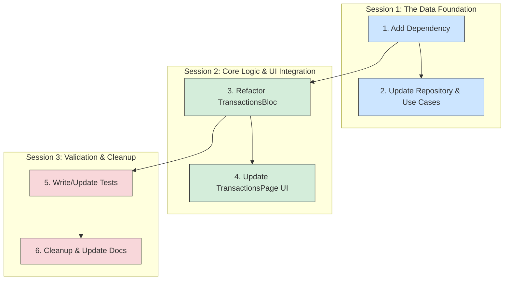

To minimize risk and ensure stability, I would break the refactoring process into three distinct work sessions. This approach allows for logical "commits" at the end of each session, where the application remains in a stable state.

Here is how I would structure the work:

---

### **Session 1: The Data Foundation**

*   **Steps Included:**
    1.  **Add Dependency:** Add `infinite_scroll_pagination` to `pubspec.yaml`.
    2.  **Update Data & Domain Layers:**
        *   Modify the `TransactionRepository` interface to support pagination.
        *   Implement the paginated query in `TransactionRepositoryImpl` using `LIMIT` and `OFFSET`.
        *   Update the `GetAllTransactions` use case in `lib/features/transactions/domain/usecases/get_transactions.dart` to accept pagination parameters.
*   **Goal:** To prepare the data access layer for pagination without affecting the currently running application.
*   **State at End of Session:** The app will still compile and run perfectly using the old data-fetching logic. The new paginated methods in the repository and use cases will be implemented and ready to be used, but they won't be called by any part of the app yet. This is a safe and reversible checkpoint.

---

### **Session 2: Core Logic and UI Integration**

*   **Steps Included:**
    3.  **Refactor State Management (`TransactionsBloc`):** Completely overhaul the BLoC to manage the `PagingController` and handle paginated data fetching events.
    4.  **Update the UI (`TransactionsPage`):** Replace the existing `SliverList` with `PagedSliverList` and connect it to the newly refactored `TransactionsBloc`.
*   **Goal:** To implement the core lazy-loading functionality. This is the "heavy lifting" session.
*   **State at End of Session:** The `TransactionsPage` will be fully functional with lazy loading. As the user scrolls, new transactions will be fetched and displayed. The old logic for fetching all transactions at once will now be orphaned (unused) but may still exist in the codebase. The primary functionality will be working.

---

### **Session 3: Validation, Cleanup, and Documentation**

*   **Steps Included:**
    5.  **Finalize and Test:**
        *   Write new widget tests for the `TransactionsPage` to verify all aspects of the pagination (initial load, subsequent loads, error states, pull-to-refresh). I will use the `test/features/transactions/transactions_page_test.dart` file.
        *   Remove the old, now-unused methods and state management logic related to the previous "load-all" approach.
    6.  **Documentation Updates:** Update `docs/README.md` to include the new dependency and the modified API signature as specified in the plan.
*   **Goal:** To ensure the new implementation is robust, free of dead code, and properly documented.
*   **State at End of Session:** The task is 100% complete. The new feature is implemented, tested, and documented, and all legacy code related to the old implementation has been removed. The codebase is clean and stable.

This structured approach isolates the most complex parts of the refactor and ensures that we have stable, testable code at the end of each session, significantly reducing the chance of introducing critical errors.