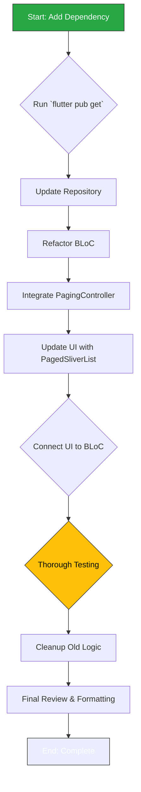

## Phase 1.2: Transactions Page Lazy Loading

This section details the plan to implement lazy loading (pagination) on the `TransactionsPage`. The goal is to replace the inefficient "load-all" approach with a scalable, on-demand data fetching strategy using the `infinite_scroll_pagination` package.

### 1.2.1. Background & Rationale

As identified in the `2analysis_insights.md` document, this refactor is crucial for the app's long-term performance and scalability.

-   **Observation:** The `TransactionsPage` currently fetches all transaction records from the database at once when the page is loaded.
-   **Insight:** This approach is not scalable. As the number of transactions grows, it will lead to significant initial load times, high memory consumption, and a poor user experience.
-   **Recommendation:** Implement pagination by refactoring the `TransactionRepository` to fetch data in chunks and using the `infinite_scroll_pagination` package to create a "lazy-loading" list that automatically requests more data as the user scrolls.

### 1.2.2. Change Severity & Impact Analysis

-   **Severity:** **High**.
-   **Impact:** This is a fundamental change to the data access pattern for a core feature. The changes are localized to the transactions feature, but they affect the data, domain, and presentation layers.
-   **Complexity:** The refactoring is of **medium-to-high complexity**. It involves introducing a new third-party dependency, modifying database queries in the data layer (`TransactionRepository`), and overhauling the state management and UI logic in the presentation layer (`TransactionsBloc`, `TransactionsPage`). The primary challenge is correctly integrating the `PagingController` from the new package with the existing BLoC architecture.

### 1.2.3. Affected Files

The following files will be modified during this task:

1.  `pubspec.yaml`: To add the `infinite_scroll_pagination` dependency.
2.  `lib/features/transactions/domain/repositories/transaction_repository.dart`: The repository interface will be updated to support paginated queries.
3.  `lib/features/transactions/data/repositories/transaction_repository_impl.dart`: The implementation will be updated with a new Drift query using `LIMIT` and `OFFSET` for pagination.
4.  `lib/features/transactions/presentation/bloc/transactions_bloc.dart` (and related state/event files): The BLoC will be completely rewritten to manage the `PagingController` and handle page requests instead of a one-time data fetch.
5.  `lib/features/transactions/presentation/pages/transactions_page.dart`: The UI will be refactored to use `PagedSliverList` instead of the current `SliverList`.

### 1.2.4. Refactoring Procedure

The process is designed to introduce the new logic layer by layer, starting from the data access layer and moving up to the UI.



#### Step-by-Step Guide

1.  **Add Dependency**:
    *   Add `infinite_scroll_pagination: ^<latest_version>` to `pubspec.yaml`.
    *   Run `flutter pub get`.

2.  **Update Data & Domain Layers (`TransactionRepository`)**:
    *   In the domain interface (`transaction_repository.dart`), modify the `getAllTransactions` method signature to `getTransactions(int page, int limit)`.
    *   In the implementation (`transaction_repository_impl.dart`), update the Drift query to use `limit()` and `offset()` based on the `page` and `limit` parameters to fetch data in chunks.

3.  **Refactor State Management (`TransactionsBloc`)**:
    *   This is the most critical step. The existing BLoC, which likely fetches a list once, needs to be refactored to drive the pagination.
    *   In `_TransactionsBlocState`, add a `PagingController<int, Transaction>`. The key (`int`) represents the page number.
    *   In the BLoC's constructor, initialize the `PagingController` and add a listener to it (`_pagingController.addPageRequestListener`).
    *   The page request listener will be responsible for triggering a new event (e.g., `_FetchTransactionPage`) that calls the repository's `getTransactions` method with the new page key.
    *   On success, append the new items to the controller (`_pagingController.appendPage(newItems, nextPageKey)`). On error, set the controller's error state (`_pagingController.error = error`).

4.  **Update the UI (`TransactionsPage`)**:
    *   In the widget that builds the list, replace the existing `ListView` or `SliverList` with `PagedSliverList`.
    *   Provide the `pagingController` from the `TransactionsBloc` to the `PagedSliverList`.
    *   The `itemBuilder` for `PagedSliverList` will provide you with the `Transaction` object for each item, similar to `ListView.builder`.
    *   The package will automatically handle displaying loading indicators (for the first page and subsequent pages) and error messages.

5.  **Finalize and Test**:
    *   Remove any old, unused logic related to fetching the full list of transactions (e.g., old BLoC states/events, old state variables holding the list).
    *   Manually test all scenarios:
        *   Does the initial page load correctly?
        *   Does the loading indicator appear at the bottom when scrolling down?
        *   Does a new page of items load and appear seamlessly?
        *   Is an error message displayed if a page fails to load?
        *   Does pull-to-refresh work correctly?
    *   Update existing widget tests to work with the new paginated approach.

### 1.2.5. Documentation Updates (`docs/README.md`)

Upon completion of this refactor, the main `PROJECT DOCS` (`docs/README.md`) must be updated to reflect the introduction of the new pagination dependency and the changes to the transaction data access API.

**1. Add New Core Technology:**

*   **File:** `docs/README.md`
*   **Location:** Section `03 · Core Technologies & Key Dependencies 🛠️`.
*   **Action:** Add a new row to the table for `infinite_scroll_pagination`.
*   **Content:**

| Library                    | Role             | Rationale                                                                                                                                    |
| -------------------------- | ---------------- | -------------------------------------------------------------------------------------------------------------------------------------------- |
| ...                        | ...              | ...                                                                                                                                          |
| **`infinite_scroll_pagination`** | **UI/Pagination** | **Provides an efficient, out-of-the-box solution for creating paginated (lazy-loading) lists, preventing large data loads and improving UI performance.** |
| ...                        | ...              | ...                                                                                                                                          |

**2. Update Domain API Cheatsheet:**

*   **File:** `docs/README.md`
*   **Location:** Section `04 · Domain Features 💼`, in the "Widget & Helper Cheatsheet" under "Transactions – Basics".
*   **Action:** Modify the method signature for fetching transactions to reflect the new paginated approach.
*   **Proposed Change:**
    *   **Find this line:**
        ```markdown
        - `getAllTransactions()` – Fetch all transactions.
        ```
    *   **Replace with:**
        ```markdown
        - `getTransactions(page, limit)` – Fetch a paginated list of transactions.
        ```

---
