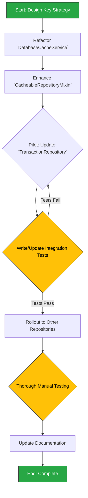

## Phase 1.3: Data Caching Strategy Enhancement

This section details the plan to enhance the `DatabaseCacheService`. The goal is to evolve the generic TTL cache into an intelligent, query-aware caching layer that automatically manages keys and invalidation, significantly boosting performance and simplifying repository logic.

### 1.3.1. Background & Rationale

As detailed in the `2analysis_insights.md` document, this refactor is essential for building a performant and maintainable data layer.

-   **Observation:** The current `DatabaseCacheService` is a generic, time-to-live (TTL) key-value store.
-   **Insight:** This cache is ineffective for dynamic or filtered data. It cannot cache specific queries (e.g., a certain page of transactions) without complex, manual key management in every repository, which is error-prone and hard to maintain.
-   **Recommendation:** Enhance the caching strategy by making the `DatabaseCacheService` capable of transparently handling query-specific caching. The cache key should be automatically generated from the query and its parameters. A robust, automated cache invalidation mechanism should be implemented using the `CacheableRepositoryMixin` to clear relevant cache entries when data is created, updated, or deleted.

### 1.3.2. Change Severity & Impact Analysis

-   **Severity:** **High**.
-   **Impact:** This is a foundational change to a core data service that affects data retrieval performance and consistency across the entire application. It alters the `DatabaseCacheService`, the shared `CacheableRepositoryMixin`, and requires modifications to all major data repositories (`TransactionRepository`, `BudgetRepository`, etc.).
-   **Complexity:** **High**. The primary challenges are:
    1.  Designing a generic and reliable cache key generation strategy that can uniquely identify any query and its parameters.
    2.  Implementing a robust invalidation mechanism that correctly targets dependent cache entries after a mutation. The logic must be precise to avoid either leaving stale data or clearing the entire cache unnecessarily.

### 1.3.3. Affected Files

The following files will be modified or created during this task:

1.  `lib/core/services/database_cache_service.dart`: The core implementation will be updated to support more advanced invalidation patterns.
2.  `lib/core/repositories/cacheable_repository_mixin.dart`: This mixin will be significantly enhanced to provide new helper methods for automated query caching and invalidation.
3.  `lib/features/transactions/data/repositories/transaction_repository_impl.dart`: Will be the first repository to adopt the new caching mechanism.
4.  `lib/features/budgets/data/repositories/budget_repository_impl.dart`: Will be updated after the pattern is proven.
5.  `lib/features/accounts/data/repositories/account_repository_impl.dart`: Will be updated.
6.  `lib/features/categories/data/repositories/category_repository_impl.dart`: Will be updated.
7.  `test/core/services/database_cache_service_test.dart`: Existing tests will need to be updated or rewritten.
8.  `test/integration/database_cache_integration_test.dart`: New integration tests are crucial to verify the correctness of the caching and invalidation logic end-to-end.

### 1.3.4. Refactoring Procedure

The process is designed to mitigate risk by implementing and testing the new caching logic on a single repository before rolling it out across the application.



#### Step-by-Step Guide

1.  **Design Cache Key Strategy**:
    *   Define a standard, automated way to generate a cache key. The key should be a composite string including the repository/table name, the method name, and a consistent representation of its arguments (e.g., `transactions:getTransactions:page=1:limit=20:filter=none`). This ensures every unique query has a unique key.

2.  **Enhance `DatabaseCacheService`**:
    *   Modify the service to support tag-based or prefix-based invalidation. For example, add a method like `invalidateWhere(bool Function(String key) test)` or `invalidateByPrefix(String prefix)`. This allows for targeted cache clearing (e.g., clear all keys starting with `transactions:`).

3.  **Refactor `CacheableRepositoryMixin`**:
    *   This is the most significant change. Abstract the caching logic here.
    *   Create a new protected helper method, e.g., `cacheReadQuery`. This method will:
        *   Accept the database query function and its parameters.
        *   Automatically generate the unique cache key based on the strategy from Step 1.
        *   Check the cache for this key. If found and valid, return the cached data.
        *   If not found, execute the database query, store the result in the cache with the generated key, and return the result.
    *   Create a new helper for write operations, e.g., `cacheWriteQuery`. This method will:
        *   Accept the write function (create/update/delete) and a cache `tag` or `prefix` (e.g., 'transactions').
        *   Execute the write function.
        *   Upon successful completion, call the new invalidation method in the `DatabaseCacheService` to remove all cache entries matching the prefix.

4.  **Update `TransactionRepositoryImpl` as a Pilot**:
    *   Refactor all read methods (e.g., `getTransactions`, `getTransactionById`) to use the new `cacheReadQuery` helper.
    *   Refactor all write methods (e.g., `createTransaction`, `deleteTransaction`) to use the `cacheWriteQuery` helper, passing `'transactions'` as the invalidation prefix.

5.  **Write and Pass Integration Tests**:
    *   Create a dedicated integration test file to rigorously validate the new mechanism.
    *   **Test 1 (Caching):** Call `getTransactions()`, then call it again. Verify (e.g., by mocking the DB) that the second call was served from the cache.
    *   **Test 2 (Invalidation):** Call `getTransactions()`, then call `createTransaction()`, then call `getTransactions()` again. Verify the cache was invalidated and the final call hit the database.
    *   These tests are critical to ensure data consistency.

6.  **Roll Out to Other Repositories**:
    *   Once the pattern is proven with `TransactionRepositoryImpl` and the tests are passing reliably, apply the same refactoring to `BudgetRepositoryImpl`, `AccountRepositoryImpl`, `CategoryRepositoryImpl`, and any other data-heavy repositories. This becomes a safe, repetitive task.

7.  **Update Documentation**:
    *   The `README.md` references a `DATABASE_CACHING_GUIDE.md`. Update that guide to reflect the new, superior caching strategy. Explain how to use the `cacheReadQuery` and `cacheWriteQuery` helpers and why manual key management is no longer necessary.

### 1.3.5. Documentation Updates (`docs/README.md` & Associated Guides)

Upon completion, the documentation must be updated to reflect the new automated caching paradigm, ensuring developers immediately adopt the correct, more straightforward pattern.

**1. Update Core Infrastructure Cheatsheet:**

*   **File:** `docs/README.md`
*   **Location:** Section `02 · Core Infrastructure 🔧`, in the "Quick reference – core services & helpers" under "Database Caching".
*   **Action:** Rewrite the descriptions for `DatabaseCacheService` and `CacheableRepositoryMixin` to reflect the new automated, query-aware system.
*   **Proposed Change:**
    *   **Find this section:**
        ```markdown
        ***Database Caching***
        - `DatabaseCacheService` – Singleton in-memory key→value store with TTL.
        - `CacheableRepositoryMixin` – Adds `cacheRead`/`invalidateCache` helpers to repositories.
        ```
    *   **Replace with:**
        ```markdown
        ***Database Caching***
        - `DatabaseCacheService` – Intelligent, query-aware in-memory cache. Supports prefix-based invalidation for automated cache clearing.
        - `CacheableRepositoryMixin` – Provides **automated** query caching (`cacheReadQuery`) and invalidation (`cacheWriteQuery`), eliminating manual key management.
        ```

**2. Overhaul the Main Caching Guide:**

*   **File:** `docs/DATABASE_CACHING_GUIDE.md`
*   **Action:** This guide needs to be fundamentally rewritten to document the new, superior caching strategy. The old TTL-based, manual key-management approach is now obsolete.
*   **Key updates for the guide:**
    *   **Introduction:** Explain that the cache is no longer a simple key-value store but an automated query caching layer.
    *   **Core Concept:** Describe how cache keys are now automatically generated from repository method names and parameters, making caching transparent.
    *   **Usage (`cacheReadQuery`):** Provide a clear "before and after" code example showing how to refactor a repository read method to use the new `cacheReadQuery` helper. Emphasize that no manual key is needed.
    *   **Usage (`cacheWriteQuery`):** Provide a clear example for write methods (create/update/delete). Explain how `cacheWriteQuery` accepts a prefix (e.g., `'transactions'`) and automatically invalidates all related cache entries after the write operation succeeds.
    *   **Best Practices:** Explicitly state that manual cache management (`get()`, `set()`, `invalidate()`) should no longer be used directly in repositories. The new mixin helpers handle everything.

---
