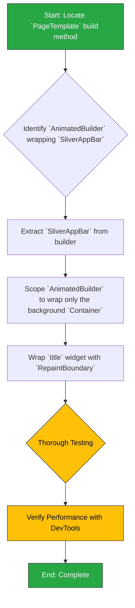

## Phase 2.2: PageTemplate Scroll Performance Optimization

This section outlines the plan to refactor the `PageTemplate` widget to optimize scroll performance. The goal is to reduce unnecessary widget rebuilds caused by an inefficiently scoped `AnimatedBuilder`.

### 2.2.1. Background & Rationale

As detailed in the `2analysis_insights.md` document, this optimization is critical for smooth scrolling performance across the application.

-   **Observation:** The `PageTemplate` widget uses an `AnimatedBuilder` that listens to a `ScrollController` to fade in the app bar's background color.
-   **Insight:** The `AnimatedBuilder` currently wraps the entire `SliverAppBar`, causing it and all its children (actions, title) to rebuild on every single scroll frame. This is a significant and unnecessary performance cost.
-   **Recommendation:** Refactor the widget by:
    1.  Scoping the `AnimatedBuilder` to wrap only the `Container` whose background color is changing.
    2.  Ensuring the `SliverAppBar` itself does not rebuild on scroll.
    3.  Wrapping the `title` widget in a `RepaintBoundary` to prevent it from repainting during the background color animation.

### 2.2.2. Change Severity & Impact Analysis

-   **Severity:** **Medium**.
-   **Impact:** The change is localized to a single, critical shared widget (`page_template.dart`). While only one file is modified, its central role means any mistake could have widespread visual consequences across the entire app, affecting every page that uses it.
-   **Complexity:** **Low-to-Medium**. The refactoring itself is not algorithmically complex; it involves restructuring the widget tree within one file. The challenge lies in carefully applying the changes without altering the existing visual behavior and ensuring performance gains are achieved without introducing regressions.

### 2.2.3. Affected Files

The following file is the sole target for modification:

1.  `lib/shared/widgets/page_template.dart`

Although only one file is edited, a full app-wide visual regression test is mandatory after the change.

### 2.2.4. Refactoring Procedure

The process is designed to be a precise surgical change to the widget's build method.



#### Step-by-Step Guide

1.  **Locate Target Code**:
    *   Open `lib/shared/widgets/page_template.dart`.
    *   Navigate to the `build` method of the widget's `State`.

2.  **Restructure `AnimatedBuilder`**:
    *   Find the `AnimatedBuilder` that listens to the `_scrollController`. Currently, it returns the entire `SliverAppBar`.
    *   The goal is to move the `AnimatedBuilder` *inside* the `SliverAppBar`'s `flexibleSpace` or `background` property, so it only wraps the `Container` responsible for the color fade.
    *   The `SliverAppBar` itself should be returned directly and should no longer be inside the `builder` function. The `scrolledUnderElevation` can still be controlled by the `_scrollController.offset`.

3.  **Isolate Title with `RepaintBoundary`**:
    *   Locate the `title` widget passed to the `SliverAppBar`.
    *   Wrap this widget with a `RepaintBoundary`. This will prevent the text from being repainted every time the background color of the app bar animates, further improving performance.

4.  **Testing and Verification**:
    *   **Manual Testing**: Navigate through several different pages of the application that use `PageTemplate`.
        *   Scroll up and down repeatedly.
        *   Verify that the app bar background color still fades in correctly.
        *   Verify that the title, actions, and other app bar elements remain visually correct and stable.
        *   Check for any new jank or visual glitches.
    *   **Performance Profiling**: Use Flutter DevTools.
        *   Open the "Performance" or "CPU Profiler" view.
        *   Record a session while scrolling on a page that uses `PageTemplate`.
        *   Enable "Track Widget Builds".
        *   Confirm that the `SliverAppBar` and its `title` and `actions` are no longer rebuilding on every frame during the scroll. You should only see the background `Container` rebuilding.

### 2.2.5. Documentation Updates (`docs/README.md` & `UI_TESTING_AND_TROUBLESHOOTING.md`)

The optimization of `PageTemplate` is a perfect, practical example of a critical Flutter performance pattern. Documenting this pattern is more valuable than just noting the widget was improved. It provides a reusable lesson for future development.

**1. Enhance Guide Description in Main README:**

*   **File:** `docs/README.md`
*   **Location:** Section `05 · UI & Navigation 🎨`, in the "UI Framework" table.
*   **Action:** Update the description for the `UI Testing & Troubleshooting` guide to explicitly mention performance patterns, making it more discoverable.
*   **Proposed Change:**
    *   **Find this line:**
        ```markdown
        | [UI Testing & Troubleshooting](UI_TESTING_AND_TROUBLESHOOTING.md) | Widget testing setup, troubleshooting common UI issues & performance tips. |
        ```
    *   **Replace with:**
        ```markdown
        | [UI Testing & Troubleshooting](UI_TESTING_AND_TROUBLESHOOTING.md) | Widget testing setup, troubleshooting common UI issues & key **UI performance patterns**. |
        ```

**2. Add "UI Performance Best Practices" to Troubleshooting Guide:**

*   **File:** `docs/UI_TESTING_AND_TROUBLESHOOTING.md`
*   **Action:** Add a new, detailed section to this guide that uses the `PageTemplate` refactor as a case study for two crucial performance optimizations.
*   **Content to Add:**

    ```markdown
    ---
    
    ## UI Performance Best Practices
    
    This section covers key patterns for writing performant Flutter UI code, preventing common sources of jank and unnecessary builds.
    
    ### 1. Scope Builders Tightly to Minimize Rebuilds
    
    **Problem:** Using builders like `AnimatedBuilder`, `ValueListenableBuilder`, or `BlocBuilder` around large widget trees is a common source of performance issues. If the builder wraps a complex widget, the entire widget and all its children will be rebuilt every time the listened-to object changes, even if only a small part of the UI actually needs to be updated.
    
    **Solution:** Always scope builders as tightly as possible around only the widgets that need to be rebuilt. Move the builder down the widget tree so it wraps the smallest possible widget.
    
    **Case Study: The `PageTemplate` Refactor**
    
    -   **Before (Inefficient):** The `AnimatedBuilder` wrapped the entire `SliverAppBar`, causing it and its `title` and `actions` to rebuild on every scroll frame just to update the background color.
    
    -   **After (Efficient):** The `AnimatedBuilder` was moved *inside* the `SliverAppBar`'s `flexibleSpace` property. Now, it rebuilds *only* the `Container` responsible for the background color, leaving the rest of the app bar static and efficient.
    
    ### 2. Use `RepaintBoundary` to Isolate Static, Complex Widgets
    
    **Problem:** Even if a widget itself doesn't rebuild, it might still be forced to *repaint* if its parent changes. In the `PageTemplate` example, the changing background color of the app bar could cause the `title` widget to repaint on every frame, which is inefficient.
    
    **Solution:** Wrap static, complex, or expensive-to-paint widgets inside a `RepaintBoundary`. This creates a separate paint layer for the widget. The Flutter framework can then skip repainting this layer entirely if its contents haven't changed, even if other things around it are changing.
    
    **When to use it:**
    -   When you have a complex widget (e.g., a custom painter, a chart) inside an animated container.
    -   When you see static UI elements repainting unnecessarily with Flutter DevTools' "Highlight Repaints" feature.
    
    **Case Study: The `PageTemplate` Refactor**
    
    -   The `title` widget in the `SliverAppBar` was wrapped in a `RepaintBoundary`. This prevents it from being repainted every time the background color behind it animates, further improving scroll performance.
    
    ```

---
