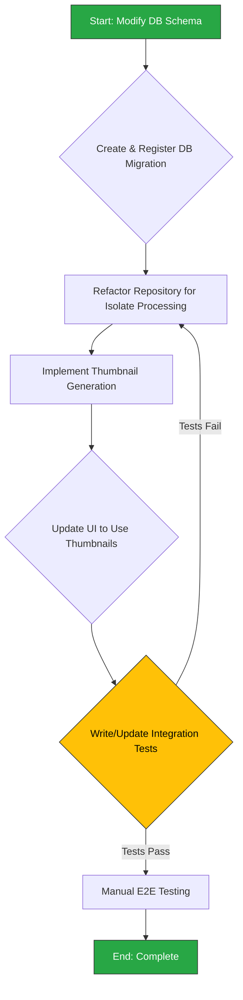

## Phase 3.1: Attachment System Optimization

This section details the plan to optimize the attachment handling system. The goal is to improve UI performance by offloading image compression to a background isolate and enhance efficiency by generating and using thumbnails.

### 3.1.1. Background & Rationale

As detailed in the `2analysis_insights.md` document, this optimization is motivated by critical performance analysis:

-   **Insight (Attachments):** The current implementation in `AttachmentRepositoryImpl` performs image compression on the **main isolate**, a major cause of UI jank when adding image attachments. The system also lacks thumbnail generation, which is inefficient for list views that display full-size, compressed images.
-   **Recommendation (Attachments):**
    1.  Refactor the image compression method in `AttachmentRepositoryImpl` to run in a separate isolate using `compute()`.
    2.  Implement thumbnail generation during the image compression step. This involves a schema change to `AttachmentsTable` to store a thumbnail path or data.
    3.  Investigate using `CompressFormat.webp` for better compression ratios.

### 3.1.2. Change Severity & Impact Analysis

-   **Severity:** **High**.
-   **Impact:** This change is multi-layered, affecting the database schema, data repository logic, and UI components. Offloading compression is critical for UI smoothness. Introducing thumbnails fundamentally changes how attachment images are stored and displayed.
-   **Complexity:** **High**. The refactor requires:
    1.  A database migration, which is a sensitive operation.
    2.  Implementing isolate communication with `compute()`, which has constraints (e.g., top-level functions).
    3.  Modifying repository logic to handle both the original image and the new thumbnail.
    4.  A project-wide search to identify and update all UI components that display attachments to use the new thumbnail system.

### 3.1.3. Affected Files

1.  `lib/core/database/tables/attachments_table.dart`: To add a new `thumbnailPath` or `thumbnailData` column.
2.  `lib/core/database/app_database.dart`: To increment the schema version and register the new migration.
3.  **New Migration File:** `lib/core/database/migrations/new_migration_file.dart` (A new file to be created).
4.  `lib/features/transactions/data/repositories/attachment_repository_impl.dart`: The image compression logic will be significantly refactored.
5.  **Potentially many UI files:** A project-wide search will be needed to find all widgets that display attachment images and update them to use thumbnails.
6.  `test/`: Related unit and integration tests will require updates.

### 3.1.4. Refactoring Procedure

The process is structured to handle the database changes first, followed by the repository logic, and finally the UI.



#### Step-by-Step Guide

1.  **Update Database Schema**:
    *   In `lib/core/database/tables/attachments_table.dart`, add a new column to the `Attachments` table, for example: `TextColumn get thumbnailPath => text().nullable()();`.
2.  **Create Database Migration**:
    *   Create a new migration file in `lib/core/database/migrations/`.
    *   Implement the `onUpgrade` logic to `addColumn` for the new `thumbnailPath`.
    *   In `app_database.dart`, increment the `schemaVersion` and add the new migration to the `migration` getter.
3.  **Refactor Image Processing**:
    *   Create a new top-level function (outside any class) that takes the image data as input, performs both compression for the full image and generates a smaller thumbnail, and returns a result object containing paths/data for both.
    *   In `lib/features/transactions/data/repositories/attachment_repository_impl.dart`, replace the existing direct call to the compression logic with a call to `compute()`, passing your new top-level function.
    *   Update the repository methods (`createAttachment`, etc.) to save the new `thumbnailPath` along with the other attachment data.
4.  **Update UI Layer**:
    *   Conduct a project-wide search for usages of attachment images.
    *   In list views or previews, modify the `Image.file` or `Image.memory` widgets to load the `thumbnailPath` instead of the full image path.
    *   Ensure that the full image is still loaded when a user taps to view the attachment in detail.
5.  **Testing**:
    *   Create or update integration tests to verify that creating an attachment correctly generates and saves a thumbnail.
    *   Manually test the full flow: add a new image attachment, verify the UI remains smooth, check that a thumbnail appears in the list, and confirm the full image opens correctly.

### 3.1.5. Documentation Updates (`docs/README.md` & `ATTACHMENTS_SYSTEM.md`)

The optimization of the attachment system introduces a more performant background processing model and a critical new feature (thumbnails). The documentation must be updated to guide developers on how to leverage these improvements and to reflect the updated repository APIs.

**1. Update Domain API Cheatsheet:**

*   **File:** `docs/README.md`
*   **Location:** Section `04 · Domain Features 💼`, in the "Widget & Helper Cheatsheet" under "Transactions – Attachments".
*   **Action:** Update the description for `compressAndStoreFile` to highlight the new, efficient background processing and thumbnail generation. This signals the performance improvement at a high level.
*   **Proposed Change:**
    *   **Find this line:**
        ```markdown
        - `compressAndStoreFile(filePath, transactionId, fileName)` – Compress image/file and prepare it for local storage.
        ```
    *   **Replace with:**
        ```markdown
        - `compressAndStoreFile(...)` – **Efficiently processes an image in the background** to compress it and generate a thumbnail before storing.
        ```

**2. Overhaul the Main Attachments Guide:**

*   **File:** `docs/ATTACHMENTS_SYSTEM.md`
*   **Action:** This guide needs a comprehensive update to document the new architecture. The previous implementation details are now obsolete.
*   **Key updates for the guide:**
    *   **Introduction:** Revise the introduction to state that the system is optimized for performance, using background processing for compression and thumbnails for efficient rendering.
    *   **Core Concept: Isolate-based Compression:**
        *   Add a new section explaining that image compression is a heavy operation that is now offloaded to a background isolate using `compute()`.
        *   Explain that this prevents UI jank when a user adds a large image.
    *   **Core Concept: Thumbnail Generation:**
        *   Add a new section detailing the thumbnail system.
        *   Explain that a small thumbnail is automatically generated and stored alongside the full-size compressed image.
        *   Document the database schema change: the addition of the `thumbnailPath` column to the `Attachments` table.
    *   **Updated Usage Guide / Best Practices:**
        *   Create a "Best Practices" section for displaying attachment images.
        *   **Rule 1: Use Thumbnails for Lists:** Emphasize that any list or grid view of attachments MUST use the `attachment.thumbnailPath` to render the image. This is critical for scroll performance.
        *   **Rule 2: Use Full Image for Detail Views:** The original (compressed) image path should only be used when displaying a single attachment in a full-screen or detail view.
        *   Provide a clear code example:

            ```dart
            // Good: For a list view
            Image.file(File(attachment.thumbnailPath!))
            
            // Good: For a detail view
            Image.file(File(attachment.filePath))
            
            // Bad: Using full image in a list, causes poor performance
            Image.file(File(attachment.filePath)) 
            ```

---
