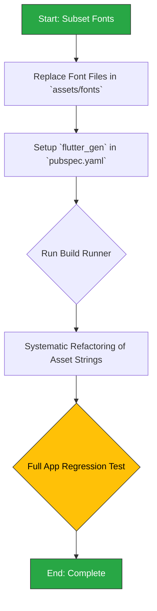

## Phase 3.2: Asset Optimization (Fonts & Type Safety)

This section details the plan to reduce the app's bundle size by subsetting fonts and to improve code safety by migrating to a type-safe asset management system.

### 3.2.1. Background & Rationale

As detailed in `2analysis_insights.md`, this task is driven by asset analysis:

-   **Insight (Fonts & Assets):** The app bundles a number of large, custom font files. Asset paths are managed via raw strings, which is error-prone and can lead to unused assets remaining in the bundle.
-   **Recommendation (Fonts & Assets):**
    1.  Implement font subsetting by using a tool to create smaller font files that only include the glyphs used by the application.
    2.  Use a tool like `flutter_gen` to generate type-safe asset accessors, eliminating string-based lookups and helping to identify unused assets.

### 3.2.2. Change Severity & Impact Analysis

-   **Severity:** **Medium**.
-   **Impact:** Font subsetting has a high impact on reducing the final bundle size. Type-safe asset generation is a project-wide refactoring effort that touches dozens of files, significantly improving developer experience and code maintainability.
-   **Complexity:** **Medium**. Font subsetting is a low-complexity task focused on file replacement. The `flutter_gen` migration is of medium complexity due to the breadth of the refactoring required, although the changes themselves are simple and repetitive.

### 3.2.3. Affected Files

1.  `pubspec.yaml`: To add the `flutter_gen` and `flutter_gen_runner` build dependencies and configure the tool.
2.  `assets/fonts/`: The existing font files will be replaced with smaller, subsetted versions.
3.  **All files using assets:** A project-wide search for asset paths (e.g., `'assets/...'`) is required to replace them with generated code (e.g., `Assets` class).

### 3.2.4. Refactoring Procedure

This is a two-part process: first, the external font optimization, followed by the internal code refactoring.



#### Step-by-Step Guide

1.  **Subset Fonts**:
    *   Use an external tool (e.g., the `font_subset` pub package or a web utility like Font Squirrel) to process the font files located in `assets/fonts/`.
    *   Configure the tool to include only the characters and glyphs necessary for the languages supported by the app (e.g., Latin characters, symbols).
    *   Replace the original font files with the new, smaller subsetted files. Visually verify in-app that all text still renders correctly.
2.  **Setup `flutter_gen`**:
    *   Add `flutter_gen` and `flutter_gen_runner` to the `dev_dependencies` in `pubspec.yaml`.
    *   Add the `flutter_gen` configuration section to `pubspec.yaml` to specify input and output directories.
    *   Run `dart run build_runner build` to generate the asset accessor class (e.g., `lib/gen/assets.gen.dart`).
3.  **Refactor Asset Paths**:
    *   This is the most time-consuming step. Methodically go through the entire project.
    *   Replace all hardcoded asset strings like `AssetImage('assets/icons/my_icon.svg')` with their type-safe counterparts, e.g., `SvgPicture.asset(Assets.icons.myIcon)`.
    *   This applies to images, fonts, icons, and any other files managed as assets.
4.  **Testing**:
    *   After refactoring, perform a full visual regression test of the application.
    *   Navigate to every screen and ensure all images, icons, and custom fonts are displayed correctly.

### 3.2.5. Documentation Updates (`docs/README.md` & `FILE_STRUCTURE.md`)

The migration to type-safe assets is a fundamental change in the development workflow. The documentation must be updated to make this new pattern clear, mandatory, and easy to adopt. Font subsetting should also be noted as a key optimization practice.

**1. Add New Core Technology:**

*   **File:** `docs/README.md`
*   **Location:** Section `03 · Core Technologies & Key Dependencies 🛠️`.
*   **Action:** Add a new row to the table for `flutter_gen_runner` to formalize its role in the project.
*   **Content:**

| Library | Role | Rationale |
|---|---|---|
| ... | ... | ... |
| **`flutter_gen_runner`** | **Code Generation** | **Generates type-safe code for assets (images, fonts, etc.), eliminating error-prone string paths and enabling compile-time verification.** |
| ... | ... | ... |

**2. Update Development Workflow Guide:**

*   **File:** `docs/README.md`
*   **Location:** Section `07 · Development Workflow & Testing 👨‍💻`, under the "Code Generation" heading.
*   **Action:** Update the text to explicitly include assets in the code generation process.
*   **Proposed Change:**
    *   **Find this paragraph:**
        ```markdown
        The project uses `freezed` for data classes and `drift` for the database. If you modify any file that requires code generation (e.g., `app_database.dart`, model files), run the build runner:
        ```
    *   **Replace with:**
        ```markdown
        The project uses code generation for data classes (`freezed`), the database (`drift`), and **assets (`flutter_gen`)**. If you add or change an asset, or modify a file that requires code generation (e.g., `app_database.dart`, model files), run the build runner:
        ```

**3. Add a "Working with Assets" Recipe:**

*   **File:** `docs/README.md`
*   **Location:** Section `06 · Common Tasks & Development Recipes 🍳`.
*   **Action:** Add a new row to the cookbook table for the common task of adding a new asset.
*   **Content to Add:**

| I need to... | Key Steps & Where to Look |
| --- | --- |
| ... | ... |
| **...add a new image or other asset?** | 1. **Add File:** Place the asset file in the correct subfolder under `assets/`.<br/>2. **Generate Code:** Run `dart run build_runner build` to create the type-safe reference.<br/>3. **Use:** Reference the asset in your code using the generated `Assets` class (e.g., `Assets.images.myImage.path`). See the `FILE_STRUCTURE.md` for details. |
| ... | ... |

**4. Overhaul Asset Documentation in the File Structure Guide:**

*   **File:** `docs/FILE_STRUCTURE.md`
*   **Action:** This guide is the primary source for asset-related documentation. It needs a new section dedicated to the type-safe asset system and font optimization.
*   **Content to Add:**

    ```markdown
    ---
    
    ## Asset Management
    
    This project uses a type-safe and optimized approach to asset management to improve developer experience, prevent runtime errors, and reduce application size.
    
    ### Type-Safe Asset Generation with `flutter_gen`
    
    We have eliminated raw string paths for assets (e.g., `'assets/images/logo.png'`). Instead, we use `flutter_gen` to automatically generate a class with static accessors for every asset.
    
    **Workflow for Adding a New Asset:**
    1.  Place the new asset file (e.g., `new_icon.svg`) into the appropriate subdirectory within the `assets/` folder (e.g., `assets/icons/`).
    2.  Run the build runner: `dart run build_runner build --delete-conflicting-outputs`.
    3.  This will update the `lib/gen/assets.gen.dart` file. You can now access your asset in code with full type-safety and auto-completion.
    
    **Usage Example:**
    
    -   **Before (Error-prone):**
        ```dart
        Image.asset('assets/images/profile_avatar.png');
        SvgPicture.asset('assets/icons/close_icon.svg');
        ```
    
    -   **After (Safe and Recommended):**
        ```dart
        // The generated 'Assets' class provides direct access.
        Image.asset(Assets.images.profileAvatar.path);
        
        // The generator even creates helpful methods for different asset types.
        Assets.icons.closeIcon.svg(); 
        ```
    
    This approach prevents typos, ensures that all referenced assets exist at compile time, and makes it easier to find unused assets.
    
    ### Font Subsetting for Optimization
    
    **Problem:** Font files often contain thousands of glyphs for many languages, making them very large. Bundling full font files significantly increases the app's download and installation size.
    
    **Solution:** We use **font subsetting**. Before being added to the `assets/fonts/` directory, all custom fonts are processed by a tool that removes any glyphs not used in our application. This reduces font file sizes by over 90% in most cases.
    
    **Best Practice:** If you need to add or update a font, ensure you use a subsetted version containing only the necessary character sets (e.g., Latin, common symbols) for the languages the app supports.
    ```

---
