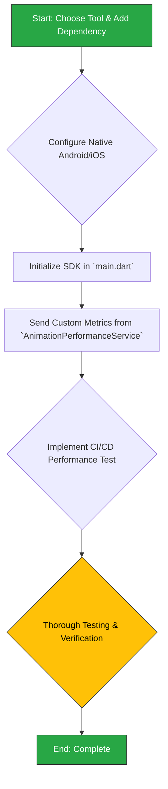

## Phase 4.1: Performance Monitoring Integration

This section details the plan to integrate a remote performance monitoring tool. The goal is to capture and analyze real-world performance data from the `AnimationPerformanceService`, enabling proactive issue detection and ensuring long-term application health.

### 4.1.1. Background & Rationale

As detailed in the `2analysis_insights.md` document, this task is motivated by the need to operationalize existing performance metrics:

-   **Insight (Performance Monitoring):** The `AnimationPerformanceService` is an advanced, adaptive system that already monitors frame rates. However, its valuable metrics are purely local and are not sent to a remote monitoring service, making it impossible to track real-world performance or diagnose device-specific issues.
-   **Recommendation (Performance Monitoring):**
    1.  Integrate a remote performance monitoring tool like Sentry or Firebase Performance Monitoring.
    2.  Use this integration to send the detailed metrics from `AnimationPerformanceService.getPerformanceProfile()` to the remote service.
    3.  Implement automated performance tests in the CI/CD pipeline using `flutter test --profile`.

### 4.1.2. Change Severity & Impact Analysis

-   **Severity:** **High**.
-   **Impact:** This is a foundational change that adds a critical long-term health monitoring capability. It requires adding a third-party dependency, modifying the app's core initialization sequence in `main.dart`, and includes native configuration for both Android and iOS.
-   **Complexity:** **Medium**. The primary complexity involves correctly initializing the chosen monitoring SDK (e.g., Sentry) with the appropriate app-start hooks and DSN configuration, adding native code, and then identifying the correct location and frequency for sending the custom performance profile from the `AnimationPerformanceService`.

### 4.1.3. Affected Files

1.  `pubspec.yaml`: To add the chosen monitoring dependency (e.g., `sentry_flutter`).
2.  `lib/main.dart`: To initialize the monitoring service at application startup.
3.  `lib/core/services/animation_performance_service.dart`: The logical place to add the code that sends metrics to the remote service.
4.  `android/app/build.gradle`: May require changes for the monitoring SDK.
5.  `ios/Runner/Info.plist`: May require changes for the monitoring SDK.
6.  **CI/CD Configuration** (e.g., a new file in `.github/workflows/`): To add the automated performance testing job.

### 4.1.4. Refactoring Procedure

The process involves integrating the service first, then wiring up the custom metrics, and finally automating checks in CI.



#### Step-by-Step Guide

1.  **Select Tool and Add Dependency**:
    *   Choose a monitoring tool (Sentry is a strong choice for its Flutter support).
    *   Add the `sentry_flutter` package to `pubspec.yaml` and run `flutter pub get`.

2.  **Configure Native Projects**:
    *   Follow the official documentation for the chosen SDK to configure the native Android and iOS projects. This typically involves adding metadata to `AndroidManifest.xml` and `Info.plist` and may involve build script changes.

3.  **Initialize SDK in `main.dart`**:
    *   In `lib/main.dart`, wrap the `runApp()` call with the SDK's initialization block (e.g., `SentryFlutter.init(...)`). This will capture crashes and performance data from the very start of the app's lifecycle.

4.  **Send Custom Metrics**:
    *   In `lib/core/services/animation_performance_service.dart`, or a suitable consumer of this service, implement the logic to send the performance profile.
    *   This could be triggered periodically (e.g., every few minutes) or tied to app lifecycle events (e.g., when the app is backgrounded).
    *   The logic will call `getPerformanceProfile()` and use the monitoring SDK's API to send the resulting data as a custom event or measurement.

5.  **Implement CI/CD Performance Test**:
    *   Create a new workflow file in your CI/CD system.
    *   This workflow should run `flutter test --profile` on a dedicated set of integration tests that cover key, performance-critical user flows.
    *   This step establishes a performance baseline and prevents future regressions.

6.  **Testing and Verification**:
    *   Run the app and verify it doesn't crash on startup.
    *   Trigger the conditions for sending custom metrics.
    *   Log into the monitoring tool's web dashboard and confirm that performance data and the custom metrics from your app are being received.

### 4.1.5. Documentation Updates (`docs/README.md` & `UI_TESTING_AND_TROUBLESHOOTING.md`)

The integration of remote performance monitoring is a critical step towards maintaining long-term application health. The documentation must be updated to reflect this new capability and guide the team on how to use it.

**1. Add New Core Technology:**

*   **File:** `docs/README.md`
*   **Location:** Section `03 · Core Technologies & Key Dependencies 🛠️`.
*   **Action:** Add a new row to the table for the chosen monitoring library (e.g., `sentry_flutter`).
*   **Content:**

| Library | Role | Rationale |
|---|---|---|
| ... | ... | ... |
| **`sentry_flutter`** | **Performance & Error Monitoring** | **Captures real-world performance data, custom metrics, and errors, enabling proactive issue detection and diagnostics.** |
| ... | ... | ... |

**2. Update Testing Philosophy:**

*   **File:** `docs/README.md`
*   **Location:** Section `07 · Development Workflow & Testing 👨‍💻`, under the "Testing Philosophy" heading.
*   **Action:** Add a bullet point for the new performance testing CI job to embed it into the team's standard practices.
*   **Proposed Change:**
    *   **Find this list:**
        ```markdown
        - **Unit Tests:** For business logic...
        - **Widget Tests:** For individual widgets...
        - **Integration Tests:** For critical, end-to-end user flows...
        ```
    *   **Add a new bullet point:**
        ```markdown
        - **Unit Tests:** For business logic...
        - **Widget Tests:** For individual widgets...
        - **Integration Tests:** For critical, end-to-end user flows...
        - **Performance Tests:** Automated CI jobs run performance-critical integration tests in profile mode to establish and track performance baselines, preventing regressions.
        ```

**3. Add a "Performance Monitoring" Recipe:**

*   **File:** `docs/README.md`
*   **Location:** Section `06 · Common Tasks & Development Recipes 🍳`.
*   **Action:** Add a new row to the cookbook table for the common task of checking application health.
*   **Content to Add:**

| I need to... | Key Steps & Where to Look |
| --- | --- |
| ... | ... |
| **...check real-world app performance or errors?** | 1. **Dashboard:** Open the Sentry dashboard to view performance trends and crashes.<br/>2. **Custom Metrics:** Analyze the custom performance profiles sent from `AnimationPerformanceService`.<br/>3. **Guide:** See the `UI_TESTING_AND_TROUBLESHOOTING.md` guide for more details. |
| ... | ... |

**4. Add "Remote Performance Monitoring" Section to Troubleshooting Guide:**

*   **File:** `docs/UI_TESTING_AND_TROUBLESHOOTING.md`
*   **Action:** Add a new, detailed section to this guide explaining the "what" and "why" of our performance monitoring strategy.
*   **Content to Add:**

    ```markdown
    ---
    
    ## Remote Performance Monitoring
    
    To ensure the application remains fast and reliable for real users on a wide variety of devices, we have integrated a remote performance and error monitoring service (Sentry). This service automatically captures crashes and allows us to proactively analyze the app's performance in the wild.
    
    ### What We Track
    
    Beyond standard metrics like screen load times, we send custom performance data to the monitoring service.
    
    -   **Source:** The `AnimationPerformanceService` continuously monitors the app's frame rate and UI responsiveness.
    -   **Data:** Periodically, the service sends a detailed performance profile to the remote monitoring service. This profile includes metrics such as:
        -   Average, worst, and best frame build times.
        -   The number of janky frames detected.
        -   The current `AnimationPerformanceMode` (e.g., `smooth`, `balanced`, `degraded`).
    -   **Purpose:** This data allows us to identify device-specific performance issues, understand the real-world impact of complex animations, and validate the effectiveness of our adaptive performance system.
    
    ### How to Use It
    
    -   **Access:** Performance and crash data can be viewed on the project's Sentry dashboard (link should be available in the project's secure notes).
    -   **Analysis:** When investigating a performance regression, check the dashboard for new trends in slow frames, an increase in janky frames, or a shift in the performance mode distribution across devices.
    
    ```

---
