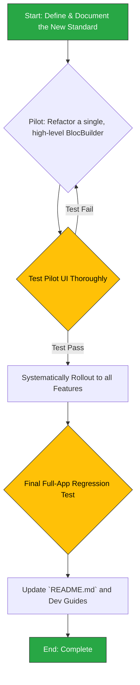

## Phase 4.2: BLoC State Management Refactor

This section outlines the plan to conduct a codebase-wide refactoring of BLoC usage. The goal is to drastically reduce unnecessary widget rebuilds by enforcing the use of `buildWhen` and `listenWhen` conditions, a key performance optimization.

### 4.2.1. Background & Rationale

As detailed in the `2analysis_insights.md` document, this refactor addresses a systemic performance issue:

-   **Insight (BLoC & State Management):** A codebase review confirms that `BlocBuilder` widgets often lack `buildWhen` conditions. This causes entire UI sections—sometimes even the whole `MaterialApp`—to rebuild for irrelevant state changes, leading to significant and unnecessary performance costs.
-   **Recommendation (BLoC & State Management):**
    1.  Enforce a new standard: all `BlocBuilder` and `BlocListener` widgets must include `buildWhen` and `listenWhen` conditions, respectively, unless the state has only a single property.
    2.  Conduct a one-time audit of the entire codebase to refactor existing `BlocBuilder` widgets to meet this standard.
    3.  Update the project's development guides.

### 4.2.2. Change Severity & Impact Analysis

-   **Severity:** **High**.
-   **Impact:** This is a pervasive, cross-cutting architectural change that will touch dozens of UI files across every feature. While the performance benefits are significant, the risk of introducing subtle UI bugs (i.e., widgets not updating when they should) is high if not done carefully.
-   **Complexity:** **High**. The complexity lies not in the code for a single change, but in the scale of the task. It requires a meticulous, project-wide audit and a deep understanding of each feature's state logic to write correct and efficient conditions.

### 4.2.3. Affected Files

1.  **Potentially all UI files using BLoC:** A project-wide search for `BlocBuilder` and `BlocListener` will be necessary. This will affect files throughout `lib/features/` and `lib/shared/`.
2.  `docs/README.md`: To update the "State Management with BLoC" section with the new mandatory standard.
3.  A new, more detailed guide could be created, e.g., `docs/BLOC_BEST_PRACTICES.md`, and linked from the main README.

### 4.2.4. Refactoring Procedure

The process is designed to be systematic, starting with a clear standard and a small pilot, then rolling out carefully across the app.



#### Step-by-Step Guide

1.  **Define and Document the Standard**:
    *   Formally write down the new rule: "All `BlocBuilder` and `BlocListener` widgets MUST include a `buildWhen` or `listenWhen` condition. This condition should compare the previous and current state and return true only if a change has occurred that affects this specific widget. This can be a comparison of specific properties (e.g., `previous.status != current.status`)."

2.  **Pilot Refactor**:
    *   Identify a single `BlocBuilder` that is a good candidate for a pilot—ideally one that is known to rebuild frequently.
    *   Add the `buildWhen` property to it. For example:
        `buildWhen: (prev, curr) => prev.isLoading != curr.isLoading || prev.items.length != curr.items.length`

3.  **Test the Pilot**:
    *   Rigorously test the UI controlled by the refactored widget.
    *   Trigger state changes that *should* cause a rebuild and verify the UI updates.
    *   Trigger state changes that *should not* cause a rebuild and verify the UI remains static. Use Flutter DevTools' "Track Widget Builds" to confirm.

4.  **Systematic Rollout**:
    *   Once the pilot is successful, begin the codebase-wide audit.
    *   Use your IDE's search functionality to find all instances of `BlocBuilder` and `BlocListener`.
    *   Go through the list methodically, feature by feature, applying the `buildWhen`/`listenWhen` logic. For each one, analyze its state object and determine which properties are relevant to that specific widget.

5.  **Final Regression Test**:
    *   After refactoring all instances, perform a full manual regression test of the entire application. Navigate every screen and test every interaction to catch any UI update bugs that may have been introduced.

6.  **Update Project Documentation**:
    *   Modify the `README.md` section on "State Management with BLoC" to include the new standard as a mandatory practice.
    *   Provide a clear "before and after" code example.
    *   Stress the importance of this practice for performance.

### 4.2.5. Documentation Updates (`docs/README.md` & `UI_PATTERNS_AND_BEST_PRACTICES.md`)

This refactor establishes a critical performance pattern. The documentation must be updated to make this new standard non-negotiable and to provide developers with a clear, practical guide on how to implement it correctly.

**1. Update UI Guide Description in Main README:**

*   **File:** `docs/README.md`
*   **Location:** Section `05 · UI & Navigation 🎨`, in the "UI Framework" table.
*   **Action:** Update the description for `UI Patterns & Best Practices` to explicitly mention state management performance, making the guide more discoverable for this topic.
*   **Proposed Change:**
    *   **Find this line:**
        ```markdown
        | [UI Patterns & Best Practices](UI_PATTERNS_AND_BEST_PRACTICES.md) | State management with BLoC, error/loading patterns & lifecycle management. |
        ```
    *   **Replace with:**
        ```markdown
        | [UI Patterns & Best Practices](UI_PATTERNS_AND_BEST_PRACTICES.md) | State management with BLoC, **performance best practices,** error/loading patterns & lifecycle management. |
        ```

**2. Update State Management Section in Main README:**

*   **File:** `docs/README.md`
*   **Location:** Section `07 · Development Workflow & Testing 👨‍💻`, at the end of the "State Management with BLoC" section.
*   **Action:** Add a new paragraph that introduces the mandatory use of `buildWhen` and `listenWhen` and links to the more detailed guide for examples.
*   **Content to Add (at the end of the section):**
    ```markdown
    **Performance Note:** To prevent costly, unnecessary widget rebuilds, all `BlocBuilder` and `BlocListener` instances **MUST** include a `buildWhen` or `listenWhen` condition, respectively. This is a mandatory performance requirement. For detailed implementation examples, see the [UI Patterns & Best Practices](UI_PATTERNS_AND_BEST_PRACTICES.md) guide.
    ```

**3. Overhaul BLoC Section in the UI Patterns Guide:**

*   **File:** `docs/UI_PATTERNS_AND_BEST_PRACTICES.md`
*   **Action:** Add a new, detailed sub-section focused entirely on the performance aspect of BLoC, using the `buildWhen` refactor as the primary example.
*   **Content to Add (under the "State Management with BLoC" section):**

    ```markdown
    ### Performance: Preventing Unnecessary Rebuilds
    
    A common performance pitfall is allowing widgets to rebuild for irrelevant state changes. For example, a `BlocBuilder` that only displays a user's name should not rebuild if the list of transactions changes in the same state object.
    
    **Rule:** To prevent this, every `BlocBuilder` and `BlocListener` **must** provide a `buildWhen` or `listenWhen` condition. This condition compares the `previous` and `current` state and returns `true` only if a property relevant to that specific widget has changed.
    
    #### Example: Before Refactoring (Inefficient)
    
    Without `buildWhen`, this widget rebuilds whenever *any* property in `ProfileState` changes (e.g., `status`, `transactions`, `error`), even though it only uses `user.name`.
    
    ```dart
    // Inefficient: Rebuilds for any state change
    BlocBuilder<ProfileBloc, ProfileState>(
      builder: (context, state) {
        return AppText('Welcome, ${state.user.name}');
      },
    )
    ```
    
    #### Example: After Refactoring (Efficient)
    
    By adding `buildWhen`, we ensure this widget *only* rebuilds if the `user` object itself changes. All other state changes are ignored by this widget, saving CPU cycles.
    
    ```dart
    // Efficient: Rebuilds only when the user's name changes
    BlocBuilder<ProfileBloc, ProfileState>(
      buildWhen: (previous, current) => previous.user.name != current.user.name,
      builder: (context, state) {
        return AppText('Welcome, ${state.user.name}');
      },
    )
    ```
    
    This practice is critical for maintaining a smooth and responsive UI, especially on complex pages with multiple `BlocBuilder` widgets.
    ```
