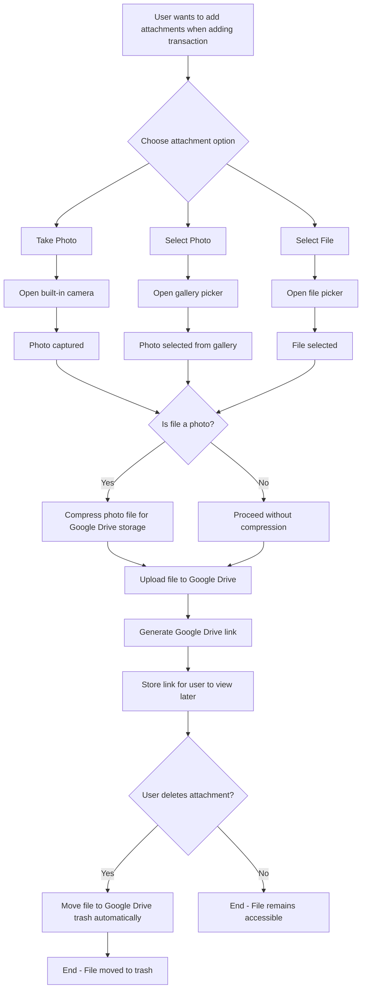

# Transactions: Attachments Guide

This guide provides a comprehensive overview of how to work with transaction attachments, including adding, retrieving, and managing them with Google Drive integration.

## Setup for Attachments

In addition to the basic transaction setup, you will need the `AttachmentRepository` and the `FilePickerService`.

```dart
import 'package:finance/features/transactions/domain/repositories/transaction_repository.dart';
import 'package:finance/features/transactions/domain/repositories/attachment_repository.dart';
import 'package:finance/features/transactions/domain/entities/transaction.dart';
import 'package:finance/features/transactions/domain/entities/transaction_enums.dart';
import 'package:finance/features/transactions/domain/entities/attachment.dart';
import 'package:finance/core/services/file_picker_service.dart';
import 'package:finance/core/di/injection.dart';

// Get the repositories and services
final transactionRepository = getIt<TransactionRepository>();
final attachmentRepository = getIt<AttachmentRepository>();
final filePickerService = getIt<FilePickerService>();
```

## Working with Attachments

### Adding Attachments to Transactions

The attachment system follows this flow:
1.  User chooses attachment source (camera, gallery, or file picker).
2.  Files are compressed if they are images.
3.  Files are uploaded to Google Drive.
4.  Google Drive links are generated and stored.

```dart
// Check if user can add attachments (Google Drive authorization)
if (!await filePickerService.canAddAttachments()) {
  // Request Google Drive authorization
  final authorized = await filePickerService.requestGoogleDriveAuthorization();
  if (!authorized) {
    print('Google Drive authorization is required to add attachments');
    return;
  }
}

// Add attachments to a transaction
try {
  final attachments = await filePickerService.addAttachments(transactionId);
  print('Added ${attachments.length} attachments to transaction');
  
  for (final attachment in attachments) {
    print('Attachment: ${attachment.fileName} (${attachment.type})');
    if (attachment.googleDriveLink != null) {
      print('View at: ${attachment.googleDriveLink}');
    }
  }
} catch (e) {
  print('Failed to add attachments: $e');
}
```

### Manual Attachment Management

#### Get Attachments for a Transaction
```dart
// Get all attachments for a specific transaction
final attachments = await attachmentRepository.getAttachmentsByTransaction(transactionId);
print('Found ${attachments.length} attachments');

for (final attachment in attachments) {
  print('${attachment.fileName}: ${attachment.isAvailable ? "Available" : "Not available"}');
}
```

#### Create Attachment Manually
```dart
// Create attachment manually (for advanced use cases)
final attachment = Attachment(
  transactionId: transactionId,
  fileName: 'receipt.jpg',
  filePath: '/path/to/local/file.jpg',
  type: AttachmentType.image,
  mimeType: 'image/jpeg',
  fileSizeBytes: 1024000,
  createdAt: DateTime.now(),
  updatedAt: DateTime.now(),
  isUploaded: false,
  isDeleted: false,
  isCapturedFromCamera: false,
  syncId: 'unique-attachment-id',
);

final createdAttachment = await attachmentRepository.createAttachment(attachment);

// Upload to Google Drive
await attachmentRepository.uploadToGoogleDrive(createdAttachment);
```

#### Delete Attachments
```dart
// Delete attachment (moves to Google Drive trash automatically)
await filePickerService.deleteAttachment(attachmentId);

// Or manually mark as deleted
await attachmentRepository.markAsDeleted(attachmentId);
```

### Working with Different Attachment Types
```dart
// Check attachment properties
if (attachment.isImage) {
  print('This is an image attachment');
} else if (attachment.isDocument) {
  print('This is a document attachment');
}

// Check if attachment is available for viewing
if (attachment.isAvailable) {
  print('Attachment can be viewed at: ${attachment.googleDriveLink}');
} else {
  print('Attachment is not available (deleted or not uploaded)');
}
```

## Google Drive Integration

### Authorization Management
```dart
// Check if user is signed in to Google Drive
final isSignedIn = await filePickerService.canAddAttachments();
print('Google Drive authorized: $isSignedIn');

// Request authorization if needed
if (!isSignedIn) {
  final authorized = await filePickerService.requestGoogleDriveAuthorization();
  if (authorized) {
    print('Google Drive authorization successful');
  } else {
    print('Google Drive authorization failed');
  }
}
```

### Managing Google Drive Files
```dart
// Get Google Drive download link for an attachment
final downloadLink = await attachmentRepository.getGoogleDriveDownloadLink(
  attachment.googleDriveFileId!,
);

if (downloadLink != null) {
  print('View file at: $downloadLink');
}

// Delete file from Google Drive (moves to trash)
await attachmentRepository.deleteFromGoogleDrive(attachment.googleDriveFileId!);
```

## Attachment Flow Implementation

The attachment system follows this specific flow as requested:

